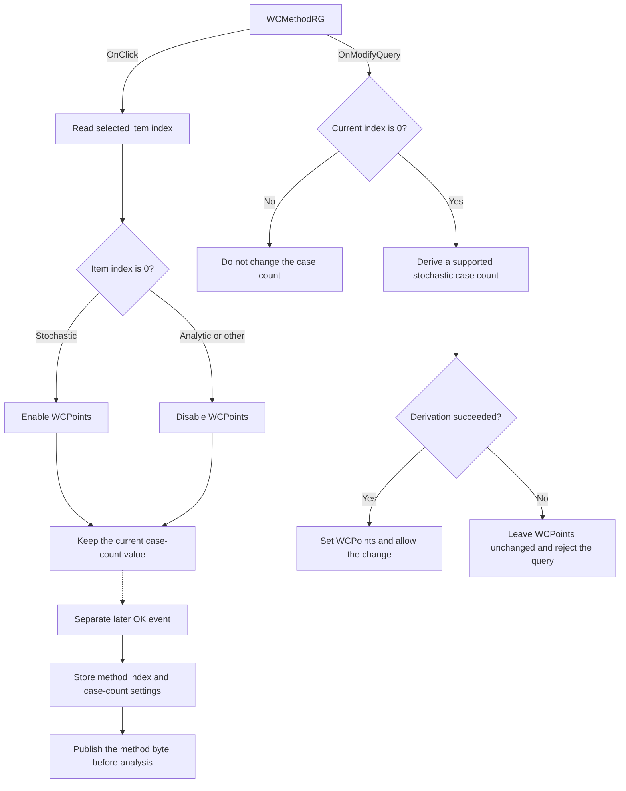

#  Method

> Analysis status: Source reviewed. The method-specific UI and stored-state effects are documented.

## Control

| Property | Recovered value |
| --- | --- |
| Form | AnalModeDlg |
| Component path | AnalModeDlg.Notebook.tsWorstCase.GroupBox3.WCMethodRG |
| Control class | TMyRadioGroup |
| Caption |  Method  |
| Hint | Not present in the recovered resource. |
| Text | Not present in the recovered resource. |
| Handler name | WCMethodRGClick |
| Handler address | 01155c00 |
| Graph node | `resource:dfm:AnalModeDlg/AnalModeDlg.Notebook.tsWorstCase.GroupBox3.WCMethodRG` |
| Handler node | `function:01155c00` |
| Graph layer | UI |

## What happens when clicked

`WCMethodRG` selects the worst-case analysis method. Its items are stored in
this order: item 0 is `Stochastic`, and item 1 is `Analytic`.

`FUN_01155c00` reads the selected item index and changes only the enabled state
of `WCPoints`, the integer editor beside the `Number of cases` label:

- Item 0 (`Stochastic`) enables `WCPoints`.
- Any other item index disables `WCPoints`. In the normal two-item control,
  this branch is item 1 (`Analytic`). It also covers an invalid or unselected
  index.

The click does not clear or change the current case-count value. It does not
change `WCDrawNom`, the nearby label, any caption, or any control visibility.
It also does not select the Worst Case notebook page. The separate current-mode
control manages notebook visibility.

The same radio group has a separate `OnModifyQuery` handler,
`FUN_01155bb0`. When the current method index is 0, that handler asks the
application model for a supported stochastic case count. It returns the query
result through its Boolean output parameter. On success, it writes the derived
power-of-two value to `WCPoints`. On failure, it leaves the editor value
unchanged. For a nonzero method index, this query handler does not calculate or
write a case count.

When the user later accepts the dialog while the current analysis mode is
Worst Case, `FUN_01155500` reads the case count, the `Draw nominal value`
checkbox, and the method index. It stores the method index at form offset
`0xD6B`. It also calculates the reported case total as `WCPoints`, plus one
when `Draw nominal value` is selected. This calculation reads the retained
case count for both methods; it does not branch on the method index.
`FUN_01b587d0` later copies the stored method byte to the application's global
analysis state before it starts the analysis path.

The click handler has no validation, error, or no-op branch. Each click applies
the enabled state that matches the current item index. Numeric range validation
happens later when the dialog reads `WCPoints`, not in this click handler.

## Click flow

## Handler evidence

- Source: [DecompiledSources/Tina16/functions/0000000001155C00__FUN_01155c00.c](../../../DecompiledSources/Tina16/functions/0000000001155C00__FUN_01155c00.c)
- Recovered role: Worst-case method case-count enablement handler.
- Current graph summary: Handles 1 Delphi UI event: AnalModeDlg.Notebook.tsWorstCase.GroupBox3.WCMethodRG.OnClick.
- Behavior: Enables `WCPoints` for item 0 and disables it for every other item index.
- Evidence: The handler reads `WCMethodRG.ItemIndex` from the form field at `0x758` and calls the Boolean setter at VMT slot `0x128` on the form field at `0x750`. `FormShow`, the integer getter and setter calls, and the DFM component order identify this field as `WCPoints`. Other recovered form handlers use the same VMT slot as `SetEnabled`.
- Complexity: simple
- Distinct outgoing calls: 0

## Direct calls

- No direct call edge is present because the handler invokes the virtual
  `SetEnabled` method through the `WCPoints` VMT.

## Related state paths

- [FUN_01155bb0](../../../DecompiledSources/Tina16/functions/0000000001155BB0__FUN_01155bb0.c)
  handles `WCMethodRG.OnModifyQuery` and initializes the stochastic case count
  only when its model query succeeds.
- [FUN_01155500](../../../DecompiledSources/Tina16/functions/0000000001155500__FUN_01155500.c)
  collects the Worst Case controls when the dialog is accepted. It stores the
  method index, case count, and nominal-value state.
- [FUN_01b587d0](../../../DecompiledSources/Tina16/functions/0000000001B587D0__FUN_01b587d0.c)
  copies the stored method byte into global analysis state before the later
  analysis path.

## Resource evidence

- Kind: Not present in the recovered resource.
- Modal result: Not present in the recovered resource.
- Checked state: Not present in the recovered resource.
- List items: ("Sto&chastic", "&Analytic")
- Affected control: `WCPoints`, a `TIntEdit` labeled `Number of cases`.
- Related checkbox: `WCDrawNom`, captioned `Draw nominal value`; the click does
  not change it.
- Image reference: Not present in the recovered resource.
- Extracted glyph: None.

## Nearby label candidates

Nearby labels are layout candidates only. They are not proof of behavior.

- Rank 1: &Number of cases at distance 275.

## Analysis limits

- The downstream code stores and publishes method values 0 and 1, but the
  recovered neighborhood does not expose the algorithm that consumes that
  global method byte. This article does not infer the analytic or stochastic
  calculation from the item captions alone.
- `FormShow` loads the saved case count and method index. Its recovered source
  does not directly call `FUN_01155c00`, so this article does not claim how the
  initial enabled state is synchronized before the first click.
- The graph export disappeared during review. The final graph neighborhood and
  layer checks used the canonical DuckDB database and the recovered sources.
