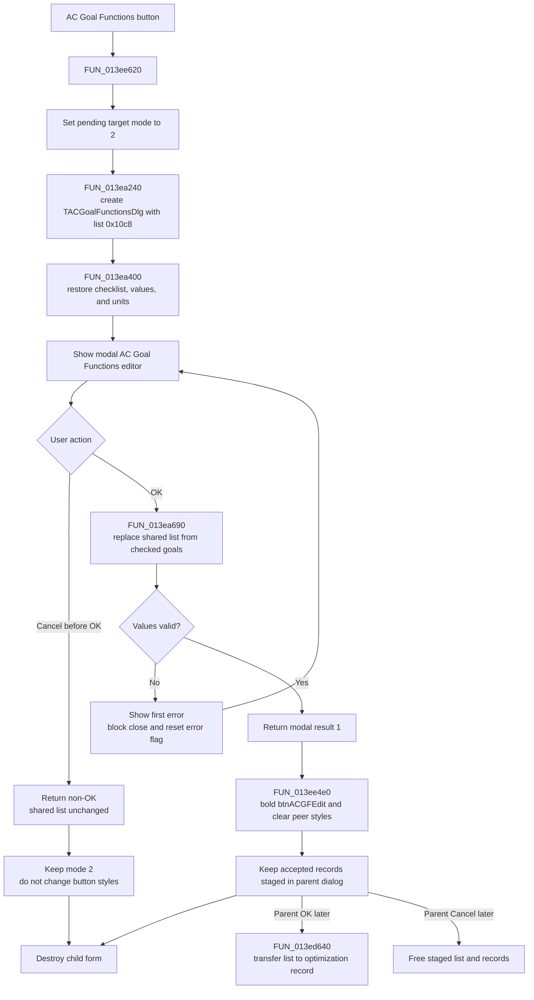

# &AC Goal Functions...

> Analysis status: Source reviewed through dialog construction, shared-state
> editing, modal acceptance, cancellation, validation, and parent commit paths.

## Control

| Property | Recovered value |
| --- | --- |
| Form | AnalModeRangeDlg |
| Component path | AnalModeRangeDlg.Notebook.tsOptimization.GroupBox3.btnACGFEdit |
| Control class | TButton |
| Caption | &AC Goal Functions... |
| Hint | Not present in the recovered resource. |
| Text | Not present in the recovered resource. |
| Handler name | btnACGFEditClick |
| Handler address | 013ee620 |
| Graph node | `resource:dfm:AnalModeRangeDlg/AnalModeRangeDlg.Notebook.tsOptimization.GroupBox3.btnACGFEdit` |
| Handler node | `function:013ee620` |
| Graph layer | UI |

## What happens when clicked

`FUN_013ee620` opens the modal `TACGoalFunctionsDlg` form. The recovered form
caption is **AC Goal Functions**. It edits six AC optimization-goal types:
Center Frequency, Low Pass, Band Pass, High Pass, Maximum, and Minimum.

Before the form opens, the handler sets the parent dialog's pending
optimization-target mode at offset `0x108c` to `2`. The sibling handlers use
values `0`, `1`, and `3` for DC Goal Functions, AC Table, and DC Table. The
parent's later save path writes this mode to the optimization record.

The handler then constructs `TACGoalFunctionsDlg` with two important inputs:

- the application owner from `PTR_DAT_02004030`; and
- the parent dialog's AC goal-record list at offset `0x10c8`.

`FUN_013ea240` stores the same list pointer in the child form at offset `0x8b8`.
It does not clone the list. When the child form is created, `FUN_013ea400`
reads the existing packed records and restores the checklist, numeric edits,
and `dB` or `V` radio selection for each goal.

The parent calls the form's modal-show method and tests its result against
`1`, the OK result.

## Accept behavior

The child form's OK handler, `FUN_013ea690`, replaces the shared list before
the modal form closes. It frees all old records, clears the list, and adds one
41-byte packed record for each checked goal. Each record contains its one-based
goal type, parsed numeric values, and the `dB` or `V` selection.

When the modal result is OK, `FUN_013ee620` calls `FUN_013ee4e0` with the parent
control at offset `0x700`, which is `btnACGFEdit`. The helper clears the font
style on all four optimization-target editor buttons and sets
`btnACGFEdit.Font.Style` to value `1`, the Delphi `fsBold` bit. This marks AC
Goal Functions as the selected target editor. The handler then destroys the
modal form.

The accepted child result is still staged in `AnalModeRangeDlg`. This click
does not directly update the application optimization collection. When the
parent dialog is later accepted, `FUN_013ed640` transfers the list at `0x10c8`
to the new or edited optimization record and transfers ownership. If the
parent dialog is discarded, its cleanup path frees the staged list and its
records.

## Cancel behavior

If the user cancels the child form before an OK attempt, the modal result is
not `1`. The parent does not call `FUN_013ee4e0`, so the four button font styles
do not change. The child OK handler did not run, so the shared AC goal-record
list is unchanged. The parent still destroys the child form.

The mode assignment at offset `0x108c` occurs before the form opens and is not
rolled back on child cancellation. It remains `2` in the parent dialog's
staged state. A later cancellation of the parent dialog prevents that staged
mode from reaching the application record.

## Validation and error behavior

The child OK path parses each checked goal's `TFloatEdit` values. The first
numeric value for Center Frequency, Low Pass, Band Pass, and High Pass must be
greater than zero. Float-edit errors and this positive-value check use
`FUN_013ea300` to show only the first validation message and set a close-block
flag. `TACGoalFunctionsDlg.FormCloseQuery` at `FUN_013eaab0` then refuses that
OK close and resets the flag, so the user can correct the values.

The list replacement happens before validation finishes. A failed OK attempt
therefore leaves the rebuilt records in the shared parent list. A later OK
attempt frees and rebuilds them again. If the user cancels the child after a
failed OK attempt, the rebuilt list remains in the parent dialog's staged
state even though `FUN_013ee620` does not bold the AC button. There is no child
rollback copy.

Normal UI use disables the child OK button when no goal is checked. If the OK
handler is invoked anyway, it clears the shared list and creates no records.
The recovered parent handler has no explicit exception recovery. Allocation or
modal-form exceptions can propagate and can skip the later style update or
explicit form destruction.

## Click flow

## Handler evidence

- Source: [DecompiledSources/Tina16/functions/00000000013EE620__FUN_013ee620.c](../../../DecompiledSources/Tina16/functions/00000000013EE620__FUN_013ee620.c)
- Recovered role: Opens the AC goal-function editor over the parent-owned
  staged record list and selects that target mode after modal acceptance.
- Current graph summary: Handles 1 Delphi UI event:
  AnalModeRangeDlg.Notebook.tsOptimization.GroupBox3.btnACGFEdit.OnClick.
- Proven inputs: The parent AC goal-record list at `0x10c8`, the application
  owner, and the child checklist and parameter controls.
- Proven outputs: A replaced staged record list on child OK, pending target
  mode `2`, and bold AC-editor button style after a successful modal result.
- Complexity: complex
- Distinct outgoing calls: 3

## Direct calls

- [`FUN_00410f20`](../../../DecompiledSources/Tina16/functions/0000000000410F20__FUN_00410f20.c)
  destroys the modal child form after it returns.
- [`FUN_013ea240`](../../../DecompiledSources/Tina16/functions/00000000013EA240__FUN_013ea240.c)
  constructs `TACGoalFunctionsDlg`, binds the caller-owned record list, and
  initializes the VCL form.
- [`FUN_013ee4e0`](../../../DecompiledSources/Tina16/functions/00000000013EE4E0__FUN_013ee4e0.c)
  clears the font styles on all four target-editor buttons and makes the
  accepted button bold.

## Related child and parent paths

- [`FUN_013ea400`](../../../DecompiledSources/Tina16/functions/00000000013EA400__FUN_013ea400.c)
  restores child controls from the input records.
- [`FUN_013ea690`](../../../DecompiledSources/Tina16/functions/00000000013EA690__FUN_013ea690.c)
  rebuilds the shared list from the checked goals and edited parameters.
- [`FUN_013eaab0`](../../../DecompiledSources/Tina16/functions/00000000013EAAB0__FUN_013eaab0.c)
  blocks one close request when child validation set the error flag.
- [`FUN_013ed640`](../../../DecompiledSources/Tina16/functions/00000000013ED640__FUN_013ed640.c)
  transfers the staged AC list into the optimization record when the parent
  dialog is accepted.
- [`FUN_013ec960`](../../../DecompiledSources/Tina16/functions/00000000013EC960__FUN_013ec960.c)
  frees the staged list and records when ownership was not transferred.

## Resource evidence

- Button caption: **&AC Goal Functions...**.
- Parent group caption: **Optimization/Target**.
- Child form class and caption: `TACGoalFunctionsDlg`, **AC Goal Functions**.
- Child checklist items: Center Frequency, Low Pass, Band Pass, High Pass,
  Maximum, and Minimum.
- Child buttons: built-in `bkOK`, `bkCancel`, and `bkHelp` bit buttons.
- Child parameter pages provide labeled target values, tolerances, and `dB` or
  `V` choices.
- Kind, modal result, checked state, image reference, and glyph: Not present on
  the parent button.
- Extracted glyph: None.

## Nearby label candidates

Nearby labels are layout candidates only. They are not proof of behavior.

- No same-parent label candidate is available. The parent group caption and
  the complete child form resource provide direct evidence instead.

## Analysis limits

- The original Delphi type name of the 41-byte goal record is not recovered.
  Its type byte, numeric slots, unit flag, and round-trip behavior are proven
  by the child load and save paths.
- The exact localized text for the positive-value validation message is not
  present in the graph. Its resource ID is `0x134`.
- The source proves that parent field `0x108c` selects mode `2`, and sibling
  handlers establish the four-mode mapping. Its original Delphi field name is
  not recovered.
