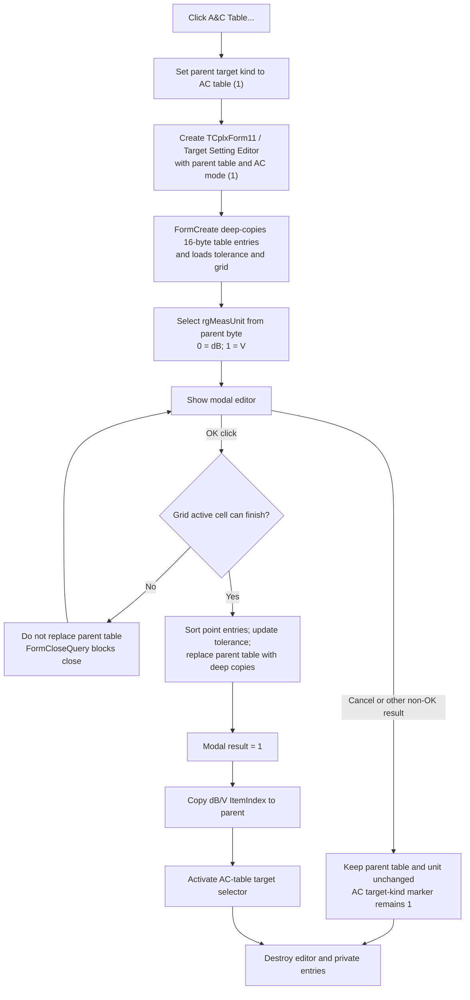

# A&C Table...

## Control

| Property | Recovered value |
| --- | --- |
| Form | AnalModeRangeDlg |
| Component path | AnalModeRangeDlg.Notebook.tsOptimization.GroupBox3.btnACTableEdit |
| Control class | TButton |
| Caption | A&C Table... |
| Hint | Not present in the recovered resource. |
| Handler name | btnACTableEditClick |
| Handler address | 013ee580 |
| Graph node | `resource:dfm:AnalModeRangeDlg/AnalModeRangeDlg.Notebook.tsOptimization.GroupBox3.btnACTableEdit` |
| Handler node | `function:013ee580` |
| Graph layer | UI |

## What happens when clicked

The button opens `TCplxForm11`, whose recovered caption is **Target Setting Editor**. The constructor receives the optimization target table at form offset `0x10c0` and mode `1`. This mode is the AC-table variant. The same constructor receives mode `0` from the neighboring **DC Table...** handler. In AC mode, the editor keeps its measurement-unit control enabled. The recovered resource identifies this control as `rgMeasUnit`, with the choices **dB** and **V**.

Before the modal editor opens, the handler does two things:

- It sets the parent dialog's target-kind marker at `0x108c` to `1`, which is the AC-table value.
- It loads the parent's saved measurement-unit byte at `0x10d8` into `rgMeasUnit.ItemIndex`. Resource order gives index `0` as **dB** and index `1` as **V**.

`TCplxForm11.FormCreate` makes a private, element-by-element copy of the supplied table. Each table element is 16 bytes. The editor works on this private list, so normal editing does not change the parent's table immediately. The editor also loads the first table value into its tolerance edit and fills its two-column grid. The resource exposes **Frequency**, **Magnitude**, **Tol. [%]**, and the dB/V selector for the AC workflow.

### OK and commit

The editor's OK handler first asks the attribute grid to finish and validate its active cell. If this succeeds, it:

1. Keeps the first special table entry in place and sorts the remaining 16-byte entries in ascending order by their first floating-point value.
2. Writes the tolerance edit value into the first entry.
3. Frees and clears every entry in the supplied parent table.
4. Deep-copies the edited entries back into that parent table.

After the modal call returns `1` (`mrOk`), `btnACTableEditClick` copies `rgMeasUnit.ItemIndex` back to the parent's unit byte and activates the AC-table target selector. It then destroys the editor and its private list.

### Cancel and errors

Cancel does not run the editor's OK handler. Therefore it does not replace the parent table, copy the dB/V selection, or activate the AC-table selector. The editor destructor frees the private working entries.

Cancel is not a complete rollback of the click. The parent target-kind marker was set to `1` before the editor opened and the handler does not restore it. When the user later accepts `AnalModeRangeDlg` on the Optimization page, its OK path copies this marker into the selected target record.

If the grid cannot finish its active-cell edit, the editor records a nonzero validation result. Its `FormCloseQuery` then sets `CanClose` to false, resets the result flag, and keeps the editor open. The parent table is not replaced on this path. The recovered `btnACTableEditClick` wrapper has no custom error message or local recovery branch; cell validation and any cell-specific feedback belong to the attribute-grid path.

## Click flow

## Handler evidence

- [Button handler `FUN_013ee580`](../../../DecompiledSources/Tina16/functions/00000000013EE580__FUN_013ee580.c) sets target kind `1`, passes table `0x10c0` and mode `1` to the editor, transfers the unit selection, tests modal result `1`, activates the selector only after acceptance, and destroys the editor.
- [Editor constructor `FUN_013e70f0`](../../../DecompiledSources/Tina16/functions/00000000013E70F0__FUN_013e70f0.c) stores the supplied table pointer and AC/DC mode in `TCplxForm11`.
- [Editor initialization `FUN_013e7930`](../../../DecompiledSources/Tina16/functions/00000000013E7930__FUN_013e7930.c) deep-copies the supplied table, loads the tolerance, builds the grid, and disables the unit control only for mode `0`.
- [Editor OK handler `FUN_013e7bc0`](../../../DecompiledSources/Tina16/functions/00000000013E7BC0__FUN_013e7bc0.c) validates, sorts, updates the tolerance value, clears the supplied table, and deep-copies the working entries back.
- [Editor close guard `FUN_013e7290`](../../../DecompiledSources/Tina16/functions/00000000013E7290__FUN_013e7290.c) blocks close for a nonzero validation result and then resets that result.
- [Editor destructor `FUN_013e71f0`](../../../DecompiledSources/Tina16/functions/00000000013E71F0__FUN_013e71f0.c) frees all private working entries and both internal lists.
- [Parent selection helper `FUN_013ee4e0`](../../../DecompiledSources/Tina16/functions/00000000013EE4E0__FUN_013ee4e0.c) clears all four target selectors and activates the selector supplied by this handler.
- [Parent OK preparation `FUN_013ecee0`](../../../DecompiledSources/Tina16/functions/00000000013ECEE0__FUN_013ecee0.c) copies the target-kind marker into the selected target state on the Optimization page.

## Resource and comparison evidence

- The recovered DFM binds `btnACTableEdit.OnClick` to `btnACTableEditClick` at `013ee580`.
- The recovered `CplxForm11` resource has class `TCplxForm11`, caption **Target Setting Editor**, an attribute grid, OK and Cancel buttons, tolerance controls, Frequency and Magnitude labels, and `rgMeasUnit` items **dB** and **V**.
- The neighboring [DC-table handler `FUN_013ee700`](../../../DecompiledSources/Tina16/functions/00000000013EE700__FUN_013ee700.c) passes the same table at `0x10c0` to the same constructor with mode `0`. This establishes that mode `1` in this handler selects the AC-table editor configuration.
- The parent load path at [FUN_013ed020](../../../DecompiledSources/Tina16/functions/00000000013ED020__FUN_013ed020.c) restores the table pointer and measurement-unit byte from the selected optimization target. The parent save path at [FUN_013ed640](../../../DecompiledSources/Tina16/functions/00000000013ED640__FUN_013ed640.c) stores them in that target record.

## Analysis limits

- The recovered source does not expose original Delphi field names for offsets `0x10c0`, `0x10d8`, or `0x108c`. Their roles come from consistent constructor, load, save, sibling-handler, and resource data flow.
- No custom exception handler is visible in `btnACTableEditClick`. This analysis does not claim how the application presents allocation, parsing, or unexpected runtime exceptions.
