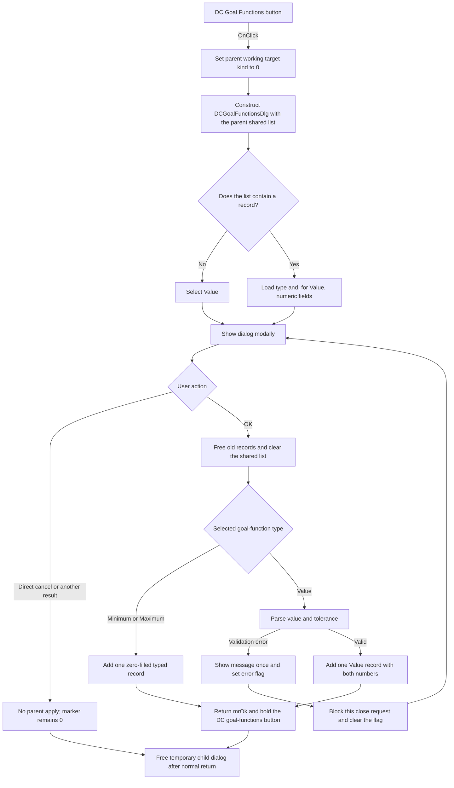

# &DC Goal Functions...

> Analysis status: Recovered source and Delphi form resources reviewed.

## Control

| Property | Recovered value |
| --- | --- |
| Form | AnalModeRangeDlg |
| Component path | AnalModeRangeDlg.Notebook.tsOptimization.GroupBox3.btnDCGFEdit |
| Control class | TButton |
| Parent group | Optimization/Target |
| Caption | &DC Goal Functions... |
| Hint | Not present in the recovered resource. |
| Handler name | btnDCGFEditClick |
| Handler address | 013ee690 |
| Child dialog | TDCGoalFunctionsDlg, caption `DC Goal Functions` |
| Child choices | Value, Minimum, Maximum |
| Shared data | Parent DC goal-function list at recovered offset `0x10d0` |
| Parent working target kind | `0`, the DC goal-functions choice |
| Graph node | `resource:dfm:AnalModeRangeDlg/AnalModeRangeDlg.Notebook.tsOptimization.GroupBox3.btnDCGFEdit` |
| Handler node | `function:013ee690` |
| Graph layer | UI |

## What happens when clicked

The handler first sets the parent dialog's working target-kind field to `0`.
The four sibling editor handlers write values `0` through `3`; the parent load
and commit paths copy this field from and back to the persistent target-kind
byte. The value `0` therefore selects DC goal functions.

The handler constructs a temporary `TDCGoalFunctionsDlg`. It passes the parent
DC goal-function list at offset `0x10d0` to the child. The child stores this
same list pointer; it does not make a private working copy. The constructor also
passes the recovered global VCL owner to the inherited form constructor.

When the child form is created, it reads the shared list:

- An empty list selects **Value**.
- Each existing record selects `record type - 1` in the radio group. The
  recovered items map record types `1`, `2`, and `3` to **Value**,
  **Minimum**, and **Maximum**.
- A type `1` record also loads its value and tolerance into `feValuePar` and
  `feTolerance`. The resource labels the tolerance as `Tol.` and `[%]`.

The parent then executes the dialog modally. The child performs the data update
inside its OK handler, before the modal call returns. The parent tests the
returned modal result.

### Accepted path

The built-in OK button has modal result `mrOk` and calls `btnOKClick`. That
handler frees every existing record, clears the shared list, and allocates one
new 41-byte record. It stores the selected radio index plus one as the record
type and zeroes the other 40 bytes. For **Value**, it also parses the two float
edits and stores the value and tolerance in the record. For **Minimum** or
**Maximum**, it leaves the numeric record fields zero. It then adds the record
to the same list that the parent supplied.

After `ShowModal` returns `1` (`mrOk`), the parent clears the font style on all
four optimization-target buttons and applies the recovered bold style to
`btnDCGFEdit`. This is the visible DC goal-functions selection state.

### Cancel and other modal results

The resource defines `btnCancel` as a built-in `bkCancel` button with no custom
click handler. If the modal result is not `1`, the parent does not call the
button-style selection helper. A direct cancel before an OK attempt therefore
leaves the shared list and the visible selection unchanged. It does not restore
the working target-kind field, which remains `0` after this click. A later
cancel of the parent dialog can still discard the parent's staged state, but
this child handler does not do that work.

### Validation and error path

Both float edits send `OnError` to `EditFloatError`. The error path displays
the supplied validation message once and sets a child error flag. The child's
`FormCloseQuery` permits closure only when this flag is clear. It then clears
the flag, so the user can correct the value and try again.

The recovered OK handler clears the shared list before it parses the numeric
fields for a **Value** record. This update is not transactional. The recovered
function has no rollback block if parsing reports an error, and the source does
not establish whether the parser interrupts the handler or returns a fallback
value. A cancel after such a failed OK attempt therefore cannot be treated as a
proven unchanged-list path. The parent click handler also has no explicit
exception or recovery block.

After any normal modal return, the parent calls the nil-safe Delphi destruction
helper on its temporary child-dialog reference. The child does not free the
shared list object. The parent manages that list and its ownership flag; its
destructor frees the records and list only when the recovered flag at `0x744`
marks the list as parent-owned.

## Click flow

## Handler evidence

- Handler source: [FUN_013ee690](../../../DecompiledSources/Tina16/functions/00000000013EE690__FUN_013ee690.c)
- Child constructor: [FUN_013eb320](../../../DecompiledSources/Tina16/functions/00000000013EB320__FUN_013eb320.c)
- Child input loader: [FUN_013eb440](../../../DecompiledSources/Tina16/functions/00000000013EB440__FUN_013eb440.c)
- Child OK commit: [FUN_013eb510](../../../DecompiledSources/Tina16/functions/00000000013EB510__FUN_013eb510.c)
- Float-edit error event: [FUN_013eb600](../../../DecompiledSources/Tina16/functions/00000000013EB600__FUN_013eb600.c)
- Child close guard: [FUN_013eb620](../../../DecompiledSources/Tina16/functions/00000000013EB620__FUN_013eb620.c)
- Parent selection helper: [FUN_013ee4e0](../../../DecompiledSources/Tina16/functions/00000000013EE4E0__FUN_013ee4e0.c)
- Parent cleanup: [FUN_013ec960](../../../DecompiledSources/Tina16/functions/00000000013EC960__FUN_013ec960.c)
- Recovered form evidence: [ui-evidence.json](../../../DecompiledSources/Tina16/resources/dfm/ui-evidence.json)
- Recovered role: Opens and applies the DC goal-functions editor for an optimization target.
- Complexity: complex
- Distinct outgoing calls: 3

## Direct calls

- `function:00410f20` — Nil-safe Delphi object destruction helper.
- `function:013eb320` — Constructs the DC Goal Functions dialog over the
  supplied shared list.
- `function:013ee4e0` — Selects one optimization-target button by font style.

## Resource evidence

- The parent group caption is `Optimization/Target`.
- The child form caption is `DC Goal Functions`.
- `rgDCGoalFuncs` contains `Value`, `Minimum`, and `Maximum`.
- `feValuePar` starts with text `0`.
- `feTolerance` starts with text `5` and has the labels `Tol.` and `[%]`.
- The child defines built-in OK, Cancel, and Help buttons.
- No hint, image reference, or extracted glyph is present for `btnDCGFEdit`.

## Analysis limits

- The recovered types have no field names. List and state identities use
  offsets, sibling-handler comparisons, form resources, and matching readers
  and writers.
- The source proves that modal result `1` is the accepted branch and the child
  uses a built-in OK button. `mrOk` is the Delphi semantic name for this result.
- The source does not show an explicit exception-recovery or rollback path for
  a failed numeric parse after the shared list is cleared.
- The recovered global owner passed to the child constructor is not named, so
  this article does not assign it a more specific application identity.
