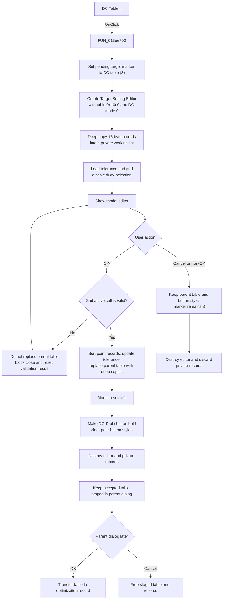

# DC &Table...

> Analysis status: Evidence-backed source review complete.

## Control

| Property | Recovered value |
| --- | --- |
| Form | AnalModeRangeDlg |
| Component path | AnalModeRangeDlg.Notebook.tsOptimization.GroupBox3.btnDCTableEdit |
| Control class | TButton |
| Caption | DC &Table... |
| Hint | Not present in the recovered resource. |
| Text | Not present in the recovered resource. |
| Handler name | btnDCTableEditClick |
| Handler address | 013ee700 |
| Graph node | `resource:dfm:AnalModeRangeDlg/AnalModeRangeDlg.Notebook.tsOptimization.GroupBox3.btnDCTableEdit` |
| Handler node | `function:013ee700` |
| Graph layer | UI |

## What happens when clicked

The button opens `TCplxForm11`, whose recovered caption is **Target Setting Editor**. Before it creates the editor, the handler sets the parent dialog's pending optimization-target marker at offset `0x108c` to `3`. The parent load path maps value `3` to the DC-table selector.

The handler passes the parent table at offset `0x10c0` to the editor constructor and selects mode `0`. The neighboring **AC Table...** handler passes the same table and mode `1`. `TCplxForm11.FormCreate` disables `rgMeasUnit` only for mode `0`, so this is the DC configuration. The editor does not read or write the parent's saved dB/V byte in this mode.

The constructor stores the supplied table pointer and creates private editor collections. On form creation, the editor allocates a new 16-byte record for each supplied table record and copies both 8-byte fields into it. It edits this private working list. It also loads the first table value into the tolerance edit and populates the two-column attribute grid.

### OK and commit

The editor's OK handler first asks the attribute grid to finish and validate its active cell. On success, it:

1. preserves the first special table record and sorts the remaining records in ascending order by their first floating-point value;
2. writes the tolerance edit value to the first working record;
3. frees and clears every record in the supplied parent table; and
4. deep-copies all working records back into the supplied table.

The modal result then returns `1` (`mrOk`) to `FUN_013ee700`. The parent handler clears the selection style from all four optimization-target buttons and makes `btnDCTableEdit` bold. It then destroys the child editor and its private records.

The accepted table is still staged in `AnalModeRangeDlg`. This click does not directly update the application optimization collection. When the parent dialog is later accepted on the Optimization page, its save path transfers the table to the selected optimization record. If the parent dialog is discarded before ownership transfers, its destructor frees the staged table and records.

### Cancel, validation, and errors

Cancel does not run the child OK handler. The private edits are freed with the editor, while the supplied parent table and the four button styles remain unchanged. The target marker was set to `3` before the editor opened and is not restored. Child cancel is therefore not a complete rollback: a later parent OK copies marker `3` into the selected target state.

If the grid cannot finish its active-cell edit, the OK handler stores a nonzero validation result and does not replace the parent table. `TCplxForm11.FormCloseQuery` sets `CanClose` to false, clears the validation result, and keeps the editor open for correction. Cancel after this blocked OK still discards only the private working copy.

The parent wrapper has no custom error message or local exception recovery. Unexpected constructor, allocation, grid, or modal exceptions can propagate and can bypass the wrapper's explicit child destruction. The editor initialization also assumes that the supplied table has a first record; the parent load path normally creates a default first record when needed.

## Click flow

## Handler evidence

- Source: [DecompiledSources/Tina16/functions/00000000013EE700__FUN_013ee700.c](../../../DecompiledSources/Tina16/functions/00000000013EE700__FUN_013ee700.c)
- Recovered role: Opens and applies the DC target-table editor for an optimization target.
- Current graph summary: Handles 1 Delphi UI event: AnalModeRangeDlg.Notebook.tsOptimization.GroupBox3.btnDCTableEdit.OnClick.
- Current graph behavior: The checked-in graph does not yet contain the source-derived modal, validation, and commit behavior in this article.
- Current graph evidence: The DFM binding, button and group captions, direct call edges, sibling AC handler, child resource, and recovered child lifecycle establish the behavior.
- Complexity: complex
- Distinct outgoing calls: 3

## Direct calls

- `function:00410f20` — Nil-safe Delphi object destruction helper
- `function:013e70f0` — [Constructs the Target Setting Editor](../../../DecompiledSources/Tina16/functions/00000000013E70F0__FUN_013e70f0.c), stores the supplied table, and selects DC mode
- `function:013ee4e0` — [Clears all four target-button styles and selects the supplied button](../../../DecompiledSources/Tina16/functions/00000000013EE4E0__FUN_013ee4e0.c)

## Related child and parent paths

- [`FUN_013e7930`](../../../DecompiledSources/Tina16/functions/00000000013E7930__FUN_013e7930.c) deep-copies the table, initializes tolerance and grid data, and disables `rgMeasUnit` for mode `0`.
- [`FUN_013e7bc0`](../../../DecompiledSources/Tina16/functions/00000000013E7BC0__FUN_013e7bc0.c) validates, sorts, updates tolerance, and replaces the supplied table with deep copies.
- [`FUN_013e7290`](../../../DecompiledSources/Tina16/functions/00000000013E7290__FUN_013e7290.c) blocks a close request after failed validation and resets the validation result.
- [`FUN_013e71f0`](../../../DecompiledSources/Tina16/functions/00000000013E71F0__FUN_013e71f0.c) frees the private working records and collections without freeing the supplied parent table.
- [`FUN_013ecee0`](../../../DecompiledSources/Tina16/functions/00000000013ECEE0__FUN_013ecee0.c) copies the pending target marker into parent optimization state during parent OK preparation.
- [`FUN_013ed640`](../../../DecompiledSources/Tina16/functions/00000000013ED640__FUN_013ed640.c) transfers the staged table to the new or edited optimization record when the parent is accepted.
- [`FUN_013ec960`](../../../DecompiledSources/Tina16/functions/00000000013EC960__FUN_013ec960.c) frees staged table records when ownership did not transfer.

## Resource evidence

- Kind: Not present in the recovered resource.
- Modal result: Not present in the recovered resource.
- Checked state: Not present in the recovered resource.
- List items: Not present in the recovered resource.
- Image reference: Not present in the recovered resource.
- Extracted glyph: None.
- Button caption: **DC Table...**.
- Parent tab and group captions: **Optimization** and **Optimization/Target**.
- Child form: `TCplxForm11`, caption **Target Setting Editor**.
- Child controls: an attribute grid, **Add new**, **Remove last**, **Clear all**, **Load**, **Save as**, **Draw**, and **Arrange points** commands, a **Tol. [%]** edit, and built-in OK, Cancel, and Help buttons.
- `rgMeasUnit` contains **dB** and **V**, but the recovered mode check disables it for this DC editor invocation.

## Nearby label candidates

Nearby labels are layout candidates only. They are not proof of behavior.

- No same-parent label candidate is available.

## Analysis limits

- Original Delphi field names are not recovered for parent offsets `0x108c` and `0x10c0`. Their marker and table roles come from the handler, sibling mode mapping, child constructor, parent load/save paths, and selector mapping.
- The attribute-grid validation helper is recovered only by address. The source proves whether commit and close are allowed, but it does not identify every cell rule or cell-specific message.
- The child resource contains hidden **Frequency**, **Magnitude**, **Name**, and **Value** labels. This article does not infer DC table column semantics from hidden labels alone.
- This review did not run the original application. It does not claim a live test of modal behavior, table sorting, validation feedback, or exception presentation.
