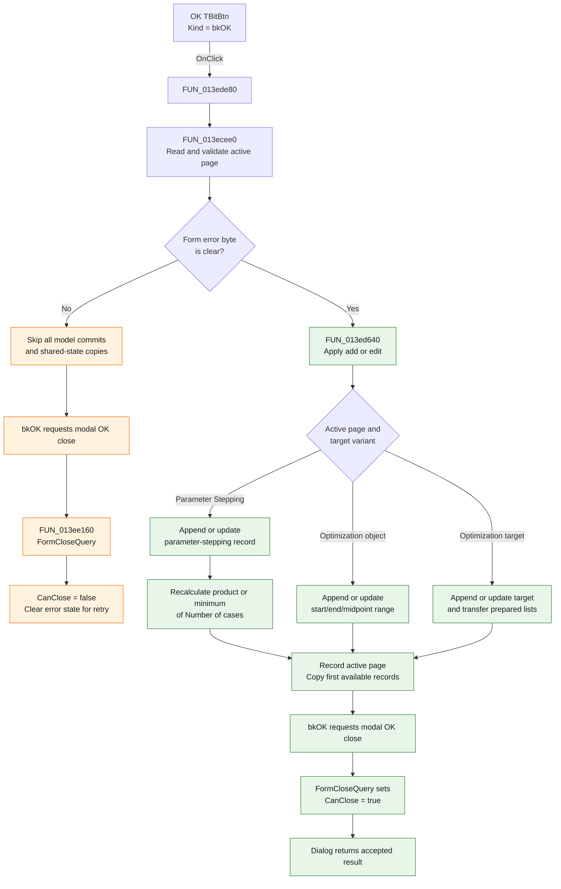

# OKBtn

> Analysis status: Complete. The recovered handler, page validator, model-commit helper, form close query, and Delphi form resources establish the accept and retry behavior.

## Control

| Property | Recovered value |
| --- | --- |
| Form | AnalModeRangeDlg |
| Form caption | Control object selection |
| Component path | AnalModeRangeDlg.OKBtn |
| Control class | TBitBtn |
| Caption | Supplied by `Kind = bkOK`; no explicit caption is present in the recovered resource. |
| Hint | Not present in the recovered resource. |
| Text | Not present in the recovered resource. |
| Handler name | OKBtnClick |
| Handler address | 013ede80 |
| Graph node | `resource:dfm:AnalModeRangeDlg/AnalModeRangeDlg.OKBtn` |
| Handler node | `function:013ede80` |
| Graph layer | UI |

## What happens when clicked

The button validates the current **Parameter Stepping** or **Optimization** page. If validation succeeds, it adds or updates the selected analysis-mode definition, refreshes shared state from the resulting collections, and lets the modal dialog close with the standard OK result. If validation fails, it makes no model or shared-state change and keeps the dialog open for correction.

The handler performs these operations:

1. It calls `FUN_013ecee0` to read and validate the controls on the active page.
2. It tests the form error byte at offset `+0x740`.
3. If that byte is set, it returns before `FUN_013ed640` or any shared-state copy.
4. If validation succeeds, `FUN_013ed640` applies the page-specific new or edited definition to the active analysis object.
5. For Parameter Stepping, it recalculates a shared case-count value from all parameter-stepping records. One global option selects either the product of each record's `Number of cases` or the minimum count. It writes the result and sets the shared mode byte to `2`.
6. It records the active page index in `DAT_0210848c`.
7. For each non-empty parameter-stepping, optimization-object, and optimization-target collection, it copies the first record into its corresponding shared configuration slot.
8. The `bkOK` button then requests the standard modal OK close. `FormCloseQuery` allows the close only while the form error byte is clear.

## Validation rules

| Active page | Proven checks |
| --- | --- |
| Parameter Stepping | Reads **Start value**, **End value**, **Number of cases**, and **Sweep type** from the embedded `TSteppingParametersFrame`. Linear stepping rejects equal start and end values. Logarithmic stepping rejects a non-positive endpoint or equal endpoints. List stepping does not apply those endpoint checks. The float and integer editors also report parse errors through their `OnError` handlers. |
| Optimization | Reads the **Start value** and **End value** editors under **Optimization/Object**, and snapshots the current target selector. A parse error sets the form error byte. The page also rejects `End value <= Start value`. |

The validation path displays only the first recovered error for that attempt. It sets the error byte after it displays the localized error message.

## Mode-specific commits

`FUN_013ed640` uses the active page and the dialog's target variant to select one commit path:

| Selection | Model change |
| --- | --- |
| Parameter Stepping | Allocates and appends a parameter-stepping record when no matching record exists, or overwrites the matching record when this is an edit. The record includes start, end, number of cases, sweep type, and list-stepping data. |
| Optimization, object-range variant | Allocates and appends an optimization-object range, or updates the matching range. It stores start, end, and their arithmetic midpoint. |
| Optimization, target variant | Allocates and appends an optimization-target record, or updates the matching record. It stores the target selector and transfers the three prepared goal/table lists into the record. It then removes list entries that do not apply to the selected target type. |

The helper also contains delete branches for the dialog's separate **Remove** command. `OKBtnClick` does not set the delete-state bytes, so a normal OK click uses the add or update branch established when the dialog opened.

## Click flow

## Handler evidence

- Handler source: [FUN_013ede80](../../../DecompiledSources/Tina16/functions/00000000013EDE80__FUN_013ede80.c)
- Page validation: [FUN_013ecee0](../../../DecompiledSources/Tina16/functions/00000000013ECEE0__FUN_013ecee0.c)
- Parameter-stepping validation: [FUN_014386d0](../../../DecompiledSources/Tina16/functions/00000000014386D0__FUN_014386d0.c)
- Page-specific model commit: [FUN_013ed640](../../../DecompiledSources/Tina16/functions/00000000013ED640__FUN_013ed640.c)
- Active-page index helper: [FUN_006d8150](../../../DecompiledSources/Tina16/functions/00000000006D8150__FUN_006d8150.c)
- Minimum helper: [FUN_00b90650](../../../DecompiledSources/Tina16/functions/0000000000B90650__FUN_00b90650.c)
- Form close query: [FUN_013ee160](../../../DecompiledSources/Tina16/functions/00000000013EE160__FUN_013ee160.c)
- Modal caller example: [FUN_0136a4d0](../../../DecompiledSources/Tina16/functions/000000000136A4D0__FUN_0136a4d0.c)
- Recovered role: Validate and commit the selected analysis-mode range or target, refresh shared analysis state, and accept the dialog.
- Likely Delphi method: `TAnalModeRangeDlg.OKBtnClick`.
- Complexity: complex
- Distinct outgoing calls: 6

The form lifecycle provides the state used by the handler:

- `FormShow` selects the configured notebook page, loads the current values, and enables only the controls for that mode.
- `FUN_013ed020` searches the three model collections. It marks each definition as new or existing and copies an existing match into the form when found.
- `FUN_013ed640` allocates and appends a new record for state `0`, overwrites the existing record for state `1`, and implements the Remove command for state `2`.
- The modal caller treats result `2` as cancellation. Therefore, the standard OK result is an accepted result.

## Direct calls

- `function:004aeac0` — Gets a checked element from an internal pointer-list collection.
- `function:006d8150` — Gets the selected page index from a page control.
- `function:00b90650` — Returns the smaller of two floating-point values.
- `function:013ecee0` — Reads and validates the controls for the active AnalModeRangeDlg page.
- `function:013ed640` — Applies the new, edited, or removed definition to the active analysis-mode collection.
- `function:019a4600` — Resolves the active analysis object that owns the three definition collections.

## Resource evidence

- The form caption is **Control object selection**.
- The notebook pages are **Parameter Stepping** and **Optimization**.
- The embedded stepping frame labels its inputs **Start value**, **End value**, **Number of cases**, and **Sweep type**. Its sweep choices are **Linear**, **Logarithmic**, and **List**.
- The Optimization page labels the numeric pair **Start value** and **End value** under **Optimization/Object**. Its adjacent group is **Optimization/Target**.
- `OKBtn.Kind` is `bkOK`. No explicit caption, hint, image, glyph bytes, or `ModalResult` property is present in the recovered DFM stream.
- `CancelBtn.Kind` is `bkCancel`. This agrees with the modal caller's result-`2` cancellation check.

## No-op, error, and retry behavior

- A numeric parse error, an invalid stepping range, or an optimization end value that is not greater than its start value sets the error byte. The click then skips every model commit, aggregate update, page-index write, and first-record copy.
- The `bkOK` modal close still reaches `FormCloseQuery`. The close query sets `CanClose` to false when the error byte is set, clears the form and stepping-frame error bytes, and leaves the dialog open for another attempt.
- The validation error is not persistent model state. A corrected second click runs validation again.
- Each first-record copy has an explicit non-empty check. If one of the three collections is empty, that copy is a no-op and its existing shared slot is not overwritten.
- The Parameter Stepping aggregate starts at `1.0`. If its collection is empty, the product or minimum path keeps `1.0`; the handler still writes that value and mode byte `2` after a valid page-0 commit path.
- All indexed reads in this handler are protected by collection-count checks or bounded loops. The recovered handler has no separate local exception-recovery branch for a failure inside a commit or copy helper.

## Analysis limits

- The recovered names of the three model record types and shared configuration fields are not available. The roles above come from their data shapes, the page resources, and the add, update, and delete paths.
- One active-page query after `FUN_013ed640` is decompiled without an explicit control operand. Other calls to the same helper pass `Notebook`, and the surrounding page-specific branches agree that index `0` is Parameter Stepping and index `1` is Optimization.
- The source proves that the first records are copied into shared slots. It does not prove which later subsystem consumes each slot, so this article does not assign a broader downstream purpose.
