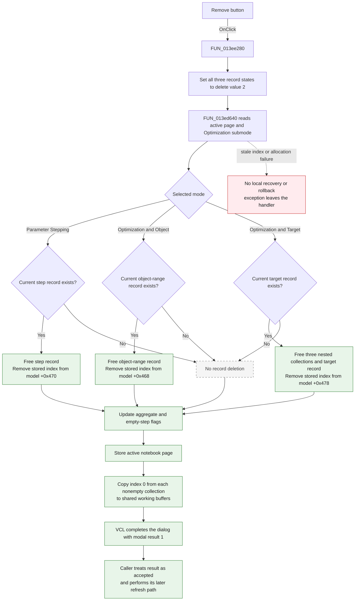

# Remove

> Analysis status: Complete. The handler, common range-state dispatcher, form loader, modal caller, and DFM properties agree on this behavior.

## Control

| Property | Recovered value |
| --- | --- |
| Form | AnalModeRangeDlg |
| Form caption | Control object selection |
| Component path | AnalModeRangeDlg.RemoveBtn |
| Control class | TBitBtn |
| Caption | Remove |
| Hint | Not present in the recovered resource. |
| Handler name | RemoveBtnClick |
| Handler address | 013ee280 |
| Graph node | `resource:dfm:AnalModeRangeDlg/AnalModeRangeDlg.RemoveBtn` |
| Handler node | `function:013ee280` |
| Graph layer | UI |

## What happens when clicked

The button removes the current analysis-range record for the selected dialog
mode. This form has editor fields and a page control, but it has no visible list
control. The current record and its index were found when the dialog loaded.

The handler first writes the value `2` to three record-state bytes. The common
dispatcher interprets `2` as **delete**. It uses the active notebook page and
the Optimization submode to select one branch:

| Dialog mode | Current record | Stored index | In-memory collection |
| --- | --- | --- | --- |
| Parameter Stepping page | `+0x10a8` | `+0x109c` | Application model `+0x470` |
| Optimization page, Object submode | `+0x10b0` | `+0x10a0` | Application model `+0x468` |
| Optimization page, Target submode | `+0x10b8` | `+0x10a4` | Application model `+0x478` |

For the selected branch, the dispatcher checks that the current-record pointer
is not null. It frees the record and removes its stored index from the matching
pointer collection. A Target record also owns three nested collections. The
dispatcher frees their entries and containers before it frees the Target
record.

The click therefore changes the shared in-memory analysis configuration during
the click. It does not wait for a later OK click.

## State updates after deletion

After the dispatcher returns, the handler performs these updates:

1. On the Parameter Stepping page, it recalculates stepping aggregate state.
   In the recovered normal mode, it stores the product of the remaining step
   counts. In the alternate mode, it scans the remaining counts with the
   recovered minimum helper, but this handler does not show a destination write
   for that calculated value.
2. If the Parameter Stepping collection is empty, it clears two global
   stepping-mode bytes.
3. It stores the active notebook page index in `DAT_0210848c`.
4. For each nonempty analysis collection, it copies record index `0` into its
   shared first-record working buffer.

The handler does not select the item that followed the deleted index. Its
replacement rule is **first remaining record**, because all three copy paths
read index `0`. If a collection is empty, its copy path is skipped. This
handler does not clear that collection's old first-record buffer.

## Click flow

## Handler and call evidence

- Click handler: [FUN_013ee280](../../../DecompiledSources/Tina16/functions/00000000013EE280__FUN_013ee280.c)
- Common add, update, and delete dispatcher: [FUN_013ed640](../../../DecompiledSources/Tina16/functions/00000000013ED640__FUN_013ed640.c)
- Dialog record loader: [FUN_013ed020](../../../DecompiledSources/Tina16/functions/00000000013ED020__FUN_013ed020.c)
- Page-index reader: [FUN_006d8150](../../../DecompiledSources/Tina16/functions/00000000006D8150__FUN_006d8150.c)
- Application-model accessor: [FUN_019a4600](../../../DecompiledSources/Tina16/functions/00000000019A4600__FUN_019a4600.c)
- Bounds-checked pointer-list item reader: [FUN_004aeac0](../../../DecompiledSources/Tina16/functions/00000000004AEAC0__FUN_004aeac0.c)
- Bounds-checked pointer-list removal: [FUN_004ae870](../../../DecompiledSources/Tina16/functions/00000000004AE870__FUN_004ae870.c)
- Record memory release: [FUN_004095f0](../../../DecompiledSources/Tina16/functions/00000000004095F0__FUN_004095f0.c)
- Recovered minimum helper: [FUN_00b90650](../../../DecompiledSources/Tina16/functions/0000000000B90650__FUN_00b90650.c)
- Form close query: [FUN_013ee160](../../../DecompiledSources/Tina16/functions/00000000013EE160__FUN_013ee160.c)
- Proven modal caller and refresh path: [FUN_0136a4d0](../../../DecompiledSources/Tina16/functions/000000000136A4D0__FUN_0136a4d0.c)
- Recovered role: Delete the current analysis-range record, rebuild shared first-record state, and accept the modal dialog.
- Likely Delphi method: `TAnalModeRangeDlg.RemoveBtnClick`.
- Complexity: complex
- Distinct direct outgoing calls: 5

The graph records direct calls from the handler to:

- `FUN_013ed640`, which performs the selected deletion.
- `FUN_006d8150`, which reads the active page index.
- `FUN_019a4600`, which returns the shared application model.
- `FUN_004aeac0`, which reads records by index.
- `FUN_00b90650`, which returns the lower of two floating-point values.

## How the current record is established

`FUN_013ed020` scans the same three collections when the dialog is configured.
It matches records to the current control object and analysis context. For a
match, it stores the record pointer and its index in the fields shown above. It
also sets the corresponding state byte to `1`, which the dispatcher interprets
as an existing record. The Remove handler changes all state bytes to `2`, but
the dispatcher processes only the branch selected by the current page and
submode.

The three delete branches have different ownership rules:

- A Parameter Stepping record can own a managed string at record offset
  `+0x11f`. The dispatcher releases it before the record.
- An Optimization/Object record has no nested collection cleanup in this path.
- An Optimization/Target record owns three pointer collections at record
  offsets `+0x13`, `+0x1b`, and `+0x23`. The dispatcher releases all entries
  and containers before the record.

## Resource and modal evidence

- The direct caption is **Remove**. No glyph or hint is present.
- The form pages are **Parameter Stepping** and **Optimization**. The
  Optimization page contains the labeled groups **Optimization/Object** and
  **Optimization/Target**. These labels agree with the dispatch fields and
  model data flow.
- The button has `ModalResult = 1`. A recovered modal caller treats only result
  `2` as cancellation, so result `1` enters its accepted-change path.
- The button also has `Cancel = true`. This makes the button the form's cancel
  button for keyboard routing, although its recovered modal result is the
  accepted value `1`. The DFM stores both properties.
- `FormCloseQuery` records the active record-state byte after the click. For
  this path, that byte remains the delete value `2`.

## Empty, boundary, and selection behavior

- Null current record: the selected delete branch does not free or remove an
  item. The handler still performs its post-processing and completes with
  modal result `1`.
- Empty collection: the handler skips its index-`0` copy. If the Parameter
  Stepping collection is empty, it also clears the recovered stepping-mode
  bytes.
- One-item collection: the only record is deleted. The collection becomes
  empty, so no replacement record is copied by this handler.
- Multiple items: the stored current index is removed. Later entries shift down
  in the pointer collection. The shared working buffer receives item `0`, not
  necessarily the shifted item at the deleted index.
- No visible list is refreshed inside this form. The form closes. One proven
  modal caller enters a separate accepted-result refresh path after `ShowModal`
  returns.

## Persistence timing

- The model collection changes immediately in memory during the OnClick
  handler. This change happens before the modal caller resumes.
- The button closes the dialog with accepted modal result `1`; it does not stage
  the deletion for a later OK click.
- The handler updates shared aggregate and first-record state before the dialog
  returns.
- No file, registry, database, or stream write is present in this handler or
  the deletion dispatcher. Durable storage timing is not established here.

## Error behavior

- The pointer-list removal validates the stored index. A stale or out-of-range
  index enters the indexed-list exception path.
- Each delete branch frees the current record before it removes the stored
  pointer from the collection. If list removal then fails, this function has no
  rollback and the collection can retain a pointer to released memory.
- Allocation, nested cleanup, list access, and aggregate traversal have no local
  recovery in the click handler. An exception stops later post-processing and
  leaves the handler through Delphi event dispatch.
- The handler does not ask for confirmation and does not validate the editor
  fields before deletion.

## Analysis limits

- Recovered field names are not available for the three model collections and
  shared buffers. Their roles come from the active page, labeled UI groups,
  record loader, ownership, and repeated call-site data flow.
- The recovered source proves one modal caller's accepted-result refresh path.
  Other callers can refresh different views after the dialog closes.
- This path proves immediate in-memory deletion only. It does not prove when a
  later project save writes the change to durable storage.
