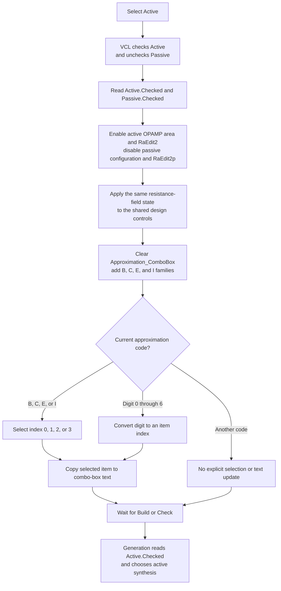

# Active

## Control

| Property | Recovered value |
| --- | --- |
| Form | Analog_form1 |
| Form caption | Filter design |
| Component path | Analog_form1.Active_RadioButton1 |
| Control class | TRadioButton |
| Caption | Active |
| Initial checked state | true |
| Handler name | Active_RadioButton1Click |
| Handler address | 01235b70 |
| Graph node | `resource:dfm:Analog_form1/Analog_form1.Active_RadioButton1` |
| Handler node | `function:01235b70` |
| Graph layer | UI |

## What happens when selected

Selecting **Active** changes the Filter design form from passive-filter inputs to active-filter inputs. The VCL radio-button group makes **Active** and **Passive** mutually exclusive before the click handler reads their checked states. `FUN_01235b70` then applies these states to the dependent controls.

The handler performs these immediate UI changes:

- It disables the passive **Configuration type** area at form offset `0x9d0`. The recovered DFM identifies this area as the initially hidden group that contains **Series inductor** and **Shunt capacitor** choices.
- It enables the active OPAMP area at `0x8d0`. The DFM contains the related **OPAMP type** choices: **Ideal Opamp**, **Standard opamp**, and **Spice opamp**.
- It enables `RaEdit2` at `0x8a0` and disables the alternate, initially hidden `RaEdit2p` at `0x9f0`. Their exit handlers independently identify these offsets and copy their values to corresponding controls on the shared design form.
- It also enables the shared control that corresponds to `RaEdit2` and disables the shared control that corresponds to `RaEdit2p`.

The enabled-state helper compares the requested state with the current state. If they are equal, that individual update is a no-op. A repeated click on an already selected **Active** radio button still clears and rebuilds the approximation list.

## Active approximation list

The handler clears `Approximation_ComboBox` and adds these items in this exact order:

1. Butterworth
2. Chebyshev
3. Elliptic
4. Inverse Chebyshev

It then reads the current approximation code from shared filter state at offset `0x1fa6` and restores the combo-box selection:

| Stored code | Selected index | Displayed item |
| --- | ---: | --- |
| `B` | 0 | Butterworth |
| `C` | 1 | Chebyshev |
| `E` | 2 | Elliptic |
| `I` | 3 | Inverse Chebyshev |
| `0` through `6` | Numeric value of the character | Item at that index, when accepted by the combo-box control |

For a supported branch, the handler also reads the selected item string and sets the combo-box text to that string. The shared text setter skips its write when the text is already equal. For another code, the handler leaves the rebuilt list without an explicit selection or text update. It has no local error message or recovery branch. The guarded numeric conversion receives only a digit, but the handler itself does not check the resulting index against the four items that it added.

## Model use and persistence timing

This click does not build a filter, write a design file, or directly store an active/passive flag in the filter model. It changes the radio-button and dependent UI state.

The later filter-generation path at `FUN_012281f0` reads `Active_RadioButton1.Checked`. It then writes that Boolean to the working filter state at offset `0x1fc8` and selects either the active synthesis routine or the passive synthesis routine. Both **Build** and **Check** reach this path after their validation/preparation call. This is the proven point at which the selected radio state affects the generated model. File persistence is not part of this handler's call path.

## Related Passive choice

The neighboring **Passive** radio button uses `FUN_01235730`. It applies the inverse enabled states: passive configuration and `RaEdit2p` become enabled, while the active OPAMP area and `RaEdit2` become disabled. It rebuilds the approximation list with only **Butterworth**, **Chebyshev**, and **Elliptic**. If the stored approximation code is not `B`, `C`, or `E`, the passive handler changes that code to `B` and selects Butterworth. The Active handler does not perform this normalization.

## Selection flow

## Evidence

- [Active click handler `FUN_01235b70`](../../../DecompiledSources/Tina16/functions/0000000001235B70__FUN_01235b70.c) reads both radio states, changes dependent enabled states, rebuilds the approximation list, maps the stored code to an item index, and updates the displayed text.
- [Passive click handler `FUN_01235730`](../../../DecompiledSources/Tina16/functions/0000000001235730__FUN_01235730.c) performs the inverse control changes, omits Inverse Chebyshev, and normalizes unsupported passive approximation codes to Butterworth.
- [Filter generation setup `FUN_012281f0`](../../../DecompiledSources/Tina16/functions/00000000012281F0__FUN_012281f0.c) reads `Active_RadioButton1.Checked`, stores it in working filter state, and selects active or passive synthesis.
- [Build handler `FUN_0122e740`](../../../DecompiledSources/Tina16/functions/000000000122E740__FUN_0122e740.c) and [Check handler `FUN_01234120`](../../../DecompiledSources/Tina16/functions/0000000001234120__FUN_01234120.c) call the filter-generation setup after their preparation step.
- [Approximation change handler `FUN_0122e8c0`](../../../DecompiledSources/Tina16/functions/000000000122E8C0__FUN_0122e8c0.c) maps the active item indexes back to the shared `B`, `C`, `E`, and `I` codes.
- [`RaEdit2` exit handler `FUN_01233a40`](../../../DecompiledSources/Tina16/functions/0000000001233A40__FUN_01233a40.c) identifies form offset `0x8a0` and its corresponding shared control at `0x720`.
- [`RaEdit2p` exit handler `FUN_01236220`](../../../DecompiledSources/Tina16/functions/0000000001236220__FUN_01236220.c) identifies form offset `0x9f0` and its corresponding shared control at `0x898`.
- [`FUN_0064dbe0`](../../../DecompiledSources/Tina16/functions/000000000064DBE0__FUN_0064dbe0.c) is the enabled-state setter used for every dependent control. [`FUN_0064de00`](../../../DecompiledSources/Tina16/functions/000000000064DE00__FUN_0064de00.c) changes control text only when it differs.
- The recovered DFM gives the form caption **Filter design**, the group caption **Active/passive filter**, the radio captions **Active** and **Passive**, and the initial checked state of **Active**. `Active_RadioButton1` has no hint, picture, glyph, or image index. The separate diagram image resource is not read or changed by this handler.

## Analysis limits

- Original Delphi field names are not present for form offsets `0x8d0` and `0x9d0`. Their active-OPAMP and passive-configuration roles are supported by the symmetric Active/Passive handler data flow and the matching DFM groups.
- The recovered click handler contains no save call and no exception handler. This article does not claim how an unexpected VCL or allocation exception is presented.
