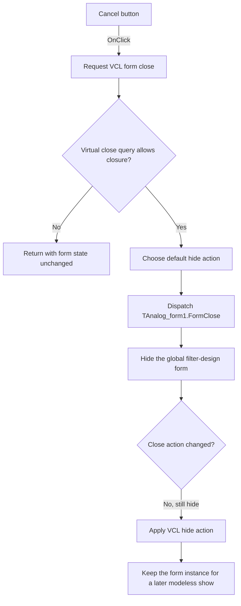

# &Cancel

> Analysis status: Recovered handler, form lifecycle, VCL close path, and Delphi form resource reviewed.

## Control

| Property | Recovered value |
| --- | --- |
| Form | Analog_form1 |
| Form caption | Filter design |
| Component path | Analog_form1.ButtonClose |
| Control class | TBitBtn |
| Caption | &Cancel |
| Kind | bkCancel |
| Glyph count | 2, supplied by the built-in button kind; no embedded custom glyph was recovered. |
| Handler name | ButtonCloseClick |
| Handler address | 01232e80 |
| Form close event | FormClose at `01232e60` |
| Form close-query event | Not bound in the recovered DFM resource. |
| Recovered presentation | Persistent modeless form that is shown and hidden. |
| Graph node | `resource:dfm:Analog_form1/Analog_form1.ButtonClose` |
| Handler node | `function:01232e80` |
| Graph layer | UI |

## What happens when clicked

`ButtonCloseClick` contains one operation: it calls the common VCL form-close
routine. The missing explicit argument at this call site is a decompiler
artifact. The callee requires a form instance, and other recovered call sites
pass one directly.

The common routine has separate modal and modeless paths. A modal form gets
modal result `2`, the Delphi `mrCancel` value. The recovered Analog opening
path uses the modeless show routine, so it continues through the modeless close
path instead. This path first asks the form's virtual close-query method whether
closure is allowed. If the query returns false, it stops before the form's
`OnClose` event and before any hide, minimize, release, or application
termination action. `Analog_form1` has no recovered `OnCloseQuery` event
binding, so there is no resource-bound application query handler to document.

If the query permits closure, the VCL routine selects a default close action
and dispatches the form's `OnClose` event. The recovered form resource uses the
default normal form style. Its default close action is therefore hide. The
`TAnalog_form1.FormClose` handler also calls the VCL hide routine on the global
`Analog_form1` instance. It does not change the close action.

The hide routine clears the form's visible state. The common close routine then
processes the unchanged hide action, which can request the same hidden state a
second time. This operation is idempotent. The filter-design form remains
allocated and its global instance remains available.

The recovered opening path confirms this lifetime model. It positions the same
global form instance and calls the paired VCL show routine, which sets visible
state to true and brings the form to the front. This is a modeless show path,
not a recovered `ShowModal` call. No modal-result consumer is present in the
button's call path.

## Save, cleanup, cancel, and error behavior

- The click handler does not save filter settings, prompt to save, copy staged
  state, clear fields, free objects, or release the form.
- The form's `OnClose` handler only hides the stored form instance. It contains
  no save prompt and no state-cleanup call.
- The button's `bkCancel` kind supplies its Cancel caption and standard button
  behavior. The common close routine can set `mrCancel` for a modal form, but
  the recovered Analog opening path is modeless. Its observed outcome comes
  from the explicit click handler and the form close lifecycle.
- A false result from the virtual close query is the proven no-action branch.
  The recovered sources do not identify a TAnalog-specific reason that would
  make this query false.
- The generic close routine supports other framework actions for main and MDI
  forms. The recovered `Analog_form1` resource and `FormClose` path do not
  select those terminate, minimize, or release actions.
- No error-message or exception-recovery path is present in the click handler
  or `FormClose` handler.

## Click flow

## Handler evidence

- Button handler: [FUN_01232e80](../../../DecompiledSources/Tina16/functions/0000000001232E80__FUN_01232e80.c)
- Common VCL close path: [FUN_00805200](../../../DecompiledSources/Tina16/functions/0000000000805200__FUN_00805200.c)
- Analog form `OnClose`: [FUN_01232e60](../../../DecompiledSources/Tina16/functions/0000000001232E60__FUN_01232e60.c)
- VCL hide wrapper: [FUN_00805990](../../../DecompiledSources/Tina16/functions/0000000000805990__FUN_00805990.c)
- VCL visibility setter: [FUN_007fdf50](../../../DecompiledSources/Tina16/functions/00000000007FDF50__FUN_007fdf50.c)
- Paired modeless show wrapper: [FUN_008059a0](../../../DecompiledSources/Tina16/functions/00000000008059A0__FUN_008059a0.c)
- Recovered opening branch: [FUN_0122db90](../../../DecompiledSources/Tina16/functions/000000000122DB90__FUN_0122db90.c)
- Recovered form evidence: [ui-evidence.json](../../../DecompiledSources/Tina16/resources/dfm/ui-evidence.json)
- Recovered role: Requests closure of the modeless Analog Filter Design form.
- Complexity: simple
- Distinct outgoing calls: 1

## Direct calls

- `function:00805200` — Runs the VCL close-query and close-action pipeline.

## Resource evidence

- `Analog_form1` has caption `Filter design` and binds `OnClose` to
  `FormClose` at `01232e60`.
- The form resource has no `OnCloseQuery` binding.
- `ButtonClose` has caption `&Cancel`, kind `bkCancel`, and two standard glyph
  states.
- No hint, image reference, or embedded custom glyph is present.
- The nearby `leptek` label is a layout candidate only and has no proven
  relation to this close command.

## Analysis limits

- The decompiler omitted the implicit form argument at the two parameterless
  close call sites. The callee signature, the UI bindings, and explicit form
  arguments at other call sites establish that these are form-close requests.
- A class can override a virtual close-query method without a DFM event. The
  recovered graph does not resolve the virtual call to a TAnalog-specific
  override, so this article does not invent a save prompt or veto reason.
- The common VCL close routine contains modal, main-form, and MDI-form branches.
  They describe framework capability, not the observed Analog form outcome.
