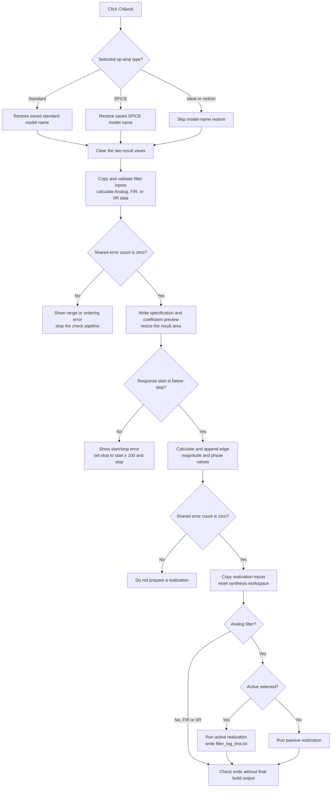

# Ch&eck

## Control

| Property | Recovered value |
| --- | --- |
| Form | Analog_form1 |
| Form caption | Filter design |
| Component path | Analog_form1.CheckBitBtn2 |
| Control class | TBitBtn |
| Caption | Ch&eck |
| Hint | Not present in the recovered resource. |
| Glyph or image | Not present in the recovered resource. |
| Handler name | CheckBitBtn2Click |
| Handler address | 01234120 |
| Graph node | `resource:dfm:Analog_form1/Analog_form1.CheckBitBtn2` |
| Handler node | `function:01234120` |
| Graph layer | UI |

## What happens when clicked

**Check** validates the current Filter design inputs, calculates the selected filter, and writes a preview report. It can also calculate the edge-frequency response and prepare an analog active or passive realization. It does not run the final diagram, macro, or netlist build steps that the neighboring **Build** button runs.

Before the calculation, `FUN_01234120` restores the saved op-amp names for the selected op-amp type. The recovered `TAnalog_form1` field table maps offsets `0x8e8`, `0x8f0`, `0x8f8`, and `0x900` to `StandardOPAMP`, `SPICEOPAMP`, `OpampComboBox1`, and `SpiceOpampComboBox2`. If **Standard opamp** is selected, the handler puts the saved standard model name in `OpampComboBox1`. If **Spice opamp** is selected, it puts the saved SPICE model name in `SpiceOpampComboBox2`. If neither option is selected, such as when **Ideal Opamp** is selected, both assignments are skipped. The shared text setter also skips an assignment when the text is already equal.

The handler then clears two result views and calls `FUN_0122db90(form, 1)`. This call performs the main check-mode preparation:

- It copies the selected low-pass, high-pass, band-pass, or band-stop attenuation and frequency fields into the shared filter record.
- It validates field ranges and the required pass-band and stop-band ordering. Field errors use messages in the form **Value has to be between ...** with a field-specific error title. A stop/pass relationship error uses **Wstop-Wpass ERROR**.
- It converts valid frequency values to angular frequency and dispatches the Analog, FIR, or IIR filter calculation.
- In check mode `1`, a successful calculation resizes and invalidates the result area, then writes a report for the selected implementation, approximation, selectivity, gains, frequencies, length or order, overall gain, and recovered coefficients.

The click handler resizes the result window after this call. If the shared error count is nonzero, it stops here. It does not calculate the edge response or prepare a realization.

## Edge-frequency check

When the first stage succeeds, `FUN_01175da0` validates the response display's start and stop frequencies. The start value must be less than the stop value. If it is not, the function shows **Start freq ... >= Stop Freq ...**, changes the stop value to 100 times the start value, sets the shared error count, and prevents the later realization step.

For a valid display range, the call calculates the complex response at the selected filter's pass-band and stop-band edges. It appends an **Edge Frequency Response** section to both result views. The section contains magnitude and phase values for two edges in low-pass or high-pass mode, or four edges in band-pass or band-stop mode.

## Realization and build boundary

If the shared error count is still zero after the edge-frequency check, `FUN_012281f0` copies the capacitance, resistance, and display-frequency values to shared state and resets the synthesis workspace. For an Analog filter, it then reads **Active** versus **Passive** and runs the corresponding realization routine:

- The active branch runs active-filter synthesis and finalizes its model when synthesis succeeds. It writes `filter_log_tina.txt` after the synthesis call, including when that call reports an error.
- The passive branch runs passive-filter synthesis and finalizes its model only when synthesis succeeds.
- For FIR and IIR filters, this function resets and fills the shared setup values but does not enter either analog realization branch.

The sibling **Build** handler continues from the same validation, edge-response, and realization sequence into `FUN_01228900` and `FUN_00805200`. **Check** does not call either function. Therefore, this click can update the shared calculated filter, preview text, response data, synthesis workspace, and active-filter log, but it does not complete the selected build target or close the form.

## Click flow

## Evidence

- [Check handler `FUN_01234120`](../../../DecompiledSources/Tina16/functions/0000000001234120__FUN_01234120.c) restores op-amp selections, clears the result views, runs the three gated calculation stages, and checks the shared error count between them.
- [Filter validation and calculation `FUN_0122db90`](../../../DecompiledSources/Tina16/functions/000000000122DB90__FUN_0122db90.c) reads the filter inputs, validates ranges and ordering, calculates the selected filter type, and requests the check-mode report only for mode `1`.
- [Range validator `FUN_0122f7c0`](../../../DecompiledSources/Tina16/functions/000000000122F7C0__FUN_0122f7c0.c) constructs the field-specific range error messages.
- [Check report writer `FUN_0118c1f0`](../../../DecompiledSources/Tina16/functions/000000000118C1F0__FUN_0118c1f0.c) clears and fills both result views with the recovered filter specification and coefficient headings.
- [Edge-response coordinator `FUN_01175da0`](../../../DecompiledSources/Tina16/functions/0000000001175DA0__FUN_01175da0.c), [display-range validator `FUN_011762d0`](../../../DecompiledSources/Tina16/functions/00000000011762D0__FUN_011762d0.c), [edge evaluator `FUN_0115f5b0`](../../../DecompiledSources/Tina16/functions/000000000115F5B0__FUN_0115f5b0.c), and [edge report writer `FUN_0115fb90`](../../../DecompiledSources/Tina16/functions/000000000115FB90__FUN_0115fb90.c) establish the range gate and the magnitude and phase output.
- [Realization setup `FUN_012281f0`](../../../DecompiledSources/Tina16/functions/00000000012281F0__FUN_012281f0.c) reads the active choice, resets shared state, dispatches active or passive analog synthesis, and writes the active-filter log.
- [Build handler `FUN_0122e740`](../../../DecompiledSources/Tina16/functions/000000000122E740__FUN_0122e740.c) proves the boundary: it uses the same gated calls, then adds `FUN_01228900` and `FUN_00805200`; the Check handler does not.
- The recovered DFM evidence gives the form caption **Filter design**, the button caption **Ch&eck**, the neighboring **Build** caption, the op-amp choice captions, and the combo-box identities. The Check button has no hint, picture, glyph, or image reference. Its distant `leptek` label candidate is hidden and does not support the button behavior.

## Analysis limits

- The recovered code identifies both result views by object offsets and repeated report writes, but it does not recover their original Delphi field names.
- The exact file or schematic effects of the final Build-only functions are outside this control's call path. This article only states that Check does not call them.
- The handler has no local exception handler. This article does not claim how an unexpected VCL, allocation, or calculation exception is presented.
