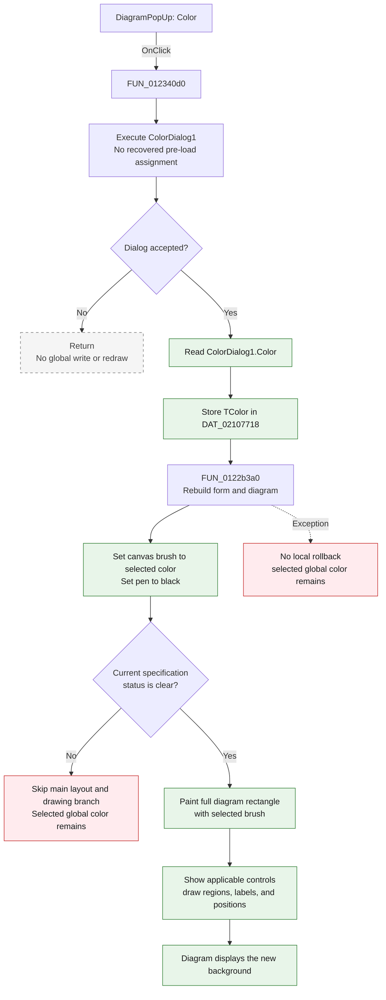

# Color

> Analysis status: Complete. The recovered click handler, color-dialog component, diagram refresh, canvas drawing path, mouse interaction path, and form initialization establish the behavior.

## Control

| Property | Recovered value |
| --- | --- |
| Form | Analog_form1 |
| Form caption | Filter design |
| Component path | Analog_form1.DiagramPopUp.Color1 |
| Parent control | DiagramPopUp (`TPopupMenu`) |
| Control class | TMenuItem |
| Caption | Color |
| Hint | Not present in the recovered resource. |
| Text | Not present in the recovered resource. |
| Handler name | Color1Click |
| Handler address | 012340d0 |
| Graph node | `resource:dfm:Analog_form1/Analog_form1.DiagramPopUp.Color1` |
| Handler node | `function:012340d0` |
| Graph layer | UI |

## What happens when clicked

The menu item opens the form's `ColorDialog1`. If the user accepts a color, the handler stores that `TColor` as the Analog filter-design diagram's in-process background color and rebuilds the specification diagram. If the user cancels, the handler returns without changing application state or redrawing the diagram.

The accepted path performs these operations:

1. It calls the color dialog's virtual `Execute` method through the `TColorDialog` object at form offset `+0x860`.
2. It reads the accepted dialog `Color` property at object offset `+0xd0`.
3. It assigns the color to `DAT_02107718`.
4. It calls `FUN_0122b3a0` with the current image canvas in `DAT_021076a8`.
5. The refresh sets the canvas brush to `DAT_02107718`, sets the pen to black, paints the full diagram rectangle, and rebuilds the filter-type-specific controls, specification regions, labels, and their positions.
6. The final drawing helpers restore their normal foreground colors for specification lines and text.

There is no live diagram-preview call while the color dialog is open. The visible filter diagram changes only after `Execute` returns success.

## Inputs, decisions, and outputs

| Stage | Proven behavior |
| --- | --- |
| Dialog input | `ColorDialog1` is a `TColorDialog` component on `Analog_form1`. The click handler does not assign its `Color` or options before it calls `Execute`. |
| User decision | The Boolean result from `Execute`. False is cancel; true is acceptance. |
| Accepted value | The 32-bit `TColor` value from `ColorDialog1.Color`. |
| Application state | Replaces process-global `DAT_02107718`. It does not write a field in the filter-parameter record. |
| Immediate rendering | Calls the common Analog form refresh. The chosen color is used as the canvas brush for the diagram background before the specification drawing is rebuilt. |
| Later rendering | The image mouse-move path also uses `DAT_02107718` as the canvas pen color while it updates interactive specification markers. |
| Output | An accepted color becomes the diagram background for the current in-process form state. Cancel has no application output. |

## Click flow

## Handler and call evidence

- Click handler: [FUN_012340d0](../../../DecompiledSources/Tina16/functions/00000000012340D0__FUN_012340d0.c)
- Analog form and diagram refresh: [FUN_0122b3a0](../../../DecompiledSources/Tina16/functions/000000000122B3A0__FUN_0122b3a0.c)
- Canvas background and specification drawing: [FUN_011777c0](../../../DecompiledSources/Tina16/functions/00000000011777C0__FUN_011777c0.c)
- Diagram drawing helper: [FUN_0122a880](../../../DecompiledSources/Tina16/functions/000000000122A880__FUN_0122a880.c)
- Interactive image mouse-move path: [FUN_01230460](../../../DecompiledSources/Tina16/functions/0000000001230460__FUN_01230460.c)
- Form initialization and default color: [FUN_0122ec80](../../../DecompiledSources/Tina16/functions/000000000122EC80__FUN_0122ec80.c)
- Recovered role: Choose and apply the Analog filter-design diagram background color.
- Likely Delphi method: `TAnalog_form1.Color1Click`.
- Complexity: simple
- Distinct outgoing calls: 1

The graph records one direct call from the handler:

- `FUN_0122b3a0` rebuilds the Analog filter-design parameter controls and specification plot for the current filter type.

The `TColorDialog.Execute` call is virtual dispatch and is not a direct function-call edge in the current graph.

## Resource evidence

- `Color1` is a `TMenuItem` under `Analog_form1.DiagramPopUp` with caption **Color**.
- `Analog_form1.ColorDialog1` is a `TColorDialog` component. The extracted resource records its design-time position but provides no color or option value.
- The form caption is **Filter design**.
- The diagram is rendered on `Analog_form1.Panel1.Image1`. That image has mouse handlers which also consume the selected background color during interactive drawing.
- The menu item has no recovered hint, image reference, embedded glyph, checked state, or list items.

## Cancel, no-op, error, and persistence behavior

- Cancel is a complete application no-op in this handler. It does not assign `DAT_02107718` and does not call the refresh helper.
- Accepting the same color is not optimized away. The handler stores it again and performs the full refresh.
- The handler does not validate or transform the accepted `TColor`; `TColorDialog` supplies the value.
- The refresh checks the existing filter-specification status. A nonzero status skips its main layout and drawing branch. The handler has already stored the color and does not roll it back.
- The accepted branch has no local exception handler. If the refresh raises an exception, the new global color remains assigned and any UI work already performed by the refresh is not rolled back.
- The color is not written to the DTB filter record, a file, the registry, or a database in the recovered path. Across the recovered functions, `DAT_02107718` is assigned only by this handler and `Analog_form1.FormCreate`.
- `FormCreate` resets the color to raw value `$00F8F8C0`. Therefore, the selected value is in-process UI state and is reset when a new form initialization runs.

## Analysis limits

- The extracted DFM evidence does not expose the design-time `TColorDialog.Color` or options. The recovered Analog form code does not preload the dialog from `DAT_02107718`, so this article does not claim which color is selected when the dialog first opens.
- The source establishes background rendering through the canvas brush and later interactive pen use. It does not give a recovered Delphi field name for `DAT_02107718`.
- The source proves that no recovered persistence path reads this global. It does not establish whether an external framework feature outside the recovered application functions can retain the native dialog's own last selection.
