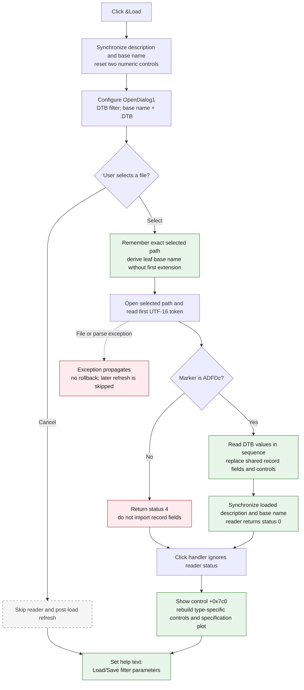

# &Load

> Analysis status: Complete. The recovered click handler, DTB reader, post-load refresh, paired Save command, DFM resource, and glyph agree on this behavior.

## Control

| Property | Recovered value |
| --- | --- |
| Form | Analog_form1 |
| Form caption | Filter design |
| Component path | Analog_form1.GroupBox1.FileLoadButton |
| Parent caption | Filter parameters |
| Control class | TBitBtn |
| Caption | &Load |
| Hint | Not present in the recovered resource. |
| Text | Not present in the recovered resource. |
| Handler name | FileLoadButtonClick |
| Handler address | 0122d240 |
| Graph node | `resource:dfm:Analog_form1/Analog_form1.GroupBox1.FileLoadButton` |
| Handler node | `function:0122d240` |
| Graph layer | UI |

## What happens when clicked

The button opens a file-selection dialog and loads one saved filter design into
the shared Analog Filter Design state. The load replaces the current filter
record fields in place. It does not create a second record or stage a later
commit.

Before the dialog opens, the handler performs these operations:

1. `FUN_01229220` copies the current description editor text into shared state.
   It also creates a default filter base name when the current name is empty or
   has the recovered placeholder pattern. It mirrors that base name to the form
   and to the shared path string.
2. The handler resets two numeric form controls at offsets `+0x870` and
   `+0x878` to zero.
3. It configures `OpenDialog1` at form offset `+0x728`.

The open dialog uses these values:

- Filter: `Filter param file(*.DTB)|*.DTB|All files (*.*)|*.*`
- Selected filter index: `1`, the `.DTB` filter
- Initial file name: the current filter base name plus `.DTB`

The handler assigns the initial value to the dialog's `FileName` property. The
source does not assign a separate directory property. Therefore, the operating
system dialog decides how this relative or absolute initial value is resolved.

## Accepted-path and import behavior

When the user accepts a file, the handler first stores the exact selected path
in `DAT_02107710`. It then extracts the leaf file name, stores it as the current
filter base name, and removes the first period and all text after it. For
example, the recovered operations reduce `Example.Revision.DTB` to `Example`.
If the leaf name has no period, it remains unchanged.

`FUN_01182570` opens the exact selected path and reads the binary DTB record. It
checks the first five UTF-16 code units for `ADFDc`. Only after this check
succeeds does it start to replace the shared filter state. It reads and applies:

- active or passive filter type, approximation, and selectivity;
- the description, order or length, gain, attenuation, and frequency values;
- the coefficient arrays used by the recovered FIR and analog/IIR branches.

The reader writes the values directly into the existing shared filter record.
It also updates the description, active/passive choice, selectivity and
approximation controls, parameter edits, and coefficient-related controls as
it reads them. Frequency values stored in the file are converted to angular
frequency in the model after their display values are assigned.

On a complete valid read, the reader calls `FUN_01229220` again. This keeps the
loaded description and current base name in the form and shared state. This
call also replaces `DAT_02107710` with the base name, so the accepted full path
is not retained there after a successful import.

## Refresh after the reader returns

The click handler does not inspect the reader's return status. After any normal
reader return, it makes the control at form offset `+0x7c0` visible and calls
`FUN_0122b3a0`.

`FUN_0122b3a0` first hides the filter-type-specific parameter controls. It then
uses the current filter type to show the applicable controls, assign their
values, rebuild the recovered specification plot and labels, calculate their
positions, and run the final parameter-display update functions. This is the
proven post-load UI refresh.

Finally, the handler sets the form's help/status text to
`Load/Save filter parameters`. The paired Load and Save focus handlers use the
same text.

## Cancel, validation, and error behavior

- Cancel: the reader and post-load refresh are skipped. The pre-dialog
  description/base-name synchronization and the two numeric resets have
  already occurred. The final help/status text is still assigned. Therefore,
  cancel is not a complete state no-op.
- Wrong format: if any character in the `ADFDc` marker does not match, the
  reader returns status `4` before it writes the imported record fields. The
  handler ignores this status and still performs its post-reader visibility and
  refresh calls. It shows no format-error message in this click path.
- Truncated or unreadable file: the reader uses Delphi checked file operations
  and has no local recovery block. The click handler also has no local recovery
  or rollback. A file exception can leave values that were already read in the
  shared record and controls while later values remain from the old design.
  The post-load refresh and final help text do not run when the exception leaves
  the handler.
- Content validation: the five-character marker is the only explicit format
  gate visible before the in-place writes. The click handler does not run the
  form's save-time parameter validator after import.

## Click flow

## Handler and call evidence

- Click handler: [FUN_0122d240](../../../DecompiledSources/Tina16/functions/000000000122D240__FUN_0122d240.c)
- DTB reader and state applier: [FUN_01182570](../../../DecompiledSources/Tina16/functions/0000000001182570__FUN_01182570.c)
- Description and base-name synchronizer: [FUN_01229220](../../../DecompiledSources/Tina16/functions/0000000001229220__FUN_01229220.c)
- Type-specific control and plot refresh: [FUN_0122b3a0](../../../DecompiledSources/Tina16/functions/000000000122B3A0__FUN_0122b3a0.c)
- Paired DTB/DTX writer: [FUN_01183c40](../../../DecompiledSources/Tina16/functions/0000000001183C40__FUN_01183c40.c)
- Paired Save click: [FUN_01234250](../../../DecompiledSources/Tina16/functions/0000000001234250__FUN_01234250.c)
- Load focus help-text handler: [FUN_01234f70](../../../DecompiledSources/Tina16/functions/0000000001234F70__FUN_01234f70.c)
- Recovered role: Load a DTB filter-parameter record into the shared Analog Filter Design state and refresh the form.
- Likely Delphi method: `TAnalog_form1.FileLoadButtonClick`.
- Complexity: complex
- Distinct outgoing calls: 14

The graph records these application-relevant direct calls from the handler:

- `FUN_01229220` synchronizes the description and default filter base name.
- `FUN_01182570` reads and applies the selected DTB record.
- `FUN_0122b3a0` rebuilds the type-specific controls and specification plot.
- `FUN_00724270` and `FUN_00724380` read and assign the open-dialog file name.
- `FUN_00441920` extracts the selected path's leaf file name.
- `FUN_0064dbe0`, `FUN_0064de00`, and `FUN_00b90440` update visibility, text, and numeric controls.
- The remaining direct calls build, slice, assign, or finalize Delphi UnicodeStrings.

## Resource evidence

- Kind: Not present in the recovered resource.
- Modal result: Not present in the recovered resource.
- Checked state: Not present in the recovered resource.
- List items: Not present in the recovered resource.
- Image reference: Not present in the recovered resource.
- Extracted glyph: [`0009_Analog_form1_Analog_form1_GroupBox1_FileLoadButton_Glyph_Data.png`](../../../glyph/0009_Analog_form1_Analog_form1_GroupBox1_FileLoadButton_Glyph_Data.png)
- Glyph observation: The recovered 32 by 16 raster contains two folder/open-file frames. This agrees with the Load caption and file-dialog handler, but the source establishes the behavior.

## Nearby label candidates

Nearby labels are layout candidates only. They are not proof of behavior.

- No same-parent label candidate is available.

## Analysis limits

- Recovered Delphi field names are not available for controls referenced only
  by form offset. Such controls remain identified by offset in this article.
- The source proves in-process state replacement. It does not show a file,
  registry, or database write during load, so no durable persistence occurs in
  this click path.
- The handler ignores the reader status. The recovered source does not prove
  that another framework-level mechanism reports status `4` to the user.
