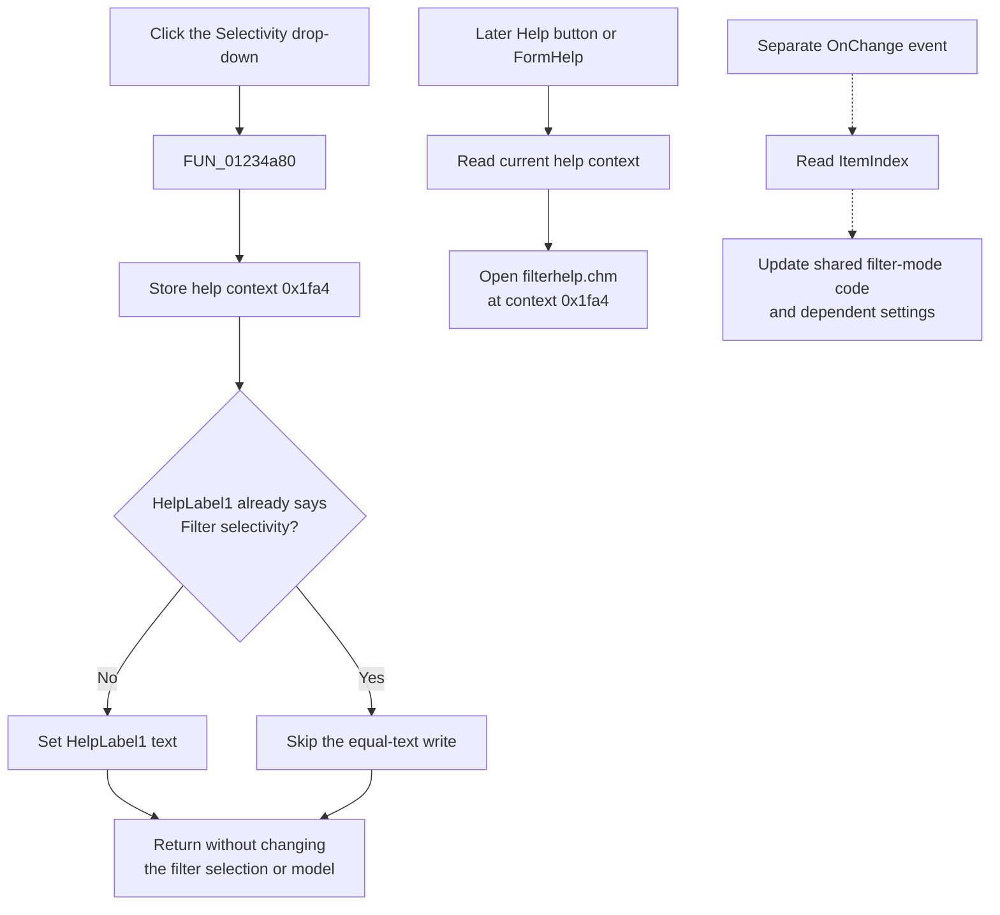

# Selectivity

> Analysis status: Complete. The click handler updates contextual help. The separate `OnChange` handler applies the selected filter mode.

## Control

| Property | Recovered value |
| --- | --- |
| Form | Analog_form1 |
| Form caption | Filter design |
| Component path | Analog_form1.SpecificationGroupBox1.Filter_Selectivity_ComboBox |
| Control class | TComboBox |
| Style | csDropDownList |
| Visible label | Selectivity |
| Items | Lowpass; Highpass; Bandpass; Bandstop |
| Hint | Not present in the recovered resource. |
| Glyph or image | Not present in the recovered resource. |
| Handler name | Filter_Selectivity_ComboBoxClick |
| Handler address | 01234a80 |
| Graph node | `resource:dfm:Analog_form1/Analog_form1.SpecificationGroupBox1.Filter_Selectivity_ComboBox` |
| Handler node | `function:01234a80` |
| Graph layer | UI |

## What happens when clicked

`FUN_01234a80` updates the Filter design form's contextual-help state. It performs two fixed writes for every invocation:

1. It stores help-context value `0x1fa4` through `PTR_DAT_02004700`.
2. It sets `HelpLabel1` to **Filter selectivity** through the change-suppressed VCL text setter.

The recovered `TAnalog_form1` field table maps form offset `0x988` to `HelpLabel1`. The DFM places this label in `Panel1` with an initial placeholder caption of **xxx**. The help button and the form's `OnHelp` handler later read the value stored through `PTR_DAT_02004700` and pass it to the VCL help system with `filterhelp.chm`. The click therefore selects the filter-selectivity help topic, but it does not open the help file by itself.

The handler does not read the combo box, its `ItemIndex`, or its selected text. It has no branch for Lowpass, Highpass, Bandpass, or Bandstop. It also does not write the shared filter record, change specification fields, recalculate a filter, validate values, build output, or save a file.

## Click versus selection change

The combo box has a separate `OnChange` handler at `FUN_01229660`. That function reads the selected item and updates the shared filter-selectivity field at `PTR_DAT_020021e8 + 0x1fa4`. For the recovered non-FIR path, indexes 0 through 3 map to the model codes `L`, `H`, `P`, and `S`, which the later validator reads as Lowpass, Highpass, Bandpass, and Bandstop. It also updates the form description and dependent frequency settings.

These two uses of `0x1fa4` are different:

| Handler | Storage | Proven purpose |
| --- | --- | --- |
| `FUN_01234a80` (`OnClick`) | 32-bit value through `PTR_DAT_02004700` | Current context passed to the help system. |
| `FUN_01229660` (`OnChange`) | Field at `PTR_DAT_020021e8 + 0x1fa4` | Selected filter-mode code in the shared filter record. |

Clicking the control can cause VCL to open the drop-down and a later selection can cause `OnChange`, but the application click handler itself does not apply a selection.

## Click flow

## Evidence

- [Click handler `FUN_01234a80`](../../../DecompiledSources/Tina16/functions/0000000001234A80__FUN_01234a80.c) contains only the context assignment and the `HelpLabel1` text-setter call.
- [Change handler `FUN_01229660`](../../../DecompiledSources/Tina16/functions/0000000001229660__FUN_01229660.c) reads the combo-box selection and writes the separate shared filter-record field.
- [Help button handler `FUN_01233030`](../../../DecompiledSources/Tina16/functions/0000000001233030__FUN_01233030.c) and [form help handler `FUN_01233120`](../../../DecompiledSources/Tina16/functions/0000000001233120__FUN_01233120.c) pass the value through `PTR_DAT_02004700` to the VCL help system with the resolved `filterhelp.chm` path.
- [OnEnter handler `FUN_01234b40`](../../../DecompiledSources/Tina16/functions/0000000001234B40__FUN_01234b40.c) sets the same context and label, then invokes the inherited form update path. [OnExit handler `FUN_01234a10`](../../../DecompiledSources/Tina16/functions/0000000001234A10__FUN_01234a10.c) is identical to the click handler. These sibling events confirm the contextual-help role.
- [VCL text setter `FUN_0064de00`](../../../DecompiledSources/Tina16/functions/000000000064DE00__FUN_0064de00.c) reads the existing text and sends the change path only when the requested text differs.
- The DFM provides the visible **Selectivity** label, the four list items, and the `csDropDownList` style. The nearer **Type:** label belongs to a hidden alternate control at the same layout position. This control has no hint, picture, glyph, or image reference.

## Error and no-op behavior

- If `HelpLabel1` already contains **Filter selectivity**, the text setter performs no text write. The handler still stores the same help-context value.
- No item-index value changes the click path because the handler does not read it.
- The handler has no validation, error message, fallback, or local exception handler.

## Analysis limits

- The CHM topic name behind numeric context `0x1fa4` is not present in the recovered sources. Its use as a help context is proven by the Help-button and form-help call sites.
- Normal VCL drop-down display and item-selection behavior is framework behavior. This article documents the recovered application handler and does not assign that behavior to `FUN_01234a80`.
