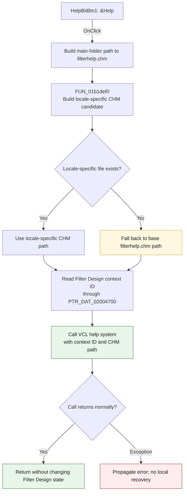

# &Help

> Analysis status: Source reviewed. The CHM file, runtime help context,
> locale-specific path fallback, and VCL help-system call are supported by the
> recovered click and form-help handlers.

## Control

| Property | Recovered value |
| --- | --- |
| Form | Analog_form1 |
| Form caption | Filter design |
| Component path | Analog_form1.HelpBitBtn1 |
| Control class | TBitBtn |
| Caption | &Help |
| Hint | Not present in the recovered resource. |
| Text | Not present in the recovered resource. |
| Handler name | HelpBitBtn1Click |
| Handler address | 01233030 |
| Graph node | `resource:dfm:Analog_form1/Analog_form1.HelpBitBtn1` |
| Handler node | `function:01233030` |
| Graph layer | UI |

## What happens when clicked

`FUN_01233030` opens context help for the **Filter design** form. It builds the
base help-file path from the recovered main TINA folder, a path separator, and
`filterhelp.chm`. It then calls `FUN_01b1def0` to select the help file that is
passed to the application help system.

The resolver splits the base path into its file-name stem and extension. It
builds a locale-specific candidate from that stem, a fixed suffix separator,
the current application locale marker, and the original extension. It uses the
locale-specific file when that candidate exists. Otherwise, it returns the
original `filterhelp.chm` path.

The click handler then reads the 32-bit help context through
`PTR_DAT_02004700` and makes an indirect call on the help-system object held by
the VCL application object. The call shape is the recovered VCL context-help
route: help-system object, context ID, and resolved help-file path.

The form's recovered `OnHelp` handler, `FUN_01233120`, constructs the same CHM
path, uses the same resolver, and passes the same context ID to the same
help-system method. It then returns true and disables a second default-help
call. This parallel route confirms that the button opens the Filter Design
form's context help, not a generic Help contents page.

The exact numeric value stored through `PTR_DAT_02004700` and its named CHM
topic are not present in the recovered sources. The proven context is the one
shared by `Analog_form1.HelpBitBtn1Click` and `Analog_form1.OnHelp`.

## Click flow

## Inputs, decisions, state changes, and outputs

| Stage | Proven behavior |
| --- | --- |
| Help collection | Uses `filterhelp.chm` under the recovered main TINA folder. |
| Locale decision | Uses a locale-specific file only when the derived candidate exists; otherwise uses the original CHM path. |
| Topic input | Reads one runtime context ID through `PTR_DAT_02004700`. The exact number and named topic are not recovered. |
| Launch | Calls the VCL application help-system object with the context ID and resolved CHM path. |
| Filter Design state | Does not read or write filter specifications, controls, build settings, files, or dialog state. |
| Return | Does not close the form, set a modal result, or inspect a success result from the help-system call. |

## Handler evidence

- Click handler: [FUN_01233030](../../../DecompiledSources/Tina16/functions/0000000001233030__FUN_01233030.c)
- Matching form `OnHelp` handler: [FUN_01233120](../../../DecompiledSources/Tina16/functions/0000000001233120__FUN_01233120.c)
- Locale-specific help-file resolver: [FUN_01b1def0](../../../DecompiledSources/Tina16/functions/0000000001B1DEF0__FUN_01b1def0.c)
- UnicodeString concatenation helper: [FUN_00416cd0](../../../DecompiledSources/Tina16/functions/0000000000416CD0__FUN_00416cd0.c)
- Locale-file existence check: [FUN_00440a20](../../../DecompiledSources/Tina16/functions/0000000000440A20__FUN_00440a20.c)
- Recovered role: Opens the Filter Design CHM at the form's runtime help
  context.
- Likely Delphi method: `TAnalog_form1.HelpBitBtn1Click`.
- Complexity: complex.
- Distinct outgoing calls: 3.

## Direct calls and launch route

- `function:00416cd0` - Concatenates three UnicodeString inputs to form the
  main-folder path to `filterhelp.chm`.
- `function:01b1def0` - Resolves a locale-specific help file and falls back to
  the original CHM path when the candidate does not exist.
- `function:00414560` - Finalizes the two local UnicodeString values after the
  help-system call. It does not implement a user-visible command.
- The final context-help invocation is indirect through the help-system object,
  so it does not appear as a direct recovered function-call edge.

## Failure and no-op behavior

- The handler has no input-dependent no-op branch. Every click reaches the
  help-system call unless a preceding operation raises an exception.
- A missing locale-specific CHM file is handled by using the original
  `filterhelp.chm` path.
- The resolver does not verify that the original CHM file exists after this
  fallback. The handler still passes that path to the help system.
- The handler does not inspect a Boolean or status result from the indirect
  help-system call. It has no retry, message, or second help-file fallback.
- The handler has no local exception handler. A path-resolution or help-system
  exception propagates to the caller.
- On a normal return, no recovered Filter Design field or application setting
  changes. A help viewer can open or navigate externally, but its internal
  state is not recovered here.

## Resource and glyph evidence

- Form caption: **Filter design**.
- Button caption: **&Help**.
- Hint: Not present.
- Extracted glyph:
  [`0008_Analog_form1_Analog_form1_HelpBitBtn1_Glyph_Data.png`](../../../glyph/0008_Analog_form1_Analog_form1_HelpBitBtn1_Glyph_Data.png).
- The extracted 36 by 18 bitmap contains two question-mark images, consistent
  with the recovered `NumGlyphs = 2` button state. This corroborates Help intent
  but does not identify the target topic.
- The generated nearby-label candidate `leptek` is hidden and is not used as
  behavioral evidence.

## Analysis limits

- The numeric help context and CHM topic name are not recovered. The article
  identifies the context by its shared use in the Filter Design click and
  `OnHelp` routes.
- The exact locale suffix and current locale marker are not named in the
  decompiled source. Their use in a derived file path and the existence test
  are proven.
- The concrete help-system class and external viewer process are not recovered.
  The VCL application object and repeated context-help call pattern establish
  the framework route.
