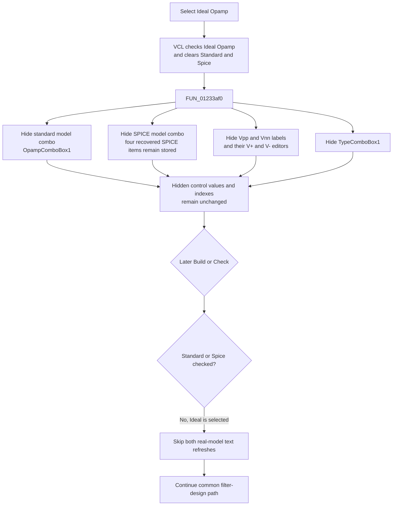

# Ideal Opamp

## Control

| Property | Recovered value |
| --- | --- |
| Form | Analog_form1 |
| Form caption | Filter design |
| Component path | Analog_form1.OpampTypeGroupBox7.IdealOpampCheckBox |
| Control class | TRadioButton |
| Caption | Ideal Opamp |
| Initial checked state | true |
| Handler name | IdealOpampCheckBoxClick |
| Handler address | 01233af0 |
| Graph node | `resource:dfm:Analog_form1/Analog_form1.OpampTypeGroupBox7.IdealOpampCheckBox` |
| Handler node | `function:01233af0` |
| Graph layer | UI |

## What happens when selected

The **Ideal Opamp**, **Standard opamp**, and **Spice opamp** controls are sibling radio buttons under `OpampTypeGroupBox7`. The VCL radio-button behavior checks **Ideal Opamp** and clears the two sibling selections before it calls `FUN_01233af0`.

The click handler then hides all controls that are specific to a real opamp model or to explicit supply values. It makes seven visibility-setter calls with a false state:

| Form offset | Recovered control | Effect |
| --- | --- | --- |
| `+0x8f8` | `OpampComboBox1` | Hides the standard-opamp model selector. |
| `+0x900` | `SpiceOpampComboBox2` | Hides the SPICE-opamp model selector. |
| `+0x920` | `VppLabel8` | Hides the **Vpp** label. |
| `+0x930` | `VnnLabel9` | Hides the **Vnn** label. |
| `+0x918` | `VppEdit` | Hides the positive-supply editor, whose initial text is `V+`. |
| `+0x928` | `VnnEdit` | Hides the negative-supply editor, whose initial text is `V-`. |
| `+0x9a8` | `TypeComboBox1` | Hides the additional opamp-type selector. |

The recovered DFM also marks these seven controls as initially hidden. Therefore, the initial checked **Ideal Opamp** state and the dependent-control visibility agree.

## Relation to Standard and SPICE choices

`FUN_01233b60`, the **Standard opamp** click handler, reads `StandardOPAMP.Checked`. It shows `OpampComboBox1` when selected, hides `SpiceOpampComboBox2`, and shows both supply labels and both supply editors. It also loads the standard model and type lists.

`FUN_01233ea0`, the **Spice opamp** click handler, performs the inverse model-selector choice: it hides `OpampComboBox1`, shows `SpiceOpampComboBox2`, and shows both supply labels and editors. The SPICE selector has these recovered resource items:

1. `NINCS KESZ`
2. `A1_101/BB`
3. `A1-101E/BB`
4. `AMP-UAFE/BB`

The Ideal handler does not call either sibling handler. It does not clear the hidden combo-box text, selected indexes, or supply text. It only changes visibility. The recovered Standard and SPICE click handlers do not explicitly restore `TypeComboBox1` visibility, so this article does not claim when that additional selector becomes visible again.

## Later model use

This click does not create an opamp model, validate a supply value, or write filter-design state. It changes the selected radio button through VCL behavior and hides the controls that are not used for the ideal choice.

The later **Build** handler `FUN_0122e740` and **Check** handler `FUN_01234120` both read `SPICEOPAMP.Checked` and `StandardOPAMP.Checked`. They refresh the corresponding model-selector text only when that choice is checked. With **Ideal Opamp** selected, both sibling radio states are false, so both refresh branches are skipped before the common filter-design calculation continues. The recovered path proves this negative selection effect. It does not identify the lower-level routine that creates the ideal opamp representation.

## Selection flow

## Evidence

- [Ideal click handler `FUN_01233af0`](../../../DecompiledSources/Tina16/functions/0000000001233AF0__FUN_01233af0.c) makes seven unconditional false-state visibility calls and performs no other work.
- [VCL visibility setter `FUN_0064dbe0`](../../../DecompiledSources/Tina16/functions/000000000064DBE0__FUN_0064dbe0.c) compares the requested value with the control byte at `+0xa9`, writes only when the value changes, and sends the VCL visible-changed message `0xb00b`.
- [Standard click handler `FUN_01233b60`](../../../DecompiledSources/Tina16/functions/0000000001233B60__FUN_01233b60.c) selects the standard model combo and shows the supply controls.
- [SPICE click handler `FUN_01233ea0`](../../../DecompiledSources/Tina16/functions/0000000001233EA0__FUN_01233ea0.c) selects the SPICE model combo and shows the supply controls.
- [Standard model change handler `FUN_01234590`](../../../DecompiledSources/Tina16/functions/0000000001234590__FUN_01234590.c), [SPICE model change handler `FUN_01234870`](../../../DecompiledSources/Tina16/functions/0000000001234870__FUN_01234870.c), and [type change handler `FUN_01235550`](../../../DecompiledSources/Tina16/functions/0000000001235550__FUN_01235550.c) identify the three combo-box offsets and their stored selection effects.
- [Build handler `FUN_0122e740`](../../../DecompiledSources/Tina16/functions/000000000122E740__FUN_0122e740.c) and [Check handler `FUN_01234120`](../../../DecompiledSources/Tina16/functions/0000000001234120__FUN_01234120.c) are the proven later consumers of the Standard and SPICE radio states.
- The DFM resource supplies the radio captions, common parent, initial Ideal checked state, dependent-control names, visibility states, editor text, and SPICE list items. No hint, glyph, picture, or image index is present for **Ideal Opamp**.

## No-op and error behavior

- The handler does not read the Ideal radio's checked state. If its event is invoked directly while the control is not selected, it still requests the same seven hidden states.
- `FUN_0064dbe0` is a per-control no-op when the requested hidden state is already set. A repeated Ideal click therefore leaves already hidden controls unchanged.
- The handler has no input-validation branch, error message, return value, or local exception handler. It does not validate the hidden `V+` and `V-` text because it does not read that text.

## Analysis limits

- The source proves the visibility changes and later Standard/SPICE state checks. It does not prove the exact lower-level circuit element that represents an ideal opamp.
- The source does not prove when `TypeComboBox1` becomes visible after another opamp choice. The two sibling click handlers populate or consume it but do not directly call the visibility setter for it.
