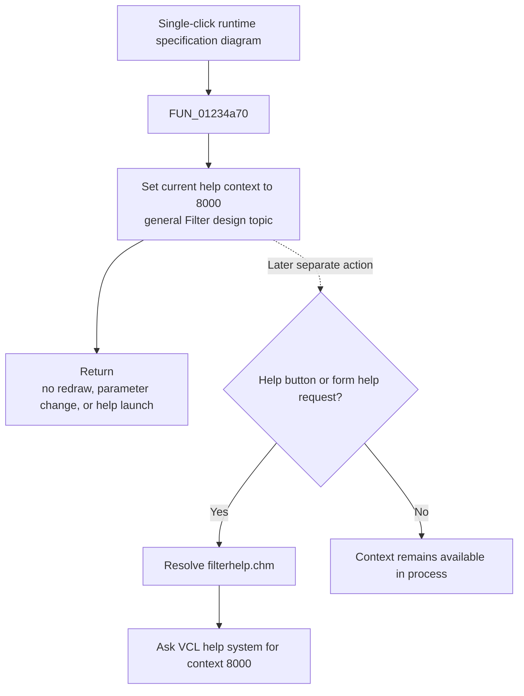

# Image1

> Analysis status: Complete. The recovered click handler, Filter Design help handlers, dynamic diagram refresh path, pointer-event handlers, DFM resource, and extracted-image manifest establish the click's limited context-selection role.

## Control

| Property | Recovered value |
| --- | --- |
| Form | Analog_form1 |
| Form caption | Filter design |
| Component path | Analog_form1.Panel1.Image1 |
| Control class | TImage |
| Position and size | Left `52`, Top `8`, Width `477`, Height `393` |
| Caption | Not present in the recovered resource. |
| Hint | Not present in the recovered resource. |
| Handler name | Image1Click |
| Handler address | 01234a70 |
| Graph node | `resource:dfm:Analog_form1/Analog_form1.Panel1.Image1` |
| Handler node | `function:01234a70` |
| Graph layer | UI |

## What happens when clicked

`FUN_01234a70` performs one unconditional assignment:

```text
PTR_DAT_02004700 := 8000
```

This global holds the current Filter Design help context. Setting it to `8000` selects the general **Filter design** topic after another control may have selected a more specific topic. `FUN_01229060`, the common form initialization/refresh path, pairs the same value with the status text `Filter design`.

The click does not open help directly. The separate **Help** button handler and the form's `OnHelp` handler later resolve `filterhelp.chm` and pass the current value at `PTR_DAT_02004700` to the VCL help system. If either help command follows this image click, it requests context `8000`.

The handler ignores the sender, mouse coordinates, image content, and current filter state. It has no branch and makes no call. It does not redraw the diagram, select a plotted point, change a filter parameter, update status text, or show a dialog.

## Image inspection

There is no embedded image to extract or inspect for this `TImage`:

- The recovered DFM component has only `Left`, `Top`, `Width`, and `Height` properties plus its event bindings.
- `Picture.Data`, `Glyph.Data`, and `Image.Data` are absent.
- `ui_event_glyphs` has no row for `Analog_form1.Panel1.Image1`.
- `glyph/manifest.json` has no resource for this component.

The source instead establishes that the control is a runtime-drawn filter specification diagram. `FUN_0122b3a0` rebuilds the type-specific parameter controls and paints a plot named `Specifications`, including a `Gain` axis whose label can include `(dB)`. `Image1DblClick` calls that refresh routine. The mouse-down, mouse-move, and mouse-up handlers implement marker dragging and commit the resulting frequency and attenuation values. These separate event handlers explain the visible image and its interactive behavior; they are not called by `Image1Click`.

## Click flow



## Evidence

- [Image click handler `FUN_01234a70`](../../../DecompiledSources/Tina16/functions/0000000001234A70__FUN_01234a70.c) assigns `8000` through `PTR_DAT_02004700` and returns. The graph has no outgoing call edge for this function.
- [Filter Design form refresh `FUN_01229060`](../../../DecompiledSources/Tina16/functions/0000000001229060__FUN_01229060.c) assigns the same help-context value and sets the form help/status text to `Filter design`.
- [Help button handler `FUN_01233030`](../../../DecompiledSources/Tina16/functions/0000000001233030__FUN_01233030.c) resolves `filterhelp.chm` and invokes the help system with the current 32-bit value read through `PTR_DAT_02004700`.
- [Form help handler `FUN_01233120`](../../../DecompiledSources/Tina16/functions/0000000001233120__FUN_01233120.c) uses the same CHM and current context for `Analog_form1.OnHelp`.
- [Diagram refresh `FUN_0122b3a0`](../../../DecompiledSources/Tina16/functions/000000000122B3A0__FUN_0122b3a0.c) paints the filter specification plot and updates its type-specific controls and labels.
- [Image double-click handler `FUN_01232e40`](../../../DecompiledSources/Tina16/functions/0000000001232E40__FUN_01232e40.c) calls the diagram refresh. The DFM also binds separate mouse-down, mouse-move, and mouse-up handlers to this image.

## Direct calls

- No direct call edge is present. The only recovered click-handler operation is the 32-bit context assignment.

## Resource evidence

- Embedded picture: None.
- Extracted picture or glyph: None.
- Image list or image index: None.
- Caption, hint, text, and action: Not present.
- Other events: `OnDblClick`, `OnMouseDown`, `OnMouseMove`, and `OnMouseUp` are resolved to separate functions.

## Nearby label candidates

Nearby labels are layout candidates only. They are not proof of click behavior. In this case, the drawing and pointer handlers independently establish the diagram's specification role.

- Rank 1: `A pass1` at distance 60.
- Rank 2: `A stop1` at distance 100.
- Rank 3: `A pass` at distance 228.

## No-op and error behavior

- Repeated clicks are idempotent when the current context is already `8000`.
- The assignment can overwrite a more specific help context selected by another control.
- The handler has no validation, allocation, file access, call result, exception block, or error path.
- A physical pointer gesture can also cause the image's separate mouse handlers to run. Any marker or parameter behavior belongs to those handlers, not to this `OnClick` function.

## Analysis limits

- No static picture is available for visual interpretation. The diagram's meaning comes from the recovered drawing and interaction code, not from an invented or substitute image.
- The recovered source proves that context `8000` is the general Filter Design context used by this form. It does not expose the human-readable CHM topic title stored inside `filterhelp.chm`.
