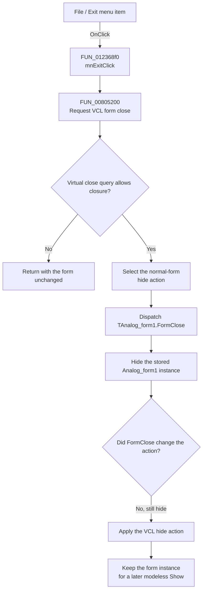

# Exit

> Analysis status: Recovered menu handler, VCL close route, form close event, and modeless form lifetime reviewed.

## Control

| Property | Recovered value |
| --- | --- |
| Form | Analog_form1 |
| Form caption | Filter design |
| Component path | Analog_form1.MainMenu1.File1.mnExit |
| Control class | TMenuItem |
| Caption | Exit |
| Hint | Not present in the recovered resource. |
| Handler name | mnExitClick |
| Handler address | 012368f0 |
| Form close event | FormClose at `01232e60` |
| Form close-query event | Not bound in the recovered DFM resource. |
| Graph node | `resource:dfm:Analog_form1/Analog_form1.MainMenu1.File1.mnExit` |
| Handler node | `function:012368f0` |
| Graph layer | UI |

## What happens when clicked

`mnExitClick` contains one operation. It calls the common VCL form-close routine for `Analog_form1`. The missing explicit form argument in the decompiled handler is a calling-convention artifact. The callee needs a form object, and other recovered call sites pass that object directly.

For this modeless form, the VCL close routine first calls the form's virtual close-query method. If the query returns false, the routine returns before it dispatches `OnClose` or changes form visibility. The DFM resource does not bind an `OnCloseQuery` handler, and the Exit handler contains no confirmation or save call.

If the query permits closure, the normal-form default close action is hide. The routine dispatches `TAnalog_form1.FormClose` with that action. The form handler calls the VCL hide wrapper on the stored global `Analog_form1` instance. It does not change the action. The close routine then applies the unchanged hide action. A repeated hide request leaves the form hidden.

This path does not destroy the form. Other recovered code positions the same global form instance and calls the paired modeless Show routine. Thus, Exit closes the Filter Design view by hiding its persistent form instance. It does not exit the full TINA application on the recovered Analog-form path.

## Click flow

## Close routing and lifetime evidence

- [FUN_012368f0](../../../DecompiledSources/Tina16/functions/00000000012368F0__FUN_012368f0.c) contains only the call to the common close routine.
- [FUN_00805200](../../../DecompiledSources/Tina16/functions/0000000000805200__FUN_00805200.c) implements the VCL form-close pipeline. For a nonmodal form it calls the virtual close query, selects a default close action, dispatches the close event, and then processes the resulting action.
- [FUN_008052e0](../../../DecompiledSources/Tina16/functions/00000000008052E0__FUN_008052e0.c) is the recovered VCL close-query implementation. It returns true by default, permits an installed `OnCloseQuery` event to change the result, and also queries MDI children when the target is an MDI parent.
- [FUN_01232e60](../../../DecompiledSources/Tina16/functions/0000000001232E60__FUN_01232e60.c) is bound to `Analog_form1.OnClose`. Its only operation is to hide the object stored in the global Analog-form reference.
- [FUN_00805990](../../../DecompiledSources/Tina16/functions/0000000000805990__FUN_00805990.c) calls the common visibility setter with false. [FUN_007fdf50](../../../DecompiledSources/Tina16/functions/00000000007FDF50__FUN_007fdf50.c) applies that visible-state change.
- [FUN_0122db90](../../../DecompiledSources/Tina16/functions/000000000122DB90__FUN_0122db90.c) later positions the same global instance and calls [FUN_008059a0](../../../DecompiledSources/Tina16/functions/00000000008059A0__FUN_008059a0.c), the paired modeless Show wrapper. This proves that the close path retains the instance for reuse.

## Confirmation, save, cleanup, and error behavior

- The Exit handler does not call a save routine, copy staged filter data, ask for confirmation, clear fields, release objects, or show an error.
- The form's `OnClose` handler only hides the stored form. It does not change the VCL close action or perform application-specific cleanup.
- The virtual close query is the only proven veto point. A false result returns with the form unchanged.
- The recovered DFM has no `OnCloseQuery` binding. No TAnalog-specific veto or confirmation reason is visible in this call path.
- The common VCL routine has framework branches for modal, main, and MDI forms. A modal close sets a cancel modal result. A main-form close can request application termination. An MDI child can minimize, do nothing, or use another action. The recovered Analog form is shown through the modeless Show path and uses the normal-form hide outcome, so these branches are not the observed Exit result.
- No exception handler or error-recovery branch is present in `mnExitClick` or `FormClose`. The recovered code does not define a command-specific error message.

## Relation to the Cancel button

`Analog_form1.ButtonClose` and this menu item use separate handlers, but both handlers contain only a call to `FUN_00805200`. The Cancel button's built-in `bkCancel` presentation does not add a different cleanup or save path. Both controls route through the same close query, `OnClose`, and hide behavior.

## Handler evidence

- Source: [DecompiledSources/Tina16/functions/00000000012368F0__FUN_012368f0.c](../../../DecompiledSources/Tina16/functions/00000000012368F0__FUN_012368f0.c)
- Recovered role: Routes the Filter Design Exit command through the VCL form-close protocol.
- Current graph summary: Handles `Analog_form1.MainMenu1.File1.mnExit.OnClick`.
- Complexity: simple.
- Distinct outgoing calls: 1.

## Direct calls

- `function:00805200` - Runs the VCL close-query and close-action pipeline.

## Resource evidence

- The DFM resource binds `mnExit.OnClick` to `mnExitClick` at `012368f0`.
- The menu caption is `Exit`, under `MainMenu1.File1` with caption `File`.
- The owning form has caption `Filter design` and binds `OnClose` to `FormClose` at `01232e60`.
- No hint, image, glyph, action, modal result, checked state, or nearby label is present for this menu item.
- Recovered resource data: [ui-evidence.json](../../../DecompiledSources/Tina16/resources/dfm/ui-evidence.json).

## Analysis limits

- A class can override a virtual close-query method without a DFM event. The recovered graph does not resolve this virtual call to a TAnalog-specific override, so this article does not invent a save prompt or a veto reason.
- The common close function contains termination, release, minimize, and modal-cancel branches for other form states. They describe VCL capability and do not establish those outcomes for this modeless Filter Design command.
- The decompiler omitted the implicit form argument at this handler's call site. The form binding, callee behavior, and explicit arguments at other call sites establish the close request.
