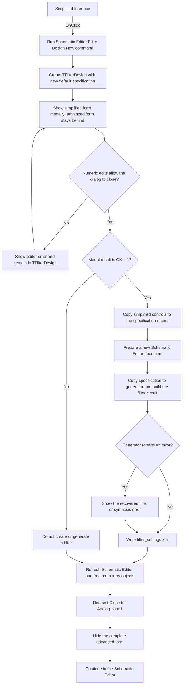

# Simplified Interface

> Analysis status: Source, graph, and form evidence reviewed.

## Control

| Property | Recovered value |
| --- | --- |
| Form | Analog_form1 |
| Component path | Analog_form1.MainMenu1.File1.mnSimplifiedInterface |
| Control class | TMenuItem |
| Caption | Simplified Interface |
| Hint | Not present in the recovered resource. |
| Text | Not present in the recovered resource. |
| Handler name | mnSimplifiedInterfaceClick |
| Handler address | 01236900 |
| Graph node | `resource:dfm:Analog_form1/Analog_form1.MainMenu1.File1.mnSimplifiedInterface` |
| Handler node | `function:01236900` |
| Graph layer | UI |

## What happens when clicked

This command leaves the advanced `TAnalog_form1` filter designer and runs the separate `TFilterDesign` simplified workflow. It does not convert the controls or panels of the current form in place.

`FUN_01236900` first calls `FUN_01c98bf0` with the global `TSchematicEditor` instance. This is the same function that handles **Filter Design New...** in the Schematic Editor. It constructs a `TFilterDesign` form and shows it modally. The advanced `Analog_form1` remains behind the modal dialog until the dialog returns.

The simplified form contains type, approximation, active/passive, OPAMP, and build-target selectors, numeric specification edits, and a preview image in `Panel1`. Its type selector offers Lowpass, Highpass, Bandpass, and Bandstop. Its form-creation path allocates a new specification record and loads type-dependent defaults into the controls. The click handler passes no values from the advanced form. In particular, it does not read any `Analog_form1` edit, radio-button, combo-box, or panel field before it opens `TFilterDesign`.

When the user selects OK, the `TFilterDesign.bOK` handler copies the simplified control values into its internal specification record. The shared command then does these operations:

1. It prepares a new schematic document in the Schematic Editor.
2. It constructs the filter generator and initializes its default state.
3. It copies the accepted simplified specification into the generator. This includes the filter type, the type-specific numeric limits and frequencies, active/passive state, OPAMP choice, and circuit-or-macro build target.
4. It checks for the installed filter template, calculates the filter, and builds the resulting circuit against the current application circuit context.
5. It writes the accepted simplified controls to `filter_settings.xml` in the application settings directory.

The source does not copy the old advanced-interface specification into the simplified dialog. Only values accepted in the simplified dialog are carried forward to the generator and settings file.

If the user selects Cancel or otherwise returns a modal result other than `1`, the shared command skips new-schematic creation, generation, and `filter_settings.xml` output. It still refreshes the Schematic Editor client control and frees the temporary simplified form.

After either modal result, `FUN_01c98bf0` returns to `FUN_01236900`. The handler then calls the VCL form-close path `FUN_00805200` for `Analog_form1`. The form has no recovered `OnCloseQuery` binding. Its `OnClose` handler hides the global `Analog_form1` instance, and the normal VCL close action also selects the hide path. No individual advanced panel is toggled. The complete advanced form becomes hidden, and navigation returns to the Schematic Editor. This also happens after Cancel in the simplified dialog.

Numeric editor errors in `TFilterDesign` set a form error flag and display the editor's error text. `FormCloseQuery` rejects that close attempt and resets the flag, so the simplified form remains open for correction. The outer handler does not run its advanced-form close until the modal dialog can return.

The generator has explicit error messages for missing filter templates, invalid specification limits, synthesis failure, and a filter order greater than 20. The traced shared command receives no success value from the generator. When the generator call returns, it continues to write `filter_settings.xml`, refresh the Schematic Editor, and return to the outer handler. The outer handler has no rollback or reopen branch and still closes the advanced form.

## Click flow

## Handler evidence

- Source: [DecompiledSources/Tina16/functions/0000000001236900__FUN_01236900.c](../../../DecompiledSources/Tina16/functions/0000000001236900__FUN_01236900.c)
- Recovered role: Opens the simplified filter-design workflow and hides the advanced filter-design form after the modal workflow returns.
- Current graph summary: Handles 1 Delphi UI event: Analog_form1.MainMenu1.File1.mnSimplifiedInterface.OnClick.
- Transition evidence: `FUN_01236900` calls `FUN_01c98bf0` with the global Schematic Editor and then calls the VCL close function `FUN_00805200` with its own form instance.
- Dialog evidence: `FUN_01c98bf0` constructs the class whose recovered DFM is `TFilterDesign`, calls its modal-show virtual method, and tests the result against `1`. The DFM identifies `bOK` as `bkOK` and `bCancel` as `bkCancel`.
- Input evidence: The outer handler passes no `Analog_form1` field to the shared command. `TFilterDesign.FormCreate` allocates a new specification record and populates its edits from defaults.
- Acceptance evidence: `TFilterDesign.bOKClick` serializes the simplified controls into form field `0x14c8`. Only modal result `1` sends that record through the generator path and writes `filter_settings.xml`.
- Cancel evidence: A result other than `1` skips `FUN_01c77470`, generator construction, specification copy, generation, and settings output. The refresh and object cleanup remain outside the result branch.
- Navigation evidence: `Analog_form1.OnClose` calls the recovered hide operation for the global advanced form. The source contains no per-panel visibility change in this command.
- Validation evidence: The simplified form's numeric error handlers call `FUN_019d4aa0`. It shows one error message and sets byte `0x811`. `TFilterDesign.FormCloseQuery` rejects the close while that byte is set and then clears it.
- Error evidence: The generation callees contain explicit messages for a missing template, invalid limits or frequency order, synthesis failure, and filter order above 20. `FUN_01c98bf0` has no returned-success test after `FUN_0123bc40`.
- Complexity: moderate
- Distinct outgoing calls: 2

## Direct calls

- `function:00805200` — Runs the VCL close sequence for `Analog_form1`; the normal result is to hide this form.
- `function:01c98bf0` — Opens `TFilterDesign` modally and, on OK, creates and generates a new filter in the Schematic Editor.

## Resource evidence

- Kind: Not present in the recovered resource.
- Modal result: Not present on this menu item. The opened form contains `bkOK` and `bkCancel` buttons.
- Checked state: Not present in the recovered resource.
- List items: Not present on this menu item.
- Image reference: Not present in the recovered resource.
- Extracted glyph: None.
- Current form: `TAnalog_form1`, caption `Filter design`, with the advanced specification, OPAMP, response, and preview controls.
- Opened form: `TFilterDesign`, caption `Filter Design`, positioned at screen center. It contains simplified selectors and numeric fields plus `Panel1.Image` for the preview.

## Nearby label candidates

Nearby labels are layout candidates only. They are not proof of behavior.

- No same-parent label candidate is available.

## Analysis limits

- The exact owner-visible document title after successful generation is not present in the traced source.
- The recovered shared command prepares a new schematic and runs circuit-generation code. This article does not assign names to the generated components beyond the recovered filter-circuit role.
- `filter_settings.xml` stores accepted simplified-interface controls. The source does not prove that it stores the old advanced-interface values or that the simplified form automatically reloads this file on entry.
- The generator reports several errors through message dialogs. Its internal recovery after each calculation error is outside the two-call outer handler, and the outer handler does not inspect a generator status.
