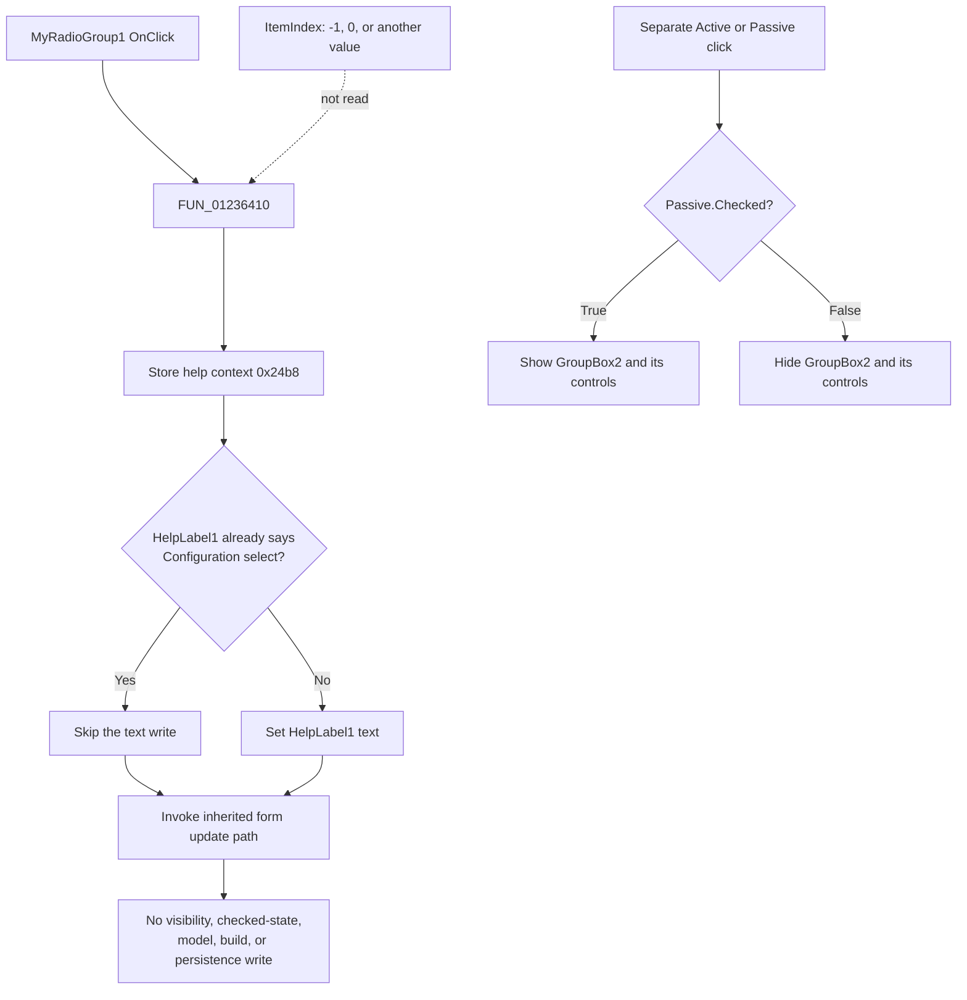

# Configuration type

> Analysis status: Complete. The recovered handler is a contextual-help handler; it does not branch on a configuration index or write filter-model state.

## Control

| Property | Recovered value |
| --- | --- |
| Form | Analog_form1 |
| Form caption | Filter design |
| Component path | Analog_form1.GroupBox2.MyRadioGroup1 |
| Control class | TMyRadioGroup |
| Caption | Configuration type |
| Hint | Not present in the recovered resource. |
| Text | Not present in the recovered resource. |
| Serialized items | None |
| Serialized item index | None |
| Handler name | MyRadioGroup1Click |
| Handler address | 01236410 |
| Graph node | `resource:dfm:Analog_form1/Analog_form1.GroupBox2.MyRadioGroup1` |
| Handler node | `function:01236410` |
| Graph layer | UI |

## What happens when the handler runs

`FUN_01236410` performs the same three operations for every invocation:

1. It writes help-context value `0x24b8` to the shared current-help field.
2. It sets `HelpLabel1` to `Configuration select`. The text setter skips the write when the label already contains that text.
3. It invokes the inherited form update path at virtual-table offset `0x188`. The recovered target sends the form's update message and refreshes the associated control when the inherited test requests it.

The handler does not read its sender, `MyRadioGroup1.ItemIndex`, either radio-button state, the active/passive selection, or any filter-model field. It does not enable, disable, show, hide, or check a control. It also does not call a build, validation, save, or persistence routine.

## Recovered selection structure

`TMyRadioGroup` inherits the standard `TRadioGroup.ItemIndex` field at control offset `+0x4a8`. However, this instance has no `Items.Strings` property and no `ItemIndex` property in the recovered DFM stream. Its parent instead contains two separate `TRadioButton` components:

| Form field | Caption | Initial state | Event evidence |
| --- | --- | --- | --- |
| `SeriesRadioButton1` at `+0x9e0` | Series inductor | Checked | `OnEnter` only; no recovered `OnClick` binding. |
| `ShuntRadioButton1` at `+0x9e8` | Shunt capacitor | Not checked | `OnEnter` only; no recovered `OnClick` binding. |

Therefore, no evidence maps `MyRadioGroup1.ItemIndex` 0 or 1 to these sibling buttons. The click handler has no item-index switch, comparison, or arithmetic. The exact recovered application branches are:

| Item-index condition | Handler branch |
| --- | --- |
| `-1`, the standard no-selection value | The common help-label and inherited-update path. |
| `0` or any other value | The same common path. The handler does not read the value. |
| Invalid value | No application error or fallback branch. The inherited `TRadioGroup` setter clamps values below `-1` to `-1` and values at or above its item count to the last item. With an empty item list, the resulting index is `-1`. |

The sibling radio buttons share a parent, so their normal VCL behavior provides mutual exclusion. That checked-state change is not implemented by `FUN_01236410`.

## Visibility and later consumers

The recovered DFM sets the parent `GroupBox2.Visible` to false. The separate Active and Passive click handlers control this parent area. Both read `Passive_RadioButton2.Checked` and pass it to the VCL visibility setter for `GroupBox2` at form offset `+0x9d0`. The **Configuration type**, **Series inductor**, and **Shunt capacitor** controls are therefore visible when Passive is checked and hidden when it is not checked. This visibility change is not part of `MyRadioGroup1Click`.

No recovered `TAnalog_form1` application method reads `MyRadioGroup1` at `+0x9d8`, `SeriesRadioButton1` at `+0x9e0`, or `ShuntRadioButton1` at `+0x9e8` to select a filter branch. The later filter-generation setup reads the separate Active radio state and chooses active or passive synthesis. The recovered passive synthesis routine branches on the filter-type code for low-pass, high-pass, band-pass, or band-stop processing; it does not receive a proven Series/Shunt selection.

No model state, generated-filter result, or persistent setting can therefore be attributed to this control from the recovered path. An indirect or missing consumer is possible, but it is not present in the available sources.

## Click flow

## Handler evidence

- Handler: [FUN_01236410](../../../DecompiledSources/Tina16/functions/0000000001236410__FUN_01236410.c)
- Inherited form update path: [FUN_0065b6d0](../../../DecompiledSources/Tina16/functions/000000000065B6D0__FUN_0065b6d0.c)
- Change-suppressed text setter: [FUN_0064de00](../../../DecompiledSources/Tina16/functions/000000000064DE00__FUN_0064de00.c)
- Radio-group item-index setter: [FUN_0074b490](../../../DecompiledSources/Tina16/functions/000000000074B490__FUN_0074b490.c)
- Active visibility handler: [FUN_01235b70](../../../DecompiledSources/Tina16/functions/0000000001235B70__FUN_01235b70.c)
- Passive visibility handler: [FUN_01235730](../../../DecompiledSources/Tina16/functions/0000000001235730__FUN_01235730.c)
- Filter-generation setup: [FUN_012281f0](../../../DecompiledSources/Tina16/functions/00000000012281F0__FUN_012281f0.c)
- Passive synthesis dispatch: [FUN_0117a570](../../../DecompiledSources/Tina16/functions/000000000117A570__FUN_0117a570.c)
- Recovered role: Updates the contextual help for the Configuration type area and invokes the inherited form update path.
- Complexity: simple.
- Distinct outgoing calls: 1 in the generated direct-call graph. The inherited virtual call is not a static graph edge.

## Direct calls

- `function:0064de00` - Sets `HelpLabel1` only when its current text differs from `Configuration select`.
- The call through the form virtual table at offset `0x188` resolves to inherited `FUN_0065b6d0` for `TAnalog_form1`.

## Resource evidence

- The group caption is **Configuration type**.
- The two sibling choices are **Series inductor** and **Shunt capacitor**. Series is initially checked.
- The parent group is initially hidden.
- No item string list, item index, hint, image reference, or glyph is present for `MyRadioGroup1`.

## Error and no-op behavior

- If `HelpLabel1` already contains `Configuration select`, the text setter does not write it again. The handler still invokes the inherited update path.
- There is no selection validation, error message, or local exception handler in `FUN_01236410`.
- Because the handler ignores `ItemIndex`, an invalid index does not select an application branch or produce a handler-level error.

## Analysis limits

- The recovered resources prove that the two labeled choices are sibling radio buttons, not serialized items of `MyRadioGroup1`. This article does not invent an index mapping between them.
- No direct or field-mediated model consumer was recovered for the Series/Shunt state. The visible labels suggest passive-filter topology choices, but the captions alone do not prove an implemented synthesis effect.
- The inherited update path is documented only to the recovered message and refresh behavior. Its original VCL method name is not established.
