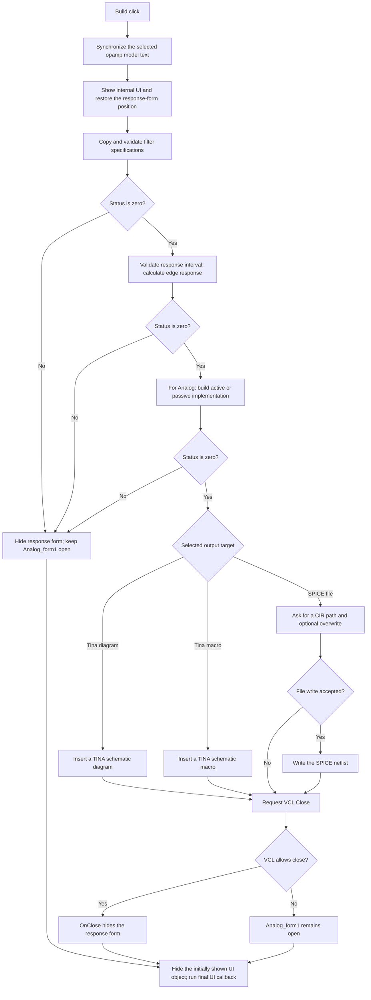

# &Build

## Control

| Property | Recovered value |
| --- | --- |
| Form | Analog_form1 |
| Component path | Analog_form1.NEXTButton1 |
| Control class | TBitBtn |
| Caption | &Build |
| Hint | Not present in the recovered resource. |
| Text | Not present in the recovered resource. |
| Handler name | NEXTButton1Click |
| Handler address | 0122e740 |
| Graph node | `resource:dfm:Analog_form1/Analog_form1.NEXTButton1` |
| Handler node | `function:0122e740` |
| Graph layer | UI |

## What happens when clicked

`NEXTButton1` is a legacy component name. The resource captions the button
`&Build`, and `Analog_form1` contains no page control, tab sheet, notebook,
Back button, or second Next button. The click does not change a page index or
move between a first and last page. It runs the final filter-build command for
this single-form dialog.

The handler first synchronizes the visible opamp selection. If **Spice opamp**
is selected, it copies the selected SPICE model name to `SpiceOpampComboBox2`.
If **Standard opamp** is selected, it copies the selected standard model name
to `OpampComboBox1`. It then shows an internal UI object, sets a shared control
to 10 by 10, and restores the shared response form position from saved screen
coordinates.

The build uses one shared integer status. Each stage runs only while this
status is zero:

1. `FUN_0122db90` copies the selected low-pass, high-pass, band-pass, or
   band-stop specification from the edits into the shared filter record. It
   validates attenuation and frequency limits, orders paired band limits, and
   converts valid frequencies to angular frequency. It then selects the
   Analog, FIR, or IIR calculation from the filter-type code. `FUN_0122f7c0`
   shows a field-specific `ERROR` dialog when a value is outside its accepted
   range.
2. `FUN_01175da0` validates the response-view start and stop frequencies. A
   valid interval is used to calculate and display edge-frequency magnitude
   and angle values in the shared response views. An invalid interval shows a
   `Start freq ... >= Stop Freq ... ERROR` message and sets the shared status.
3. `FUN_012281f0` is an additional implementation stage for the **Analog**
   filter type. It copies the implementation edits to shared design state,
   resets the coefficient work area, and builds either the active or passive
   implementation according to the **Active/Passive** radio state. Its returned
   design status becomes the shared status. The recovered function does not
   run either synthesis path for the FIR or IIR filter-type codes.
4. `FUN_01228900` dispatches the completed design to the selected target:
   **Tina Schematic Diagram**, **Tina Schematic Macro**, or **Spice Netlist
   File**. The SPICE path opens a `.CIR` save dialog and asks before it replaces
   an existing file.

If any of the first three stages sets a nonzero status, the handler skips all
later stages, hides the shared response form, and leaves `Analog_form1` open so
the user can correct the input. When all stages succeed, it runs the target
output helper and requests the normal VCL Close operation for `Analog_form1`.
The VCL close path still performs its normal can-close and close-action checks.
If close proceeds, `Analog_form1.OnClose` hides the shared response form.

Cancel in the SPICE save dialog, or refusal of its overwrite question, skips
the file writer. The output helper does not set the shared error status in
these two paths. Therefore, the outer click handler still requests that the
form close. The outer handler has no separate exception or output-error branch.

The adjacent **Check** button uses the same validation, response, and
implementation stages, but it passes preview mode to the validation helper. It
does not dispatch an output target and does not close `Analog_form1`.

## Click flow

## Handler evidence

- Handler source: [FUN_0122e740](../../../DecompiledSources/Tina16/functions/000000000122E740__FUN_0122e740.c)
- Input and validation source: [FUN_0122db90](../../../DecompiledSources/Tina16/functions/000000000122DB90__FUN_0122db90.c)
- Range-error source: [FUN_0122f7c0](../../../DecompiledSources/Tina16/functions/000000000122F7C0__FUN_0122f7c0.c)
- Response-stage source: [FUN_01175da0](../../../DecompiledSources/Tina16/functions/0000000001175DA0__FUN_01175da0.c)
- Implementation-stage source: [FUN_012281f0](../../../DecompiledSources/Tina16/functions/00000000012281F0__FUN_012281f0.c)
- Output-stage source: [FUN_01228900](../../../DecompiledSources/Tina16/functions/0000000001228900__FUN_01228900.c)
- VCL close source: [FUN_00805200](../../../DecompiledSources/Tina16/functions/0000000000805200__FUN_00805200.c)
- Recovered role: Run the final status-gated filter build and dispatch the selected output.
- Complexity: complex
- Distinct outgoing calls: 13

The DFM binds `Analog_form1.NEXTButton1.OnClick` to `NEXTButton1Click` at
`0122e740` and gives the control the caption `&Build`. The same resource lists
the three output radio buttons and the separate `Ch&eck` and `&Cancel` buttons.
The handler reads the standard and SPICE opamp radio controls before it calls
the four build stages. It tests the shared status after validation, response
calculation, and implementation construction. It calls the VCL close helper
only on the zero-status path.

## Direct calls

- `function:0064cbf0` — set the internal control width.
- `function:0064cc50` — set the internal control height.
- `function:0064de00` — set selected opamp combo text with change suppression.
- `function:0064e770` — invoke the final virtual UI callback.
- `function:00805200` — request the normal VCL form close operation.
- `function:00805990` — hide a VCL object.
- `function:008059a0` — show and activate a VCL object.
- `function:00806af0` — restore the response form's horizontal position.
- `function:00806b40` — restore the response form's vertical position.
- `function:01175da0` — validate the response interval and publish edge response values.
- `function:012281f0` — for Analog type, construct the active or passive filter implementation.
- `function:01228900` — dispatch the selected diagram, macro, or SPICE output.
- `function:0122db90` — synchronize and validate the filter specifications.

## Resource evidence

- The form caption is `Filter design`.
- The Build control has no recovered hint, embedded glyph, modal result, or
  checked state.
- The output controls are `Tina Schematic Diagram`, `Tina Schematic Macro`, and
  `Spice Netlist File`; the diagram target is initially checked.
- The opamp controls are `Ideal Opamp`, `Standard opamp`, and `Spice opamp`.
- The nearby `leptek` label is not used as behavior evidence because neither
  the handler nor the component hierarchy connects it to the Build command.

## Analysis limits

- The recovered symbols do not identify the internal UI object that the
  handler shows at entry or the final virtual callback at main-object offset
  `+0xA10`.
- The output helper does not return a status to the click handler. This source
  does not prove how downstream schematic-insertion or file-write failures are
  reported.
