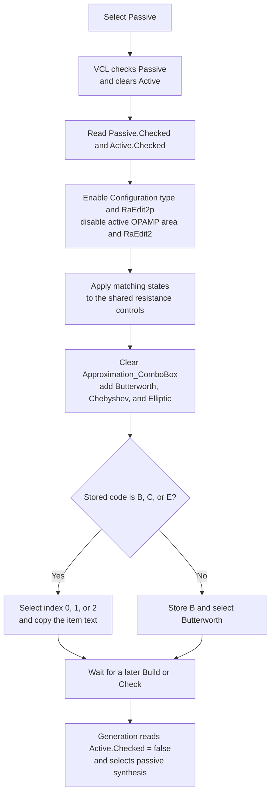

# Passive

## Control

| Property | Recovered value |
| --- | --- |
| Form | Analog_form1 |
| Form caption | Filter design |
| Component path | Analog_form1.Passive_RadioButton2 |
| Control class | TRadioButton |
| Caption | Passive |
| Initial checked state | false; Active is initially checked |
| Handler name | Passive_RadioButton2Click |
| Handler address | 01235730 |
| Graph node | `resource:dfm:Analog_form1/Analog_form1.Passive_RadioButton2` |
| Handler node | `function:01235730` |
| Graph layer | UI |

## What happens when selected

Selecting **Passive** changes the Filter design form from active-filter inputs to passive-filter inputs. The VCL radio group checks **Passive** and clears **Active**. `FUN_01235730` reads these resulting states; it does not set the radio states itself.

The handler makes these immediate UI changes:

- It enables the passive **Configuration type** area at form offset `0x9d0`. This area contains the **Series inductor** and **Shunt capacitor** choices.
- It disables the active OPAMP area at offset `0x8d0`.
- It enables the alternate resistance editor `RaEdit2p` at offset `0x9f0` and disables `RaEdit2` at offset `0x8a0`.
- It applies the same resistance-editor states to their shared design-form controls at offsets `0x898` and `0x720`.

The enabled-state setter skips an individual write when the requested state is already set. The click handler still rebuilds the approximation list on each call.

## Passive approximation list

The handler clears `Approximation_ComboBox` and adds three items in this order:

1. Butterworth
2. Chebyshev
3. Elliptic

The handler then reads the shared approximation code at offset `0x1fa6`. It accepts only `B`, `C`, or `E` for passive mode:

| Stored code | Resulting index | Displayed item |
| --- | ---: | --- |
| `B` | 0 | Butterworth |
| `C` | 1 | Chebyshev |
| `E` | 2 | Elliptic |
| Any other code | 0 | Butterworth; the stored code is changed to `B` |

This normalization also replaces the active-only `I` code for **Inverse Chebyshev**. For `B`, `C`, and `E`, the handler selects the matching list item and copies its text to the combo box. The branches for `I` and numeric codes remain in the recovered control flow, but the earlier normalization makes them unreachable in this handler.

## Later effect on filter generation

This click does not synthesize a filter, save a file, or open a dialog. A later generation path reads `Active_RadioButton1.Checked`. A false value selects passive synthesis. That path also reads the values from `CapEdit1`, `RaEdit2`, and `RaEdit2p`. The radio selection and edited values therefore affect the model only when a later **Build** or **Check** operation reaches generation.

When this radio receives keyboard focus, its separate `OnEnter` handler writes the text **Passive filter** to the form's help field. This text supports the mode interpretation, but it is not part of the click handler.

## Selection flow

## Evidence

- [Passive click handler `FUN_01235730`](../../../DecompiledSources/Tina16/functions/0000000001235730__FUN_01235730.c) reads both radio states, changes the dependent enabled states, rebuilds the combo box, normalizes its shared code, and restores its selected text.
- [Active click handler `FUN_01235b70`](../../../DecompiledSources/Tina16/functions/0000000001235B70__FUN_01235b70.c) performs the inverse UI change and adds **Inverse Chebyshev** as a fourth choice.
- [Approximation change handler `FUN_0122e8c0`](../../../DecompiledSources/Tina16/functions/000000000122E8C0__FUN_0122e8c0.c) maps indexes 0, 1, 2, and 3 to shared codes `B`, `C`, `E`, and `I`.
- [Filter-generation setup `FUN_012281f0`](../../../DecompiledSources/Tina16/functions/00000000012281F0__FUN_012281f0.c) reads `Active_RadioButton1.Checked` and selects the active or passive synthesis path.
- [`RaEdit2` exit handler `FUN_01233a40`](../../../DecompiledSources/Tina16/functions/0000000001233A40__FUN_01233a40.c) identifies form offset `0x8a0` and its corresponding shared control at `0x720`.
- [`RaEdit2p` exit handler `FUN_01236220`](../../../DecompiledSources/Tina16/functions/0000000001236220__FUN_01236220.c) identifies form offset `0x9f0` and its corresponding shared control at `0x898`.
- [Passive focus handler `FUN_01236030`](../../../DecompiledSources/Tina16/functions/0000000001236030__FUN_01236030.c) writes help context `0x2454` and the text **Passive filter**.
- [`FUN_0064dbe0`](../../../DecompiledSources/Tina16/functions/000000000064DBE0__FUN_0064dbe0.c) changes a VCL control's enabled state only when the state differs. [`FUN_0064de00`](../../../DecompiledSources/Tina16/functions/000000000064DE00__FUN_0064de00.c) applies the same change-suppression rule to control text.
- The recovered DFM gives the captions **Filter design**, **Active**, **Passive**, **Configuration type**, **Series inductor**, and **Shunt capacitor**. It marks **Active** as initially checked. The Passive radio has no hint, image, or glyph.

## Error and repeat behavior

- The handler has no cancel path, dialog result, file I/O, local error message, or local exception handler.
- A repeated call still clears and rebuilds the approximation list. Individual enabled-state and text writes can be skipped when their target already has the requested value.
- An unsupported approximation code is not an error. The handler replaces it with `B` and selects Butterworth.

## Analysis limits

- The original Delphi field names are not recovered for the mode areas at form offsets `0x8d0` and `0x9d0`. Their roles follow from the symmetric Active and Passive handlers and the matching DFM groups.
- The click handler changes UI and shared approximation state only. This article does not attribute synthesis or persistence work to it.
