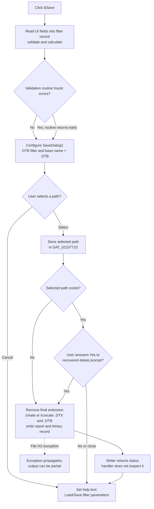

# &Save

> Analysis status: Complete. The recovered handler, filter-form synchronizer, file writer, paired Load command, and DFM resource establish the dialog, validation, overwrite, output, and in-process state behavior.

## Control

| Property | Recovered value |
| --- | --- |
| Form | Analog_form1 |
| Form caption | Filter design |
| Component path | Analog_form1.GroupBox1.SaveBitBtn1 |
| Parent caption | Filter parameters |
| Control class | TBitBtn |
| Caption | &Save |
| Hint | Not present in the recovered resource. |
| Text | Not present in the recovered resource. |
| Handler name | SaveBitBtn1Click |
| Handler address | 01234250 |
| Graph node | `resource:dfm:Analog_form1/Analog_form1.GroupBox1.SaveBitBtn1` |
| Handler node | `function:01234250` |
| Graph layer | UI |

## What happens when clicked

The command saves the filter-design parameters and calculated coefficients. It behaves as **Save As** on every click: `FUN_01234250` always configures and executes `SaveDialog1`. It does not select between a direct Save path and a Save As path.

Before it opens the dialog, the handler calls `FUN_0122db90(form, 0)`. This function reads the visible filter fields into the shared filter record, validates the attenuation and frequency fields for the selected low-pass, high-pass, band-pass, or band-stop mode, and calculates the filter data. Validation uses the recovered names `Apass1`, `Apass2`, `Astop1`, `Astop2`, `Wpass1`, `Wpass2`, `Wstop1`, and `Wstop2` as applicable. The validator returns early when its global error count is nonzero. However, `FUN_01234250` does not test a result or the error count, so the recovered click path still opens the save dialog after that return.

The save dialog has these settings:

- Filter: `Filter param file(*.DTB)|*.DTB|All files (*.*)|*.*`
- Selected filter index: `1`, the `.DTB` filter
- Initial file name: the current global base name plus `.DTB`

If the user cancels the dialog, the handler does not change the remembered selected path and does not call the writer.

If the user selects a path, the handler stores that exact path in the process-global UnicodeString at `DAT_02107710`. The paired Load command uses the same global, but a later Save click initializes the dialog from the separate global base name at `PTR_DAT_02004ff0`; this handler does not prove that the selected save path is reused as the next default, and it does not prove persistence across application sessions.

## Overwrite decision

The handler checks whether the selected path already identifies an accessible file.

- If it does not, the handler calls the writer immediately.
- If it does, the handler shows a Yes/No confirmation. The recovered prompt starts with `Do you really want to delete ` and includes the quoted selected path. The writer runs only when the dialog result is `6`, the Win32/Delphi `Yes` result.
- A No response or closing the confirmation leaves the selected path in `DAT_02107710`, but it does not write a file.

The prompt checks only the selected path. The writer also creates a companion file with another extension. Therefore, if the selected `.DTB` path does not exist but the companion `.DTX` path does, this click path has no separate confirmation for that `.DTX` file.

## Files written

`FUN_01183c40` removes the selected path's final extension and uses the result as a base name. This applies even when the user selects another extension through the `All files` filter. It then creates or truncates two files:

| Output | Recovered contents |
| --- | --- |
| `<base>.DTX` | Human-readable filter report. It includes active/passive type, approximation, selectivity, attenuation and frequency values, sampling frequency, filter length or order, overall gain, and formatted coefficient tables. |
| `<base>.DTB` | Binary filter-parameter record. It contains a recovered format marker, filter metadata and specifications, length or order, gain, and coefficient values. |

The writer supports the recovered FIR window/algorithm names Rectangular, Bartlett, Blackman, Hamming, Hanning, Kaiser, and Parks-McCl, and the recovered analog/IIR approximation names Butterworth, Chebyshev, Elliptic, and Inverse Chebyshev. It supports Lowpass, Highpass, Bandpass, and Bandstop selectivity.

The writer creates both output streams before it finishes checking every recovered filter-type branch. It returns status `3` for an unsupported internal filter type and `0` after a complete write. An empty path is also a no-write status-`0` path, although the dialog-success branch normally supplies a nonempty path. The click handler ignores the status and shows no success or failure message. Low-level file errors can propagate out of the writer; the handler has no local exception block. An error can therefore leave a created, truncated, or partly written output file.

After the normal cancel, refusal, or writer-return path, the handler sets the form's help/status control to `Load/Save filter parameters`. The same text is set by this button's recovered enter/focus handler. An exception before the final statement can prevent this update.

## Click flow

## Handler evidence

- Click handler: [DecompiledSources/Tina16/functions/0000000001234250__FUN_01234250.c](../../../DecompiledSources/Tina16/functions/0000000001234250__FUN_01234250.c)
- Form-to-model validation and calculation: [DecompiledSources/Tina16/functions/000000000122DB90__FUN_0122db90.c](../../../DecompiledSources/Tina16/functions/000000000122DB90__FUN_0122db90.c)
- DTX/DTB writer: [DecompiledSources/Tina16/functions/0000000001183C40__FUN_01183c40.c](../../../DecompiledSources/Tina16/functions/0000000001183C40__FUN_01183c40.c)
- Paired Load command: [DecompiledSources/Tina16/functions/000000000122D240__FUN_0122d240.c](../../../DecompiledSources/Tina16/functions/000000000122D240__FUN_0122d240.c)
- Enter/focus help-text handler: [DecompiledSources/Tina16/functions/0000000001234FF0__FUN_01234ff0.c](../../../DecompiledSources/Tina16/functions/0000000001234FF0__FUN_01234ff0.c)
- Recovered role: Save the current filter design to paired text and binary parameter files through an explicit path-selection and overwrite gate.
- Complexity: complex
- Distinct outgoing calls: 13

## Direct calls

- `function:0122db90` — synchronizes, validates, and calculates the filter record from the form
- `function:01183c40` — writes the paired `.DTX` report and `.DTB` binary record
- `function:00440a20` — tests the selected path before the overwrite prompt
- `function:0072d440` — executes the Yes/No overwrite confirmation
- `function:00724270` and `function:00724380` — read and assign the save-dialog file name
- `function:0064de00` — assigns the final help/status text
- The remaining direct calls build or finalize Delphi UnicodeStrings.

## Resource evidence

- Kind: Not present in the recovered resource.
- Modal result: Not present in the recovered resource.
- Checked state: Not present in the recovered resource.
- List items: Not present in the recovered resource.
- Image reference: Not present in the recovered resource.
- Extracted glyph: [`0010_Analog_form1_Analog_form1_GroupBox1_SaveBitBtn1_Glyph_Data.png`](../../../glyph/0010_Analog_form1_Analog_form1_GroupBox1_SaveBitBtn1_Glyph_Data.png)
- Glyph observation: The small raster shows two disk-like symbols. This is consistent with saving, but the handler and writer provide the behavior evidence.

## Nearby label candidates

Nearby labels are layout candidates only. They are not proof of behavior.

- No same-parent label candidate is available.

## Analysis limits

- The recovered source does not name the two file formats beyond their `.DTX` and `.DTB` extensions and serialized contents.
- The selected path is remembered in process-global state, but no evidence in this click path proves cross-session persistence.
- The handler does not expose the writer's status, so the recovered source does not prove what the user sees after a non-exception write failure.
