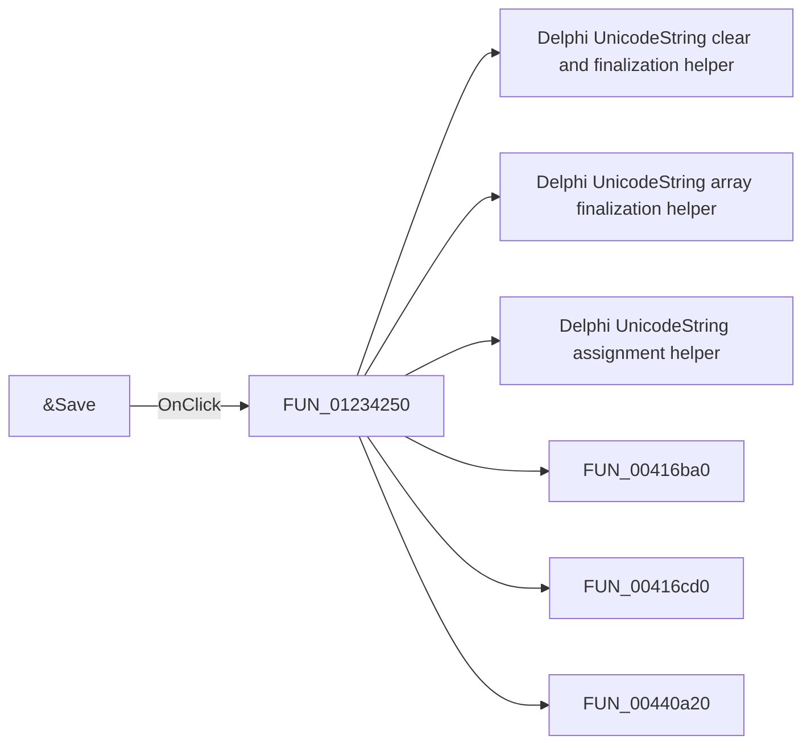

# &Save

> Analysis status: Pending individual source review.

## Control

| Property | Recovered value |
| --- | --- |
| Form | Analog_form1 |
| Component path | Analog_form1.GroupBox1.SaveBitBtn1 |
| Control class | TBitBtn |
| Caption | &Save |
| Hint | Not present in the recovered resource. |
| Text | Not present in the recovered resource. |
| Handler name | SaveBitBtn1Click |
| Handler address | 01234250 |
| Graph node | `resource:dfm:Analog_form1/Analog_form1.GroupBox1.SaveBitBtn1` |
| Handler node | `function:01234250` |
| Graph layer | UI |

## What happens when clicked

Pending individual analysis. An agent must read the recovered handler source and its relevant callees before it replaces this text.

## Click flow

## Handler evidence

- Source: [DecompiledSources/Tina16/functions/0000000001234250__FUN_01234250.c](../../../DecompiledSources/Tina16/functions/0000000001234250__FUN_01234250.c)
- Recovered role: Not present in the recovered resource.
- Current graph summary: Handles 1 Delphi UI event: Analog_form1.GroupBox1.SaveBitBtn1.OnClick.
- Current graph behavior: Not present in the recovered resource.
- Current graph evidence: Not present in the recovered resource.
- Complexity: complex
- Distinct outgoing calls: 13

## Direct calls

- `function:00414480` — Delphi UnicodeString clear and finalization helper
- `function:00414560` — Delphi UnicodeString array finalization helper
- `function:00414ad0` — Delphi UnicodeString assignment helper
- `function:00416ba0` — FUN_00416ba0
- `function:00416cd0` — FUN_00416cd0
- `function:00440a20` — FUN_00440a20
- `function:00441920` — FUN_00441920
- `function:0064de00` — VCL control text setter with change suppression
- `function:00724270` — FUN_00724270
- `function:00724380` — FUN_00724380
- `function:0072d440` — FUN_0072d440
- `function:01183c40` — FUN_01183c40
- `function:0122db90` — FUN_0122db90

## Resource evidence

- Kind: Not present in the recovered resource.
- Modal result: Not present in the recovered resource.
- Checked state: Not present in the recovered resource.
- List items: Not present in the recovered resource.
- Image reference: Not present in the recovered resource.
- Extracted glyph: [`0010_Analog_form1_Analog_form1_GroupBox1_SaveBitBtn1_Glyph_Data.png`](../../../glyph/0010_Analog_form1_Analog_form1_GroupBox1_SaveBitBtn1_Glyph_Data.png)

## Nearby label candidates

Nearby labels are layout candidates only. They are not proof of behavior.

- No same-parent label candidate is available.

## Analysis limits

- Do not infer behavior from the control class, caption, hint, glyph, or nearby label alone.
- Do not replace the pending status until the handler source and relevant call path provide enough evidence.
