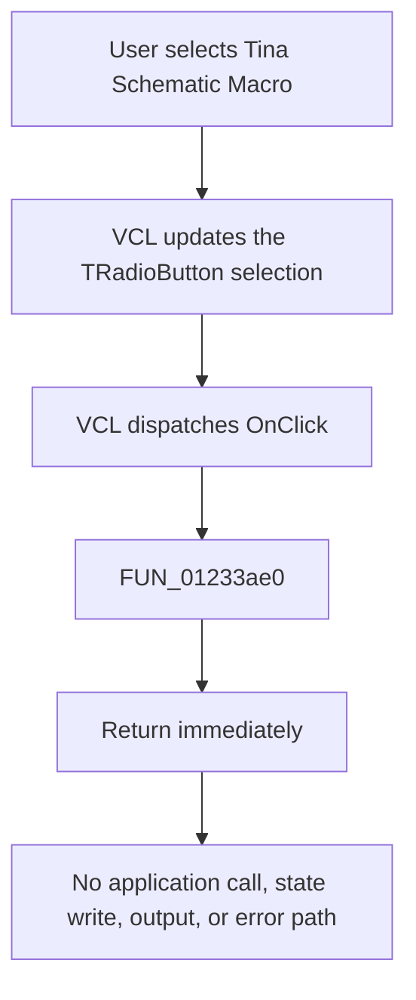

# Tina Schematic Macro

> Analysis status: Evidence-backed source review complete.

## Control

| Property | Recovered value |
| --- | --- |
| Form | Analog_form1 |
| Component path | Analog_form1.TargetGroupBox6.SaveMacroCheckBox1 |
| Control class | TRadioButton |
| Caption | Tina Schematic Macro |
| Hint | Not present in the recovered resource. |
| Text | Not present in the recovered resource. |
| Handler name | SaveMacroCheckBox1Click |
| Handler address | 01233ae0 |
| Graph node | `resource:dfm:Analog_form1/Analog_form1.TargetGroupBox6.SaveMacroCheckBox1` |
| Handler node | `function:01233ae0` |
| Graph layer | UI |

## What happens when clicked

This control is one of three `TRadioButton` choices in `TargetGroupBox6`. Its caption identifies the choice as the **Tina Schematic Macro** build target. The sibling `SaveTinaCheckBox1` choice is checked by default, so this choice is not the recovered default.

The application click handler does not implement an action. After the VCL dispatches `OnClick` to `FUN_01233ae0`, the function returns immediately. It does not read the radio-button state, call another function, write application state, start a save or build operation, close the form, or report an error. The standard `TRadioButton` can still update its checked selection through VCL behavior; that framework-managed selection is outside this empty application handler.

The separate `OnEnter` handler displays `Build target Tina Schematic Macro`, which supports the target meaning of the option. It does not establish where a later command reads the selected radio button. Therefore, the recovered click path proves only target selection plus a no-op application callback. It does not prove the later macro-generation or file-output path.

## Click flow

## Handler evidence

- Source: [DecompiledSources/Tina16/functions/0000000001233AE0__FUN_01233ae0.c](../../../DecompiledSources/Tina16/functions/0000000001233AE0__FUN_01233ae0.c)
- Recovered role: No-op click handler for the Tina Schematic Macro target radio button.
- Current graph summary: Handles 1 Delphi UI event: Analog_form1.TargetGroupBox6.SaveMacroCheckBox1.OnClick.
- Current graph behavior: Returns immediately without reading input, making a decision, calling another function, changing application state, producing output, or handling an error.
- Current graph evidence: The recovered body contains only `return;`, and the graph contains no outgoing call edge from `function:01233ae0`.
- Complexity: simple
- Distinct outgoing calls: 0

## Direct calls

- None. The recovered function returns without making a call.

## Resource evidence

- Kind: Not present in the recovered resource.
- Modal result: Not present in the recovered resource.
- Checked state: This radio button has no `Checked` property in the recovered DFM. Its sibling `SaveTinaCheckBox1` has `Checked = true`.
- List items: Not present in the recovered resource.
- Image reference: Not present in the recovered resource.
- Extracted glyph: None.

## Nearby label candidates

Nearby labels are layout candidates only. They are not proof of behavior.

- No same-parent label candidate is available.

## Analysis limits

- The caption and `OnEnter` status text identify the selection as a Tina schematic macro build target, but they do not identify the later consumer of the selected state.
- The recovered click handler does not expose the downstream macro-generation or file-output path.
- The VCL selection change is standard control behavior. It is not an application state write performed by `FUN_01233ae0`.
