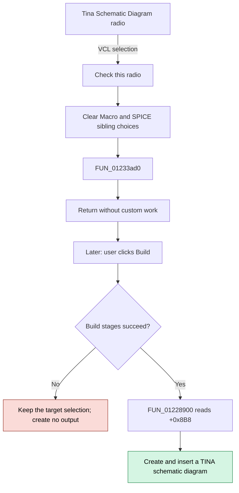

# Tina Schematic Diagram

## Control

| Property | Recovered value |
| --- | --- |
| Form | Analog_form1 |
| Component path | Analog_form1.TargetGroupBox6.SaveTinaCheckBox1 |
| Control class | TRadioButton |
| Caption | Tina Schematic Diagram |
| Initial checked state | true |
| Handler name | SaveTinaCheckBox1Click |
| Handler address | 01233ad0 |
| Graph node | `resource:dfm:Analog_form1/Analog_form1.TargetGroupBox6.SaveTinaCheckBox1` |
| Handler node | `function:01233ad0` |
| Graph layer | UI |

## What happens when clicked

The click selects **Tina Schematic Diagram** as the filter build target. The Delphi VCL `TRadioButton` behavior sets this control to checked and clears the two sibling target choices, **Tina Schematic Macro** and **Spice Netlist File**. This selection is the only click-time state change that the recovered evidence supports.

`FUN_01233ad0` is the published `OnClick` handler, but its body contains only `return`. It does not validate the filter, build a schematic, write a file, close the form, or change application state. The two sibling target handlers are also empty. This repeated structure confirms that VCL radio-button behavior owns the target selection.

The selected target is deferred state. A later click on **Build** runs `FUN_0122e740`. If all build stages succeed, it calls `FUN_01228900`. That dispatcher reads the checked state at form offset `+0x8B8` and creates and inserts a TINA schematic diagram. A failed build stage prevents output dispatch but does not undo the selected target.

## Click flow

## State and decision details

- The DFM marks this radio as checked. It is the initial build target.
- Selection is exclusive within the three `TRadioButton` controls under `TargetGroupBox6`.
- Clicking an already selected radio keeps the same selection. The published handler still performs no work.
- Calling `FUN_01233ad0` directly does not select the radio because the function reads and writes no state. VCL selection happens outside this handler.
- Focus entry uses a separate handler, `FUN_01234dc0`. It sets help context `0x21FC` and the status text `Build target Tina Schematic Diagram`. These help updates are not actions of `FUN_01233ad0`.

## Handler evidence

- [OnClick handler `FUN_01233ad0`](../../../DecompiledSources/Tina16/functions/0000000001233AD0__FUN_01233ad0.c) contains only `return`.
- [Macro OnClick handler `FUN_01233ae0`](../../../DecompiledSources/Tina16/functions/0000000001233AE0__FUN_01233ae0.c) and [SPICE OnClick handler `FUN_01234580`](../../../DecompiledSources/Tina16/functions/0000000001234580__FUN_01234580.c) are also empty.
- [Build handler `FUN_0122e740`](../../../DecompiledSources/Tina16/functions/000000000122E740__FUN_0122e740.c) calls the output dispatcher only after its status-gated build stages succeed.
- [Output dispatcher `FUN_01228900`](../../../DecompiledSources/Tina16/functions/0000000001228900__FUN_01228900.c) reads the diagram radio at form offset `+0x8B8` and runs the TINA diagram branch.
- [Focus-entry handler `FUN_01234dc0`](../../../DecompiledSources/Tina16/functions/0000000001234DC0__FUN_01234dc0.c) supplies the control-specific help context and status text.

## Direct calls

- `FUN_01233ad0` has no direct calls.

## Failure and no-op behavior

- The click handler has no validation, error, cancel, or exception branch because it has no executable operation.
- The click does not create or save output. It only selects the target through VCL state.
- If a later Build stage reports a nonzero status, `FUN_0122e740` skips `FUN_01228900`. No TINA schematic is created, and the form remains open.
- No glyph, hint, text property, or nearby label is needed to identify this control. Its caption, checked state, sibling captions, and downstream field read provide direct evidence.

## Analysis limits

- The recovered source does not expose the internal VCL function that applies radio-button exclusivity.
- The recovered field name for form offset `+0x8B8` is not available. Its control identity comes from the recovered form field table and the DFM component evidence.
