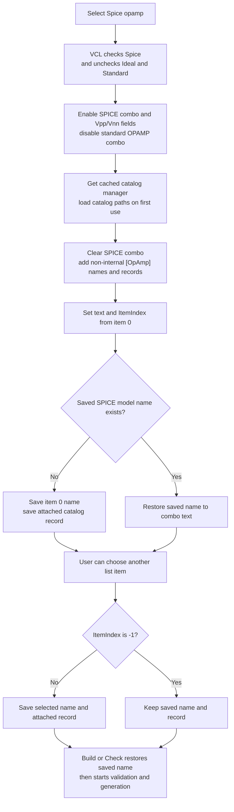

# Spice opamp

## Control

| Property | Recovered value |
| --- | --- |
| Form | Analog_form1 |
| Form caption | Filter design |
| Component path | Analog_form1.OpampTypeGroupBox7.SPICEOPAMP |
| Control class | TRadioButton |
| Caption | Spice opamp |
| Handler name | SPICEOPAMPClick |
| Handler address | 01233ea0 |
| Graph node | `resource:dfm:Analog_form1/Analog_form1.OpampTypeGroupBox7.SPICEOPAMP` |
| Handler node | `function:01233ea0` |
| Graph layer | UI |

## What happens when selected

Selecting **Spice opamp** chooses the catalog-backed OPAMP path in the Filter design form. The VCL radio-button group checks this control and unchecks the sibling **Ideal Opamp** and **Standard opamp** controls before `FUN_01233ea0` reads `SPICEOPAMP.Checked` at form offset `0x8f0`.

The handler applies these enabled states:

- `SpiceOpampComboBox2` at `0x900` follows `SPICEOPAMP.Checked`, so it is enabled for the normal selected path.
- The standard `OpampComboBox1` at `0x8f8` receives the inverse state and is disabled.
- `VppEdit` at `0x918`, `VnnEdit` at `0x928`, and their labels at `0x920` and `0x930` are enabled. The two edit change handlers later report `V+ = V-` as an error if the entered supply texts are equal.

The handler does not change visibility. The recovered DFM marks both model combo boxes, both supply labels, and both supply edits as initially hidden. Their visibility is controlled elsewhere in the form lifecycle or interface mode.

## SPICE model list and selection

The handler obtains the cached application catalog manager. On its first use, that manager loads the common catalog and catalog directories. It then clears `SpiceOpampComboBox2.Items` and fills the list from catalog entries that match the `[OpAmp]` section. Internal-only records are excluded. Each visible item has both a display name and its catalog record attached as the item object.

After population, the handler reads item `0`, copies its name to the combo-box text, and selects index `0`. It then uses shared model state as follows:

- If the shared SPICE OPAMP name is empty, it copies the first item's name into that shared string and copies the first item's attached catalog record into the shared record pointer.
- If a shared name already exists, it restores that name to the combo-box text. This branch does not search the rebuilt list and does not replace the shared record pointer.

When the user later changes `SpiceOpampComboBox2`, `FUN_01234870` reads the selected index. For any index other than `-1`, it copies both the selected item name and attached catalog record into shared state, then normalizes the displayed text to the saved name. Index `-1` leaves the saved name and record unchanged.

## Later Build and synthesis effects

Both **Build** and **Check** test `SPICEOPAMP.Checked`. If it is true, they restore the saved SPICE model name to `SpiceOpampComboBox2` before validation and generation. The selected name and attached catalog record therefore survive later radio changes and are available when generation starts.

The recovered coefficient-synthesis path does not read the SPICE model name or attached record. A later active schematic-construction path distinguishes ideal from non-ideal OPAMPs: because selecting Spice unchecks **Ideal Opamp**, it includes the non-ideal supply block before it constructs active filter stages. This same proven effect also applies to **Standard opamp**. No recovered source read of the shared catalog-record pointer was found beyond the SPICE click and combo-change assignments, so this article does not claim how the selected record is applied to an individual generated OPAMP instance.

## Cancel, no-op, and error behavior

This radio click does not open a file picker, model-selection dialog, or modal form. Therefore it has no local OK or Cancel branch.

The Filter design form is persistent and modeless. Its **Cancel** button requests a normal close, and the form close path hides the existing form instance. It does not restore the shared SPICE model name or attached catalog record. A selection made in the combo therefore remains in shared memory after Cancel hides the form.

The enabled-state and text helpers skip individual updates when the requested value already matches. However, a repeated click still clears and reloads the catalog list. The combo-change handler is a proven no-op for item index `-1`.

The click handler does not check whether catalog population produced an item before it reads item `0`, and it does not verify that a previously saved name still exists in the rebuilt list. It has no local message, exception handler, or recovery branch for catalog-loading, empty-list, or stale-name failures. The supply equality message belongs to later Vpp/Vnn edit changes, not to this click.

## Selection flow

## Evidence

- [SPICE radio handler `FUN_01233ea0`](../../../DecompiledSources/Tina16/functions/0000000001233EA0__FUN_01233ea0.c) applies the control states, fills the catalog list, selects item `0`, and initializes or restores shared model state.
- [Catalog singleton `FUN_017105e0`](../../../DecompiledSources/Tina16/functions/00000000017105E0__FUN_017105e0.c) initializes the shared catalog manager and its catalog-directory substitutions once.
- [Catalog list wrapper `FUN_01717780`](../../../DecompiledSources/Tina16/functions/0000000001717780__FUN_01717780.c) passes the `[OpAmp]` and `[All]` filters to [the catalog enumerator `FUN_01717260`](../../../DecompiledSources/Tina16/functions/0000000001717260__FUN_01717260.c). The enumerator clears the target list, excludes `[Internal]` records, filters catalog entries, and adds each display name with its source record as the item object.
- [SPICE combo change handler `FUN_01234870`](../../../DecompiledSources/Tina16/functions/0000000001234870__FUN_01234870.c) updates the shared name and attached record only for an item index other than `-1`.
- [Build handler `FUN_0122e740`](../../../DecompiledSources/Tina16/functions/000000000122E740__FUN_0122e740.c) and [Check handler `FUN_01234120`](../../../DecompiledSources/Tina16/functions/0000000001234120__FUN_01234120.c) restore the saved name when `SPICEOPAMP` is checked.
- [Active schematic constructor `FUN_01160b70`](../../../DecompiledSources/Tina16/functions/0000000001160B70__FUN_01160b70.c) tests the Ideal OPAMP radio and adds the supply block for a non-ideal choice before it constructs active stages.
- [Ideal OPAMP handler `FUN_01233af0`](../../../DecompiledSources/Tina16/functions/0000000001233AF0__FUN_01233af0.c) disables both model combos and all four Vpp/Vnn controls. [Standard OPAMP handler `FUN_01233b60`](../../../DecompiledSources/Tina16/functions/0000000001233B60__FUN_01233b60.c) enables the standard combo, disables the SPICE combo, and also enables the supply controls.
- [Vpp change `FUN_01234660`](../../../DecompiledSources/Tina16/functions/0000000001234660__FUN_01234660.c) and [Vnn change `FUN_01234730`](../../../DecompiledSources/Tina16/functions/0000000001234730__FUN_01234730.c) identify the supply edit offsets and their equality error.
- The DFM places **Ideal Opamp**, **Standard opamp**, and **Spice opamp** in the **OPAMP type** group and marks Ideal as initially checked. `SPICEOPAMP` has no hint, picture, glyph, or image index.

## Analysis limits

- The shared SPICE name and catalog-record globals have no recovered source names. Their roles come from the list item text/object data flow.
- No direct consumer of the shared catalog-record pointer is present in the recovered C sources beyond its assignments. The exact attachment of that record to a generated OPAMP remains unproven.
