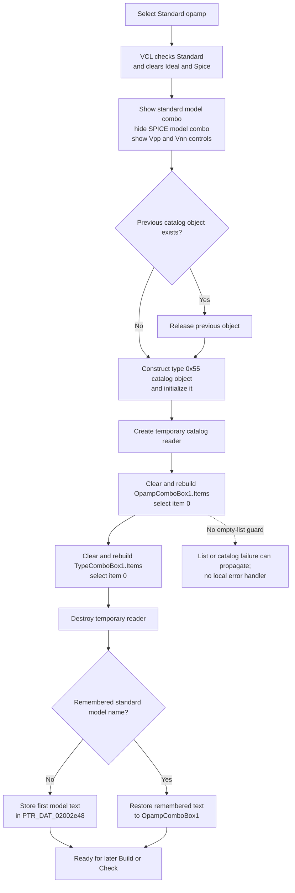

# Standard opamp

> Analysis status: Complete. The recovered click handler, sibling opamp handlers, combo-box handlers, catalog readers, later Build and Check paths, and DFM resource establish the control-state and model-list behavior.

## Control

| Property | Recovered value |
| --- | --- |
| Form | Analog_form1 |
| Form caption | Filter design |
| Component path | Analog_form1.OpampTypeGroupBox7.StandardOPAMP |
| Control class | TRadioButton |
| Caption | Standard opamp |
| Initial checked state | false; `IdealOpampCheckBox` is initially checked |
| Hint | Not present in the recovered resource. |
| Handler name | StandardOPAMPClick |
| Handler address | 01233b60 |
| Graph node | `resource:dfm:Analog_form1/Analog_form1.OpampTypeGroupBox7.StandardOPAMP` |
| Handler node | `function:01233b60` |
| Graph layer | UI |

## What happens when selected

The **Ideal Opamp**, **Standard opamp**, and **Spice opamp** controls are sibling radio buttons. Normal VCL radio-button behavior checks **Standard opamp** and clears the sibling choices before `FUN_01233b60` runs.

The handler reads `StandardOPAMP.Checked` and uses that value to control the two model selectors:

- It shows `OpampComboBox1`, the standard-opamp model selector, when **Standard opamp** is checked.
- It hides `SpiceOpampComboBox2` in that same state. If the handler is invoked while **Standard opamp** is unchecked, these two visibility states are reversed.
- It unconditionally shows `VppLabel8`, `VppEdit`, `VnnLabel9`, and `VnnEdit`. Their DFM captions and initial editor text identify the positive and negative supply controls as `Vpp`/`V+` and `Vnn`/`V-`.

The handler does not read or validate either supply value. It also does not change the visibility of `TypeComboBox1`. The DFM marks that additional opamp-type selector as initially hidden, and the **Ideal Opamp** handler hides it explicitly. This Standard handler populates it, but the recovered click path does not prove that it becomes visible.

## Standard model and type lists

After the visibility changes, the handler rebuilds the standard-opamp catalog state in this order:

1. It releases the previous object stored at `PTR_DAT_02001830`, when that pointer is non-null.
2. It constructs a replacement component/catalog object with recovered type code `0x55`, assigns a fixed placeholder identifier from `DAT_01233e98`, and initializes its internal data.
3. It creates a temporary catalog-reader object and stores it at form offset `+0xa30`.
4. `FUN_0172c930` clears `OpampComboBox1.Items`, reads the model names for catalog group `0`, and assigns the resulting list.
5. The handler copies item `0` into `OpampComboBox1.Text` and sets `ItemIndex` to `0`.
6. `FUN_0172c500` clears `TypeComboBox1.Items` and adds each recovered 27-byte type-name record from the temporary catalog data.
7. The handler destroys the temporary catalog-reader object, then copies item `0` into `TypeComboBox1.Text` and sets its `ItemIndex` to `0`.

The replacement component/catalog object remains in `PTR_DAT_02001830`; only the temporary reader at `+0xa30` is destroyed in this handler.

## Remembered standard model

`PTR_DAT_02002e48` is the process-global UnicodeString used for the selected standard-opamp model name.

- If it is empty, the handler reads the current `OpampComboBox1.Text` after selecting item `0` and stores that first model name in the global.
- If it is not empty, the handler assigns the remembered name back to `OpampComboBox1.Text` after the list rebuild.

`OpampComboBox1Change`, recovered as `FUN_01234590`, updates this global from the selected item when `ItemIndex` is not `-1`. The Standard click handler itself does not prove that a restored name exists in the newly built list, and it does not test the result of the text assignment. It also always resets `TypeComboBox1` to item `0`; it does not restore a remembered type in this direct call path.

The later **Build** and **Check** handlers read `StandardOPAMP.Checked`. When it is checked, they assign `PTR_DAT_02002e48` back to `OpampComboBox1.Text` before their common filter-design work. This proves that the selected standard model name is retained for later form processing. The recovered source does not establish persistence across application sessions.

## Selection flow

## Evidence

- [Standard click handler `FUN_01233b60`](../../../DecompiledSources/Tina16/functions/0000000001233B60__FUN_01233b60.c) reads the radio state, changes dependent-control visibility, reconstructs the catalog objects, fills both combo boxes, selects their first entries, and stores or restores `PTR_DAT_02002e48`.
- [VCL visibility setter `FUN_0064dbe0`](../../../DecompiledSources/Tina16/functions/000000000064DBE0__FUN_0064dbe0.c) updates a control only when its visibility byte changes and sends the recovered VCL visible-changed message.
- [Standard-model list builder `FUN_0172c930`](../../../DecompiledSources/Tina16/functions/000000000172C930__FUN_0172c930.c) clears the target `TStrings`, builds the catalog selection text through `FUN_0172c5d0`, and assigns the list.
- [Type-name list copier `FUN_0172c500`](../../../DecompiledSources/Tina16/functions/000000000172C500__FUN_0172c500.c) clears the target `TStrings`, reads the catalog record count, converts each fixed-size type name, and appends it.
- [Standard model change handler `FUN_01234590`](../../../DecompiledSources/Tina16/functions/0000000001234590__FUN_01234590.c) stores the selected index and model text when an item is selected.
- [Type change handler `FUN_01235550`](../../../DecompiledSources/Tina16/functions/0000000001235550__FUN_01235550.c) stores the selected type and rebuilds the standard model list for that type. It is not called directly by this click handler.
- [Build handler `FUN_0122e740`](../../../DecompiledSources/Tina16/functions/000000000122E740__FUN_0122e740.c) and [Check handler `FUN_01234120`](../../../DecompiledSources/Tina16/functions/0000000001234120__FUN_01234120.c) restore the remembered standard model text only when `StandardOPAMP.Checked` is true.
- [Ideal handler `FUN_01233af0`](../../../DecompiledSources/Tina16/functions/0000000001233AF0__FUN_01233af0.c) hides both model selectors, both supply labels and editors, and `TypeComboBox1`.
- [SPICE handler `FUN_01233ea0`](../../../DecompiledSources/Tina16/functions/0000000001233EA0__FUN_01233ea0.c) selects the SPICE model selector instead and shows the supply controls.

## Direct calls

- `function:0064dbe0` — changes visibility of the standard/SPICE selectors and supply controls
- `function:01cf1750`, `function:017bf050`, and `function:01d38290` — construct and initialize the replacement component/catalog object
- `function:0172bd70` — constructs the temporary catalog reader
- `function:0172c930` — rebuilds the standard model selector items
- `function:0172c500` — rebuilds the additional type selector items
- `function:00410f20` — destroys the temporary reader after list population
- `function:0064dd90` and `function:0064de00` — read or assign combo-box text
- The remaining calls allocate or finalize Delphi-managed values and release the previous catalog object.

## Resource evidence

- `OpampMyRadioGroup1` caption: `OPAMP type`
- Sibling choices: `Ideal Opamp`, `Standard opamp`, and `Spice opamp`
- Initial choice: `Ideal Opamp` is checked; `Standard opamp` is not checked.
- `OpampComboBox1`, `SpiceOpampComboBox2`, `VppLabel8`, `VppEdit`, `VnnLabel9`, `VnnEdit`, and `TypeComboBox1` are initially hidden.
- `TypeComboBox1` style: `csDropDownList`
- Hint, action, image, and glyph: Not present in the recovered resource.

## No-op and error behavior

- A normal Standard click rebuilds both lists even if Standard was already selected. Visibility assignments are per-control no-ops when the requested state already matches.
- The handler does not check either list count before it reads item `0`. It has no local exception handler or fallback for a missing or malformed catalog, allocation failure, or list-access failure.
- The handler does not validate `V+` or `V-`, does not run the filter calculation, and does not show a confirmation or error message.
- If the handler is invoked directly while `StandardOPAMP.Checked` is false, it hides the standard selector and shows the SPICE selector, but it still shows the supply controls and rebuilds the standard lists.

## Analysis limits

- The recovered type code `0x55` and catalog structures do not expose a Delphi class name. The handler context and the lists establish their standard-opamp catalog role, but not the original class identifier.
- The handler populates `TypeComboBox1` but does not make it visible. Another path can change its selection, but this click path does not prove when that control is shown.
- The recovered source proves in-process reuse of the selected standard model name, not storage in a settings or project file.
