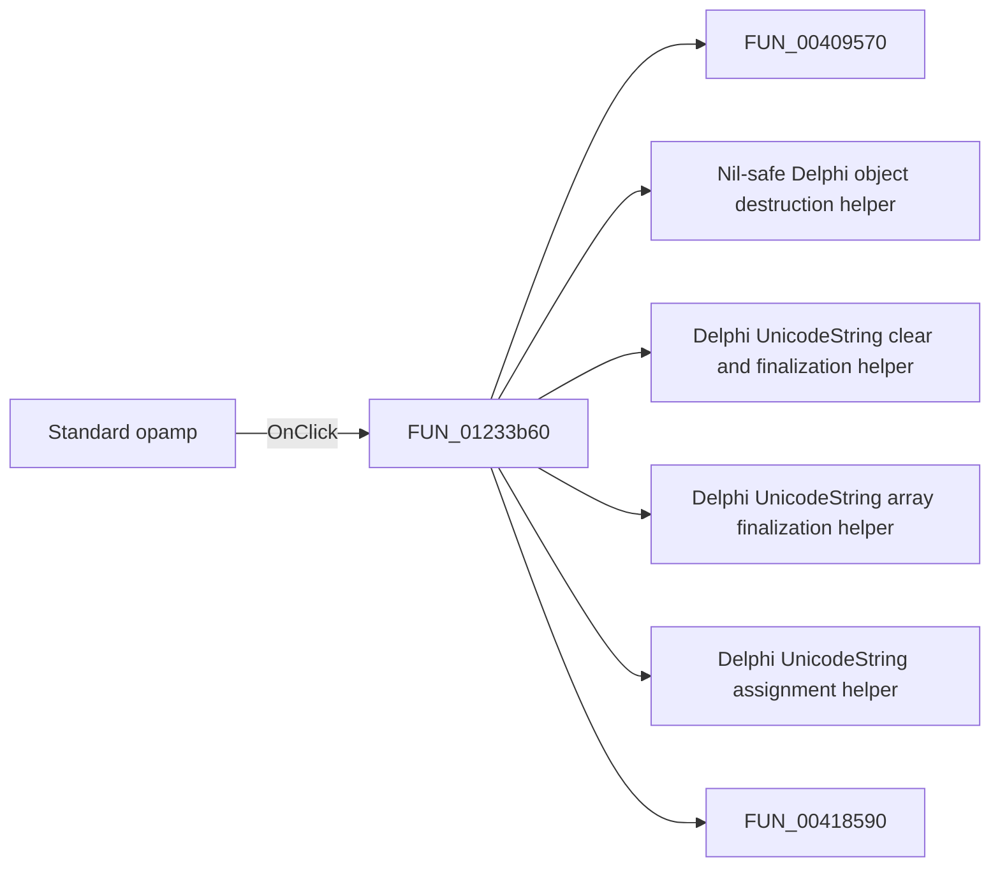

# Standard opamp

> Analysis status: Pending individual source review.

## Control

| Property | Recovered value |
| --- | --- |
| Form | Analog_form1 |
| Component path | Analog_form1.OpampTypeGroupBox7.StandardOPAMP |
| Control class | TRadioButton |
| Caption | Standard opamp |
| Hint | Not present in the recovered resource. |
| Text | Not present in the recovered resource. |
| Handler name | StandardOPAMPClick |
| Handler address | 01233b60 |
| Graph node | `resource:dfm:Analog_form1/Analog_form1.OpampTypeGroupBox7.StandardOPAMP` |
| Handler node | `function:01233b60` |
| Graph layer | UI |

## What happens when clicked

Pending individual analysis. An agent must read the recovered handler source and its relevant callees before it replaces this text.

## Click flow

## Handler evidence

- Source: [DecompiledSources/Tina16/functions/0000000001233B60__FUN_01233b60.c](../../../DecompiledSources/Tina16/functions/0000000001233B60__FUN_01233b60.c)
- Recovered role: Not present in the recovered resource.
- Current graph summary: Handles 1 Delphi UI event: Analog_form1.OpampTypeGroupBox7.StandardOPAMP.OnClick.
- Current graph behavior: Not present in the recovered resource.
- Current graph evidence: Not present in the recovered resource.
- Complexity: complex
- Distinct outgoing calls: 15

## Direct calls

- `function:00409570` — FUN_00409570
- `function:00410f20` — Nil-safe Delphi object destruction helper
- `function:00414480` — Delphi UnicodeString clear and finalization helper
- `function:00414560` — Delphi UnicodeString array finalization helper
- `function:00414ad0` — Delphi UnicodeString assignment helper
- `function:00418590` — FUN_00418590
- `function:0064dbe0` — FUN_0064dbe0
- `function:0064dd90` — VCL control Unicode text reader
- `function:0064de00` — VCL control text setter with change suppression
- `function:0172bd70` — FUN_0172bd70
- `function:0172c500` — FUN_0172c500
- `function:0172c930` — FUN_0172c930
- `function:017bf050` — FUN_017bf050
- `function:01cf1750` — FUN_01cf1750
- `function:01d38290` — FUN_01d38290

## Resource evidence

- Kind: Not present in the recovered resource.
- Modal result: Not present in the recovered resource.
- Checked state: Not present in the recovered resource.
- List items: Not present in the recovered resource.
- Image reference: Not present in the recovered resource.
- Extracted glyph: None.

## Nearby label candidates

Nearby labels are layout candidates only. They are not proof of behavior.

- Rank 1: Vnn at distance 174.
- Rank 2: Vpp at distance 182.

## Analysis limits

- Do not infer behavior from the control class, caption, hint, glyph, or nearby label alone.
- Do not replace the pending status until the handler source and relevant call path provide enough evidence.
