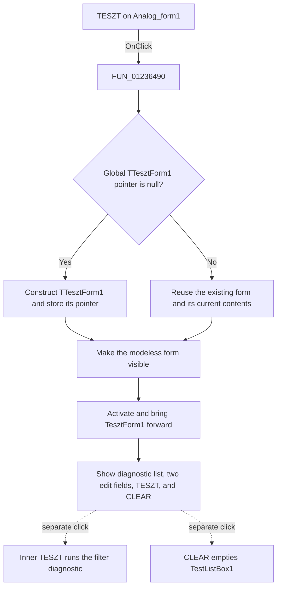

# TESZT

This button opens the modeless `TTesztForm1` filter-diagnostic window. It does not run the diagnostic calculation.

## Control

| Property | Recovered value |
| --- | --- |
| Form | Analog_form1 |
| Component path | Analog_form1.TesztButton1 |
| Control class | TButton |
| Caption | TESZT |
| Hint | Not present in the recovered resource. |
| Text | Not present in the recovered resource. |
| Handler name | TesztButton1Click |
| Handler address | 01236490 |
| Graph node | `resource:dfm:Analog_form1/Analog_form1.TesztButton1` |
| Handler node | `function:01236490` |
| Graph layer | UI |

## What happens when clicked

`FUN_01236490` checks the global pointer to `TTesztForm1`. If the pointer is null, the handler constructs the form and stores the new pointer. It then passes the stored form to the common VCL show wrapper. The wrapper makes the form visible and activates it.

The first click creates the diagnostic window. A later click reuses the same form instance. The handler does not copy data from `Analog_form1`, reset the diagnostic list, or change either edit field. Thus, reuse preserves the current form contents. If the form is already visible, the visible-state setter has no state change, but the wrapper still runs the activation step and brings the form forward.

The recovered `TesztForm1` resource contains `TestListBox1`, two edit fields, an inner `TESZT` button, and a `CLEAR` button. The inner `TESZT` handler calls the filter-diagnostic calculation path, which appends filter results to the list. The `CLEAR` handler clears that list. These actions do not run when this outer button opens the window.

There is no input validation, result value, modal-result update, or handler-level error branch. Construction failures remain in the common VCL construction path; this handler has no application-specific fallback.

## Click flow

## Handler evidence

- Source: [DecompiledSources/Tina16/functions/0000000001236490__FUN_01236490.c](../../../DecompiledSources/Tina16/functions/0000000001236490__FUN_01236490.c)
- Recovered role: Opens or reactivates the singleton filter-diagnostic form.
- Current graph summary: Handles `Analog_form1.TesztButton1.OnClick` and calls the common VCL form-construction and modeless-show paths.
- Source decision: The global form pointer at `PTR_DAT_02004f98` controls whether construction is necessary.
- State change: A newly constructed `TTesztForm1` pointer is stored globally. An existing instance is reused without clearing its controls.
- UI output: The handler shows and activates `TesztForm1`.
- Complexity: moderate
- Distinct outgoing calls: 2

## Direct calls

- `function:007fc180` — [FUN_007fc180](../../../DecompiledSources/Tina16/functions/00000000007FC180__FUN_007fc180.c), the common VCL form-construction path used only when the stored pointer is null.
- `function:008059a0` — [FUN_008059a0](../../../DecompiledSources/Tina16/functions/00000000008059A0__FUN_008059a0.c), the modeless show-and-activate wrapper used on every click.

## Resource evidence

- Kind: Not present in the recovered resource.
- Modal result: Not present in the recovered resource.
- Checked state: Not present in the recovered resource.
- List items: Not present in the recovered resource.
- Image reference: Not present in the recovered resource.
- Extracted glyph: None.

The target form resource identifies `TTesztForm1` and its six recovered components. Its caption is `Teszt`. The form has a diagnostic list, two text edits, and the separate `TESZT` and `CLEAR` commands. The resource has no recovered form lifecycle event that would add behavior to this click path.

## Nearby label candidates

Nearby labels are layout candidates only. They are not proof of behavior.

- Rank 1: leptek at distance 555.

## Analysis limits

- The recovered names do not identify the purpose of the two edit fields. This article does not assign meanings to them.
- The common constructor has its own failure handling, but the outer click handler does not expose an application-specific error path.
- The nearby `leptek` label is distant and is not used as behavior evidence.
