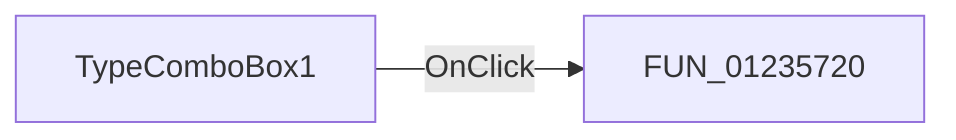

# TypeComboBox1

> Analysis status: Pending individual source review.

## Control

| Property | Recovered value |
| --- | --- |
| Form | Analog_form1 |
| Component path | Analog_form1.OpampTypeGroupBox7.TypeComboBox1 |
| Control class | TComboBox |
| Caption | Not present in the recovered resource. |
| Hint | Not present in the recovered resource. |
| Text | Not present in the recovered resource. |
| Handler name | TypeComboBox1Click |
| Handler address | 01235720 |
| Graph node | `resource:dfm:Analog_form1/Analog_form1.OpampTypeGroupBox7.TypeComboBox1` |
| Handler node | `function:01235720` |
| Graph layer | UI |

## What happens when clicked

Pending individual analysis. An agent must read the recovered handler source and its relevant callees before it replaces this text.

## Click flow

## Handler evidence

- Source: [DecompiledSources/Tina16/functions/0000000001235720__FUN_01235720.c](../../../DecompiledSources/Tina16/functions/0000000001235720__FUN_01235720.c)
- Recovered role: Not present in the recovered resource.
- Current graph summary: Handles 1 Delphi UI event: Analog_form1.OpampTypeGroupBox7.TypeComboBox1.OnClick.
- Current graph behavior: Not present in the recovered resource.
- Current graph evidence: Not present in the recovered resource.
- Complexity: simple
- Distinct outgoing calls: 0

## Direct calls

- No direct call edge is present in the recovered graph.

## Resource evidence

- Kind: Not present in the recovered resource.
- Modal result: Not present in the recovered resource.
- Checked state: Not present in the recovered resource.
- List items: Not present in the recovered resource.
- Image reference: Not present in the recovered resource.
- Extracted glyph: None.

## Nearby label candidates

Nearby labels are layout candidates only. They are not proof of behavior.

- Rank 1: Vnn at distance 29.
- Rank 2: Vpp at distance 61.

## Analysis limits

- Do not infer behavior from the control class, caption, hint, glyph, or nearby label alone.
- Do not replace the pending status until the handler source and relevant call path provide enough evidence.
