# Manage Libraries...

> Analysis status: Complete. The recovered click handler, modal-form call pattern, `TCompilePackage` resource and lifecycle, and VHDL library DLL calls establish this behavior.

## Control

| Property | Recovered value |
| --- | --- |
| Form | AnaloptVHDLAdvanced |
| Form caption | Advanced Options |
| Parent group | HDL |
| Component path | AnaloptVHDLAdvanced.rgVhdl.bManageLibraries |
| Control class | TButton |
| Caption | Manage Libraries... |
| Hint | Not present in the recovered resource. |
| Text | Not present in the recovered resource. |
| Handler name | bManageLibrariesClick |
| Handler address | 014ef000 |
| Graph node | `resource:dfm:AnaloptVHDLAdvanced/AnaloptVHDLAdvanced.rgVhdl.bManageLibraries` |
| Handler node | `function:014ef000` |
| Graph layer | UI |

## What happens when clicked

The button creates a new `TCompilePackage` form, executes it as a modal form,
and destroys that form after it closes. The target DFM caption is **Manage
Libraries**, and its position is `poScreenCenter`.

`FUN_014ef000` passes only the application object as the form owner. It does not
pass the parent Advanced Options form, the adjacent **Library search list**
text, or the **Default model for HDL macros** selection. Each click creates a
new manager instance; it does not reuse a cached form.

The virtual call at form slot `+0x2d0` is the recovered VCL `ShowModal` path.
Other recovered callers use the same slot and compare its return value with
modal results. This handler does not inspect that value. When the modal call
returns, the handler uses the nil-safe Delphi destruction helper to free the
manager instance. It performs no parent-form refresh after the destruction.

## Manager initialization

Constructing the form runs its `OnCreate` handler. That handler reads the saved
Xilinx home directory from the registry. If the value is absent, it uses
`D:\Xilinx\14.7\ISE_DS\ISE` as the in-memory default.

When the modal form is shown, `TCompilePackage.FormShow` performs these proven
steps:

1. It calls the `VHDL_DLL2.DLL` export `_Pkg_GetLibraryList`.
2. It replaces `cbLibraryList.Items` with the returned library names.
3. It sets `cbLibraryList.ItemIndex` to the last returned item. An empty list
   produces index `-1`.
4. It displays the current Xilinx home directory and initializes the simple or
   advanced panel state.

The manager therefore opens with the current VHDL package-library list, not
with a list copied from the parent form controls.

## Operations available in the modal form

The target resource and its recovered handlers establish these operations:

- **New Library** opens a name-entry dialog. An accepted name is passed to
  `_Pkg_NewLibrary`, and the library list is rebuilt from the DLL response.
- **Delete Library** reads the selected target library, asks for confirmation,
  and calls `_Pkg_DeleteLibrary` only after a Yes result. It then rebuilds the
  library list.
- **Select...** opens a source-file dialog and sends the selected source or
  source-list entries to the compile path for the selected target library.
- **More...** exposes the advanced Xilinx-library controls.
- The advanced panel can select a Xilinx home directory, request small
  libraries, and run the recovered Xilinx library compile path.
- **Abort Compiling** requests cancellation of an active compile operation.

The manager has no OK or Cancel button in its DFM. New, delete, and compile
actions run inside their own handlers. Closing the manager ends the modal call;
it does not enter a separate commit or rollback branch in `FUN_014ef000`.

## Close and persistence behavior

`TCompilePackage.FormClose` writes the current `XilinxHome` value to the
application registry key. This write occurs when the manager closes, independent
of the modal result ignored by the opener.

The new and delete handlers call the VHDL DLL when the user accepts those
individual operations. The opener has no rollback path. Closing the parent
Advanced Options form later with Cancel is not passed to the manager and does
not cause this click handler to undo a library action. The recovered source
does not establish whether `VHDL_DLL2.DLL` persists its library changes to a
specific file or registry location.

## Click flow

```mermaid
flowchart TD
    click["Click Manage Libraries..."] --> create["Create a new TCompilePackage<br/>owned by the application"]
    create --> formCreate["OnCreate<br/>load saved XilinxHome or default path"]
    formCreate --> modal["Run ShowModal"]
    modal --> formShow["OnShow<br/>call VHDL_DLL2 _Pkg_GetLibraryList"]
    formShow --> list["Replace target-library items<br/>select the last item or -1"]
    list --> actions{"User action in Manage Libraries"}
    actions -->|New| newLibrary["Name dialog<br/>_Pkg_NewLibrary on acceptance"]
    actions -->|Delete| deleteLibrary["Confirm selection<br/>_Pkg_DeleteLibrary on Yes"]
    actions -->|Select source| compile["Choose source file or list<br/>run compile path"]
    actions -->|Advanced| xilinx["Configure or compile Xilinx libraries"]
    newLibrary --> actions
    deleteLibrary --> actions
    compile --> actions
    xilinx --> actions
    actions -->|Close window| close["OnClose<br/>write XilinxHome registry value"]
    close --> returned["ShowModal returns<br/>result is ignored"]
    returned --> destroy["Destroy the manager instance"]
    formShow -. "DLL or initialization exception" .-> error["No local recovery in opener<br/>normal destroy path can be skipped"]

    classDef changed fill:#e8f5e9,stroke:#2e7d32,color:#1b1b1b;
    classDef failure fill:#ffebee,stroke:#c62828,color:#1b1b1b;
    class newLibrary,deleteLibrary,compile,xilinx,close changed;
    class error failure;
```

## Handler and lifecycle evidence

- Button handler: [FUN_014ef000](../../../DecompiledSources/Tina16/functions/00000000014EF000__FUN_014ef000.c)
- Delphi form constructor: [FUN_007fc180](../../../DecompiledSources/Tina16/functions/00000000007FC180__FUN_007fc180.c)
- Manager `OnCreate`: [FUN_014ec080](../../../DecompiledSources/Tina16/functions/00000000014EC080__FUN_014ec080.c)
- Manager `OnShow`: [FUN_014ec0d0](../../../DecompiledSources/Tina16/functions/00000000014EC0D0__FUN_014ec0d0.c)
- Library-list assignment: [FUN_014ebf20](../../../DecompiledSources/Tina16/functions/00000000014EBF20__FUN_014ebf20.c)
- Manager `OnClose`: [FUN_014ec070](../../../DecompiledSources/Tina16/functions/00000000014EC070__FUN_014ec070.c)
- Xilinx-home registry reader: [FUN_014ed840](../../../DecompiledSources/Tina16/functions/00000000014ED840__FUN_014ed840.c)
- Xilinx-home registry writer: [FUN_014ed760](../../../DecompiledSources/Tina16/functions/00000000014ED760__FUN_014ed760.c)
- New-library handler: [FUN_014ec9a0](../../../DecompiledSources/Tina16/functions/00000000014EC9A0__FUN_014ec9a0.c)
- Delete-library handler: [FUN_014ec7d0](../../../DecompiledSources/Tina16/functions/00000000014EC7D0__FUN_014ec7d0.c)
- Source-selection and compile handler: [FUN_014ec510](../../../DecompiledSources/Tina16/functions/00000000014EC510__FUN_014ec510.c)
- Recovered role: Open a new modal VHDL library manager and free it after the user closes it.
- Likely Delphi method: `TAnaloptVHDLAdvanced.bManageLibrariesClick`.
- Complexity: moderate
- Distinct outgoing calls: 2

The graph records two direct calls from the click handler:

- `FUN_007fc180` constructs and initializes the Delphi form instance.
- `FUN_00410f20` destroys the instance after `ShowModal` returns.

The `ShowModal` call is virtual, so the recovered static call graph does not
show a direct edge for it. The target form's DFM lifecycle and methods provide
the initialization and close evidence described above.

## Resource evidence

- The direct button caption is **Manage Libraries...**. No hint, glyph,
  picture, image index, action, button kind, or modal result is present.
- The target form caption is **Manage Libraries** and its recovered controls
  include **Target Library**, **Library search list**, **New Library**,
  **Delete Library**, **Select source file to compile**, and **Xilinx
  Libraries**.
- No extracted glyph is available for this button.

## Nearby label candidates

Nearby labels are layout candidates only. They are not proof of behavior.

- Rank 1: **Library search list:** at distance 19.
- Rank 2: **Default model for HDL macros:** at distance 46.

The click handler does not read either adjacent control. Their proximity agrees
with the HDL setting context, but it does not establish data flow into the
manager.

## Cancel, boundary, and error behavior

- The manager has no local OK or Cancel control. Closing its window ends the
  modal call. The opener ignores the returned modal code.
- If `_Pkg_GetLibraryList` returns no entries, initialization selects index
  `-1`. The dialog can still open, but operations that require a selected target
  library have their own empty-selection handling.
- Allocation, DFM initialization, `ShowModal`, DLL calls, and registry access
  have no recovery branch in `FUN_014ef000`. An exception leaves the handler
  before its later statements. If it occurs before the explicit destruction
  call, this recovered path does not prove that the manager instance is freed.
- The handler does not report success or failure and does not refresh the
  parent form after the manager closes.

## Analysis limits

- The manager's VHDL DLL operations are proven, but their durable storage
  format and location are not present in these recovered functions.
- The click opens the modal manager. Individual compile, new, delete, abort,
  and Xilinx actions have their own handlers and error paths; this article
  describes them only to establish the controls and effects available after
  the modal form opens.
- The nearby parent settings are not passed to the manager by this handler.
