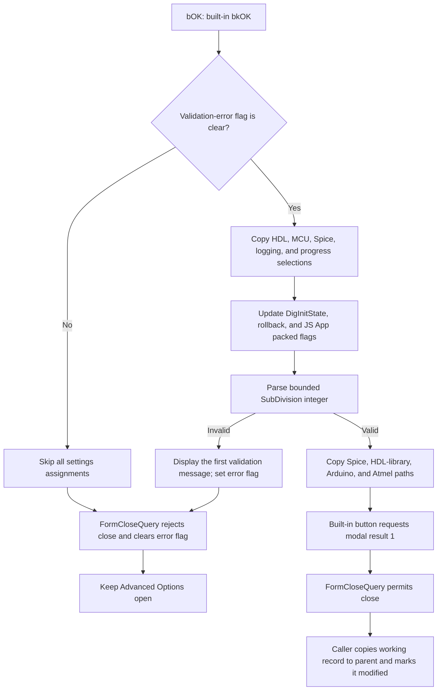

# bOK

> Analysis status: Source reviewed. The Advanced Options validation and commit path is documented.

## Control

| Property | Recovered value |
| --- | --- |
| Form | AnaloptVHDLAdvanced |
| Component path | AnaloptVHDLAdvanced.bOK |
| Control class | TBitBtn |
| Caption | Supplied by the built-in `bkOK` kind. |
| Hint | Not present in the recovered resource. |
| Text | Not present in the recovered resource. |
| Handler name | bOKClick |
| Handler address | 014ef040 |
| Graph node | `resource:dfm:AnaloptVHDLAdvanced/AnaloptVHDLAdvanced.bOK` |
| Handler node | `function:014ef040` |
| Graph layer | UI |

## What happens when clicked

`bOK` copies the controls on the **Advanced Options** form into the form's
working configuration record. The caller creates this working record from the
parent Analysis Options configuration before it opens the modal dialog. The
caller copies the working record back only when the dialog returns the OK
result. Thus, the handler edits a temporary configuration. It does not write a
file or update the parent configuration directly.

The handler first checks the form validation-error flag at offset `+0x8A0`.
When the flag is nonzero, it skips every settings assignment. The form's
`FormCloseQuery` then rejects the OK close request and clears the flag for the
next attempt.

When the validation flag is clear, the handler copies these control values to
the working record at form offset `+0x7F0`:

- **HDL:** `cbModel` selected index, **Display node states**, **Disable dig.
  interactive clock (debugger)**, and the **Library search list** text.
- **MCU:** **PIC ASM: use MPLab X 'mpasmx' if installed**, the Arduino path,
  the Atmel Studio path, **Fast MCU simulation**, and **Arduino optimization**.
- **Spice:** the **Timing**, **Input level**, **Output level**, and
  **DigInitState** selected indexes, plus the **Search path** text.
- **General progress and logging:** **Enable logging**, **Show compile
  progress**, and **Show simulation progress**.
- **Rollback:** the **Enable** state and the numeric **SubDivision** value.
- The hidden **JS App Example** checkbox state.

Most checkbox states are stored as a Boolean or as integer `0` or `1`. Two
settings share one packed flag value. `cbDigInitState` replaces its low nibble.
The rollback checkbox uses bit `0x10` with inverse meaning: checked clears the
bit, and unchecked sets it. `cbJSAPPExample` replaces only bit zero of its own
configuration value.

`eSubdivision` is the only recovered input with an `OnError` binding. Its
integer reader parses the text and checks the edit control's runtime minimum
and maximum. The error callback displays the first validation message and sets
the form error flag. The OK handler has no local exception handler. Therefore,
an invalid subdivision can leave part of the working record updated, but it
cannot update the parent configuration: `FormCloseQuery` rejects that close,
and the caller copies the record back only after an accepted OK result.

On a valid click, the built-in `bkOK` behavior supplies modal result `1`.
`FormCloseQuery` permits the close because the error flag is zero. The caller
then copies the complete working record back to the parent Analysis Options
record and sets its modified flag at parent offset `+0x8CA`. The adjacent
built-in Cancel button has no custom click handler. A non-OK modal result does
not copy the working record back and does not set the modified flag.

## Click flow

## Handler evidence

- Handler source: [FUN_014ef040](../../../DecompiledSources/Tina16/functions/00000000014EF040__FUN_014ef040.c)
- Form initialization source: [FUN_014eec50](../../../DecompiledSources/Tina16/functions/00000000014EEC50__FUN_014eec50.c)
- Close-query source: [FUN_014ef3d0](../../../DecompiledSources/Tina16/functions/00000000014EF3D0__FUN_014ef3d0.c)
- Integer-error event source: [FUN_014ef4c0](../../../DecompiledSources/Tina16/functions/00000000014EF4C0__FUN_014ef4c0.c)
- Validation-message helper: [FUN_014ef410](../../../DecompiledSources/Tina16/functions/00000000014EF410__FUN_014ef410.c)
- Modal caller and parent commit: [FUN_014f4590](../../../DecompiledSources/Tina16/functions/00000000014F4590__FUN_014f4590.c)
- Recovered role: Copy validated Advanced Options controls to the working configuration record.
- Complexity: complex
- Distinct outgoing calls: 4

The recovered Delphi field table identifies all 40 form component offsets.
`FormShow` performs the inverse operation for every handler-read component: it
loads the working record values into the same combos, checkboxes, integer edit,
and text edits. This confirms the control-to-record mapping. `FUN_014f4590`
constructs the form, copies the parent record into it, runs the modal dialog,
and copies the working record back only when the result equals `1`.

## Direct calls

- `function:00414560` — finalize the four temporary Delphi UnicodeStrings.
- `function:00414ad0` — assign each path or search-list UnicodeString to the
  working record.
- `function:0064dd90` — read text from the four path and search-list edits.
- `function:00f04d50` — parse `eSubdivision` and enforce its runtime bounds.

The combo-box and checkbox getters are indirect VCL virtual calls. They do not
appear as named direct-call edges.

## Resource evidence

- Form caption: `Advanced Options`.
- Button kind: `bkOK`; this supplies the standard OK text and modal result.
- The button has no recovered custom caption, hint, embedded glyph, or explicit
  modal-result property.
- `cbModel` items: `TTL`, `LS`, `HC`, `CMOS`, `HCT`, `S`, `AS`, and `ALS`.
- Spice timing items: `Min`, `Typ`, `Max`, and `Worst`.
- Spice input-level items: `AtoD1` through `AtoD4`.
- Spice output-level items: `DtoA1` through `DtoA4`.
- Digital initial-state items: `0`, `1`, and `X`.
- `cbCompileProgress` is disabled and hidden in the recovered resource, but the
  handler still copies its checked state to the working record.
- `cbJSAPPExample` is hidden and disabled by `FormShow` before values are
  presented to the user, but its state is still preserved by the handler.
- No same-parent label candidate or extracted glyph is available for `bOK`.

## Analysis limits

- The recovered source identifies the configuration fields by offsets, not by
  Delphi record member names.
- The DFM does not override the subdivision edit's numeric bounds. The integer
  reader enforces its runtime minimum and maximum, but this analysis does not
  assign numeric limit values.
- The handler updates only the working record. This source does not establish
  when or where the parent Analysis Options record is persisted after the
  parent dialog is accepted.
