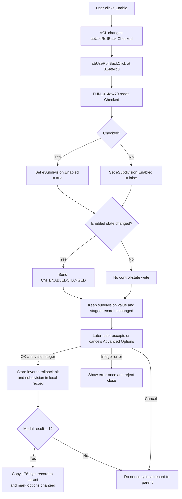

# Enable rollback

> Analysis status: Complete. The checkbox immediately controls the subdivision editor; rollback settings remain staged until the advanced dialog is accepted.

## Control

| Property | Recovered value |
| --- | --- |
| Form | AnaloptVHDLAdvanced |
| Form caption | Advanced Options |
| Component path | AnaloptVHDLAdvanced.rgRollback.cbUseRollBack |
| Parent group | Rollback |
| Control class | TCheckBox |
| Caption | Enable |
| Hint | Not present in the recovered resource. |
| Text | Not present in the recovered resource. |
| Handler name | cbUseRollBackClick |
| Handler address | 014ef4b0 |
| Graph node | `resource:dfm:AnaloptVHDLAdvanced/AnaloptVHDLAdvanced.rgRollback.cbUseRollBack` |
| Handler node | `function:014ef4b0` |
| Graph layer | UI |

## What happens when clicked

The VCL changes `cbUseRollBack.Checked` before `cbUseRollBackClick` runs. The handler calls `FUN_014ef470`, which reads that checked state and applies the same Boolean value to `eSubdivision.Enabled`.

| Checkbox state | Immediate UI result |
| --- | --- |
| Checked | Enables the integer `eSubdivision` editor. |
| Cleared | Disables the integer `eSubdivision` editor. |

The recovered field table maps `cbUseRollBack` to form offset `+0x768` and `eSubdivision` to `+0x770`. The enabled-state setter changes control byte `+0xaa` and sends `CM_ENABLEDCHANGED` only when the requested state differs from the current state.

The click does not change the current subdivision number, the **SubDivision:** label, the Rollback group, or any other control. It also does not write the staged settings record, start a simulation, perform rollback, save a file, or persist a setting.

## Subdivision value and validation

The recovered DFM sets `eSubdivision.MinValue` to 1 and associates it with the **SubDivision:** label. Its separate `OnError` handler shows the supplied integer-edit error once and sets the form error flag. `FormCloseQuery` rejects closure while that flag is set and then clears the flag for another attempt.

Disabling the editor does not clear its value. The OK path reads and range-checks `eSubdivision` even when rollback is cleared. There is no special unchecked branch that resets or skips the subdivision value.

## Staged settings and acceptance

`FormShow` restores the checkbox and integer from a 176-byte local advanced-options record:

- Rollback is enabled when bit `0x10` in the record byte at form offset `+0x87f` is clear. A set bit means disabled.
- The subdivision integer is stored at form offset `+0x858`.
- The form invokes the same enabled-state synchronizer during initialization. If restoring the checkbox changes its state, the VCL checked-state setter also dispatches the bound click event, so the subdivision editor ends with the restored enabled state.

The OK handler captures these values only through the dialog acceptance path. It first clears bit `0x10` when rollback is checked or sets the bit when rollback is cleared. It then reads the subdivision integer and stores it in the local record. An integer conversion or range error occurs after the local bit update, prevents the subdivision assignment and successful close, and does not copy the local record to the parent. A later successful OK attempt can still return the complete record.

The parent **Advanced** command creates this dialog with a copy of its current advanced-options record. It copies the dialog record back and marks the parent options as changed only when the modal result is 1. Cancel or a rejected close does not copy the local record back. This control path has no proven direct disk write; final application persistence occurs outside the recovered click handler.

## Click flow

## Handler evidence

- Click handler: [FUN_014ef4b0](../../../DecompiledSources/Tina16/functions/00000000014EF4B0__FUN_014ef4b0.c)
- Enabled-state synchronizer: [FUN_014ef470](../../../DecompiledSources/Tina16/functions/00000000014EF470__FUN_014ef470.c)
- VCL enabled-state setter: [FUN_0064dc60](../../../DecompiledSources/Tina16/functions/000000000064DC60__FUN_0064dc60.c)
- VCL checkbox getter: [FUN_00689d50](../../../DecompiledSources/Tina16/functions/0000000000689D50__FUN_00689d50.c)
- Checkbox state setter and change dispatch: [FUN_00689da0](../../../DecompiledSources/Tina16/functions/0000000000689DA0__FUN_00689da0.c)
- Form initialization: [FUN_014eec50](../../../DecompiledSources/Tina16/functions/00000000014EEC50__FUN_014eec50.c)
- OK capture: [FUN_014ef040](../../../DecompiledSources/Tina16/functions/00000000014EF040__FUN_014ef040.c)
- Integer reader and range check: [FUN_00f04d50](../../../DecompiledSources/Tina16/functions/0000000000F04D50__FUN_00f04d50.c)
- Integer error handler: [FUN_014ef4c0](../../../DecompiledSources/Tina16/functions/00000000014EF4C0__FUN_014ef4c0.c)
- Error presentation and flag: [FUN_01b1cf30](../../../DecompiledSources/Tina16/functions/0000000001B1CF30__FUN_01b1cf30.c)
- Close query: [FUN_014ef3d0](../../../DecompiledSources/Tina16/functions/00000000014EF3D0__FUN_014ef3d0.c)
- Parent modal-copy path: [FUN_014f4590](../../../DecompiledSources/Tina16/functions/00000000014F4590__FUN_014f4590.c)
- Recovered role: Synchronizes the rollback subdivision editor with the Enable checkbox.
- Complexity: simple.
- Distinct outgoing calls: 1.

## Direct calls

- `function:014ef470` - Reads `cbUseRollBack.Checked` and applies it to `eSubdivision.Enabled`.

## Resource evidence

- The checkbox caption is **Enable** inside the **Rollback** group.
- The associated integer editor is labeled **SubDivision:** and has a minimum value of 1.
- No initial checked state, hint, image reference, or glyph is present for the checkbox.

## Error and no-op behavior

- Reapplying the current enabled state is a no-op in the VCL setter. The click handler still performs the read and setter call.
- The click handler has no validation, error message, or local exception handler.
- Integer parsing and range errors belong to the later OK/read path, not to the checkbox click.
- Clearing rollback preserves the subdivision value and its staged integer field.

## Analysis limits

- The recovered paths establish how the enable flag and subdivision value are staged and returned to the parent options dialog. They do not establish the simulator algorithm that consumes those settings.
- The flag uses inverse storage semantics. This article calls rollback enabled only when the stored `0x10` bit is clear, as proven by both FormShow and OK capture.
- No direct file or global-settings write occurs in this handler.
