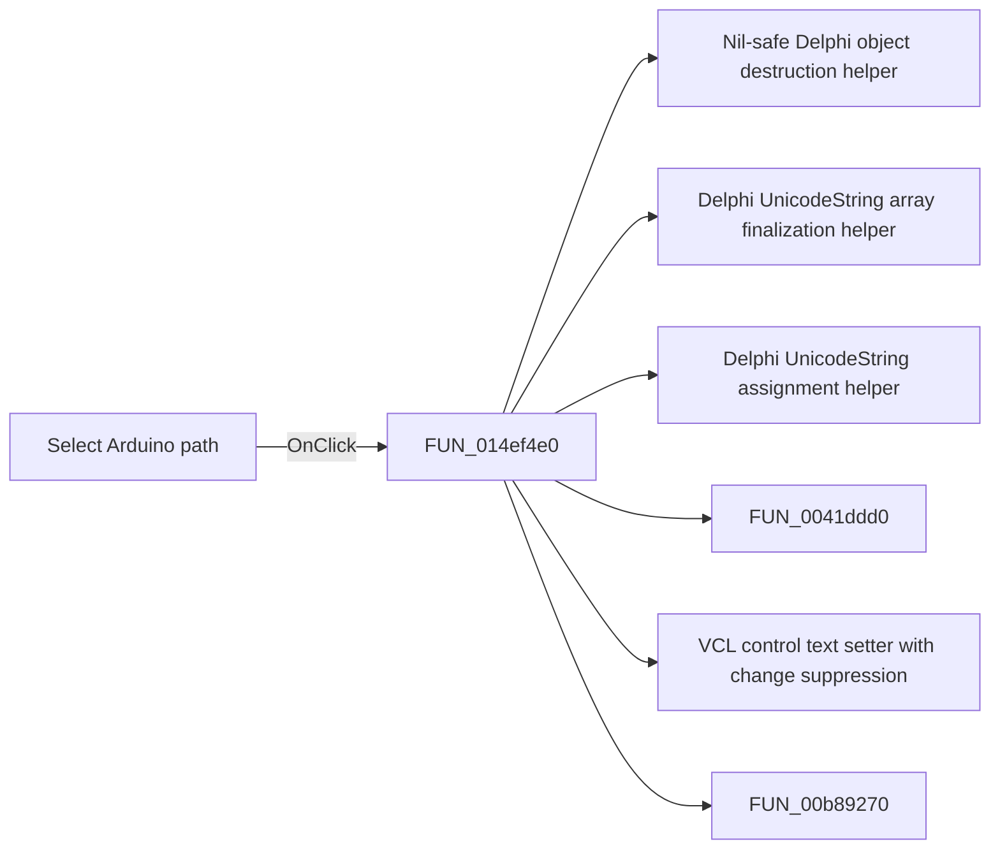

# Select Arduino path

> Analysis status: Pending individual source review.

## Control

| Property | Recovered value |
| --- | --- |
| Form | AnaloptVHDLAdvanced |
| Component path | AnaloptVHDLAdvanced.rgMCU.sbSelectArduinoPath |
| Control class | TSpeedButton |
| Caption | Not present in the recovered resource. |
| Hint | Select Arduino path |
| Text | Not present in the recovered resource. |
| Handler name | sbSelectArduinoPathClick |
| Handler address | 014ef4e0 |
| Graph node | `resource:dfm:AnaloptVHDLAdvanced/AnaloptVHDLAdvanced.rgMCU.sbSelectArduinoPath` |
| Handler node | `function:014ef4e0` |
| Graph layer | UI |

## What happens when clicked

Pending individual analysis. An agent must read the recovered handler source and its relevant callees before it replaces this text.

## Click flow

## Handler evidence

- Source: [DecompiledSources/Tina16/functions/00000000014EF4E0__FUN_014ef4e0.c](../../../DecompiledSources/Tina16/functions/00000000014EF4E0__FUN_014ef4e0.c)
- Recovered role: Not present in the recovered resource.
- Current graph summary: Handles 1 Delphi UI event: AnaloptVHDLAdvanced.rgMCU.sbSelectArduinoPath.OnClick.
- Current graph behavior: Not present in the recovered resource.
- Current graph evidence: Not present in the recovered resource.
- Complexity: complex
- Distinct outgoing calls: 11

## Direct calls

- `function:00410f20` — Nil-safe Delphi object destruction helper
- `function:00414560` — Delphi UnicodeString array finalization helper
- `function:00414ad0` — Delphi UnicodeString assignment helper
- `function:0041ddd0` — FUN_0041ddd0
- `function:0064de00` — VCL control text setter with change suppression
- `function:00b89270` — FUN_00b89270
- `function:00b8e650` — FUN_00b8e650
- `function:00d30800` — FUN_00d30800
- `function:01055ef0` — FUN_01055ef0
- `function:0105a0d0` — FUN_0105a0d0
- `function:0105f390` — FUN_0105f390

## Resource evidence

- Kind: Not present in the recovered resource.
- Modal result: Not present in the recovered resource.
- Checked state: Not present in the recovered resource.
- List items: Not present in the recovered resource.
- Image reference: Not present in the recovered resource.
- Extracted glyph: [`0011_AnaloptVHDLAdvanced_AnaloptVHDLAdvanced_rgMCU_sbSelectArduinoPath_Glyph_Data.png`](../../../glyph/0011_AnaloptVHDLAdvanced_AnaloptVHDLAdvanced_rgMCU_sbSelectArduinoPath_Glyph_Data.png)

## Nearby label candidates

Nearby labels are layout candidates only. They are not proof of behavior.

- Rank 1: Ardunio path:  at distance 398.
- Rank 2: Atmel Studio path:  at distance 425.

## Analysis limits

- Do not infer behavior from the control class, caption, hint, glyph, or nearby label alone.
- Do not replace the pending status until the handler source and relevant call path provide enough evidence.
