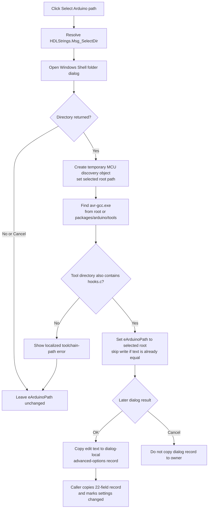

# Select Arduino path

## Control

| Property | Recovered value |
| --- | --- |
| Form | AnaloptVHDLAdvanced |
| Form caption | Advanced Options |
| Component path | AnaloptVHDLAdvanced.rgMCU.sbSelectArduinoPath |
| Control class | TSpeedButton |
| Caption | Not present in the recovered resource. |
| Hint | Select Arduino path |
| Handler name | sbSelectArduinoPathClick |
| Handler address | 014ef4e0 |
| Target edit | AnaloptVHDLAdvanced.rgMCU.eArduinoPath |
| Graph node | `resource:dfm:AnaloptVHDLAdvanced/AnaloptVHDLAdvanced.rgMCU.sbSelectArduinoPath` |
| Handler node | `function:014ef4e0` |
| Graph layer | UI |

## What happens when clicked

`FUN_014ef4e0` resolves the localized resource key `HDLStrings.Msg_SelectDir` and uses the result as the title for a Windows Shell folder-selection dialog. The dialog is owned by the application window.

If the user cancels the folder dialog, or if the Shell dialog does not return a directory, the handler stops. It does not change `eArduinoPath`, display an error, or change the dialog's settings record.

If the user selects a directory, the handler creates a temporary MCU toolchain-discovery object and assigns the selected directory to its two root-path fields. It then validates the directory for the default Arduino AVR toolchain:

1. It searches a file listing rooted at the selected directory for `avr-gcc.exe`.
2. If that search fails, it searches below `packages\arduino\tools`.
3. After it finds the tool directory, it also requires `hooks.c`.
4. It derives Arduino hardware and library paths in the temporary object.

The validator returns true only after it finds `hooks.c`. On success, the handler copies the selected root from the temporary object to `eArduinoPath`. The VCL text setter skips the write and its change notification when the edit already contains the same text. The handler then destroys the temporary discovery object.

## Invalid directory and retry behavior

If the discovery routine returns false, the handler resolves another localized string and passes it to the MCU toolchain error-dialog builder. That routine adds further localized details and displays the message. The handler does not copy the rejected directory to `eArduinoPath`. The previous edit value remains available, and the user can click the selection button again.

This handler does not set the form's close-query error byte. Therefore, a rejected folder does not itself block the Advanced Options dialog from closing. The error-dialog routine sets a local output flag, but `FUN_014ef4e0` does not use that flag.

The handler has no explicit catch branch. An unexpected Shell, allocation, or discovery exception follows the Delphi runtime exception path and is not converted to this invalid-directory message by the recovered handler.

## Commit and ownership

`FUN_014eec50`, the form's `OnShow` handler, loads the dialog-local Arduino path at form offset `+0x838` into `eArduinoPath` at `+0x7a0`. The selection click changes only this edit control.

When the user selects **OK**, `FUN_014ef040` reads the current edit text and assigns it to the dialog-local field at `+0x838` when the dialog's error byte is clear. This path-selection handler does not set that byte. After the modal result is OK, caller `FUN_014f4590` copies the complete 22-field advanced-options record back to its owning settings object and sets its changed flag. On Cancel, the caller does not copy the dialog record back.

The recovered OK handler does not call the Arduino-path validator. The validation described here applies to a directory selected through this button. A previous value or text entered directly in `eArduinoPath` is copied by OK without this handler's discovery check.

## Click flow

## Evidence

- [Click handler `FUN_014ef4e0`](../../../DecompiledSources/Tina16/functions/00000000014EF4E0__FUN_014ef4e0.c) resolves the prompt, opens the folder dialog, validates an accepted path, reports failure, and updates `eArduinoPath` only on success.
- [Folder-selection helper `FUN_00d30800`](../../../DecompiledSources/Tina16/functions/0000000000D30800__FUN_00d30800.c) calls the Windows Shell folder browser, returns a Boolean selection result, and clears its output on cancellation or failure.
- [MCU toolchain validator `FUN_0105f390`](../../../DecompiledSources/Tina16/functions/000000000105F390__FUN_0105f390.c) uses `avr-gcc.exe`, the `arduino` package name, `packages\arduino\tools`, and `hooks.c` for the mode used by this handler.
- [Toolchain path derivation `FUN_0105ee90`](../../../DecompiledSources/Tina16/functions/000000000105EE90__FUN_0105ee90.c) builds the Arduino hardware and library locations in the temporary object.
- [Toolchain error builder `FUN_01055ef0`](../../../DecompiledSources/Tina16/functions/0000000001055EF0__FUN_01055ef0.c) builds a localized multi-part message, displays it, and sets the local output flag.
- [Form-show loader `FUN_014eec50`](../../../DecompiledSources/Tina16/functions/00000000014EEC50__FUN_014eec50.c) copies the dialog-local path to the edit. [OK handler `FUN_014ef040`](../../../DecompiledSources/Tina16/functions/00000000014EF040__FUN_014ef040.c) copies the edit back to the dialog-local record.
- [Modal caller `FUN_014f4590`](../../../DecompiledSources/Tina16/functions/00000000014F4590__FUN_014f4590.c) copies the complete record to the owner only after modal result 1 and then sets the owner's changed flag.
- [VCL text setter `FUN_0064de00`](../../../DecompiledSources/Tina16/functions/000000000064DE00__FUN_0064de00.c) suppresses an equal-text update.
- The DFM resource identifies `eArduinoPath`, its nearby label `Ardunio path:`, and the button hint **Select Arduino path**. The extracted [two-frame folder glyph](../../../glyph/0011_AnaloptVHDLAdvanced_AnaloptVHDLAdvanced_rgMCU_sbSelectArduinoPath_Glyph_Data.png) supports the folder-selection intent but does not establish the validation behavior.

## Direct calls

- `function:00b89270` gets the shared localization manager.
- `function:00b8e650` resolves the localized folder-dialog title.
- `function:00d30800` opens the folder dialog.
- `function:0105a0d0` creates the temporary MCU toolchain-discovery object.
- `function:0105f390` validates and discovers the Arduino AVR toolchain layout.
- `function:01055ef0` displays the localized failure message.
- `function:0064de00` updates `eArduinoPath` only when the text differs.
- `function:00410f20` destroys the temporary object.
- The remaining direct calls manage temporary Delphi UnicodeString values.

## Analysis limits

- The localized prompt and error strings are resolved at run time. The recovered source provides the resource key and message-building path, but not the final text for every language.
- The source proves the AVR compiler and `hooks.c` discovery checks. It does not prove which later compiler invocation consumes every derived path.
