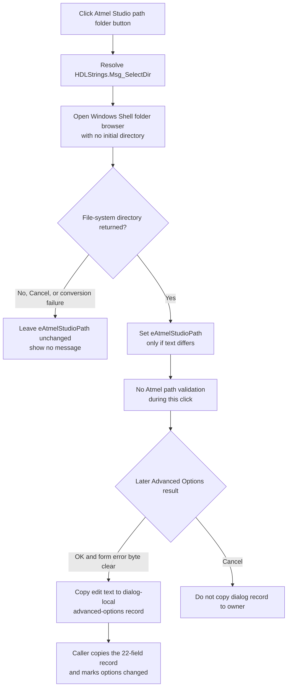

# Select Atmel Studio path

## Control

| Property | Recovered value |
| --- | --- |
| Form | AnaloptVHDLAdvanced |
| Form caption | Advanced Options |
| Component path | AnaloptVHDLAdvanced.rgMCU.sbSelectAtmelStudioPath |
| Control class | TSpeedButton |
| Caption | Not present in the recovered resource. |
| Hint | Select Arduino path |
| Handler name | sbSelectAtmelStudioPathClick |
| Handler address | 014ef670 |
| Target edit | AnaloptVHDLAdvanced.rgMCU.eAtmelStudioPath |
| Graph node | `resource:dfm:AnaloptVHDLAdvanced/AnaloptVHDLAdvanced.rgMCU.sbSelectAtmelStudioPath` |
| Handler node | `function:014ef670` |
| Graph layer | UI |

The button hint says **Select Arduino path**, but this is a reused or incorrect hint. The DFM places the button beside the **Atmel Studio path:** label and `eAtmelStudioPath`. The handler, form-show loader, and OK handler all access the same edit-control field at form offset `+0x7d0`.

## What happens when clicked

`FUN_014ef670` gets the shared localization manager and resolves `HDLStrings.Msg_SelectDir`. It passes the localized text to `FUN_00d30800` as the title of a Windows Shell folder-selection dialog. It supplies an empty initial-directory argument, so this click does not seed the browser from the current edit text.

If the Shell browser returns a directory, the handler passes that directory to the VCL text setter for `eAtmelStudioPath`. The setter first compares the new and current strings. It sends the text-change path only when they differ.

The click handler does not test the selected directory, search for Atmel Studio files, or display an invalid-path message. The edit therefore accepts any directory returned by the folder browser. Later Atmel AVR build code checks the configured root for `toolchain\avr8\avr8-gnu-toolchain\bin`, `avr-gcc.exe`, `avr-objcopy.exe`, `avr-objdump.exe`, `avr-size.exe`, and device-pack directories. Those later checks can report errors such as **Invalid Atmel Studio path**, but they are not part of this click.

## Cancel, failure, and error behavior

`FUN_00d30800` returns false when the user cancels the Shell browser, when the browser returns no item, or when the selected item cannot be converted to a file-system path. In all these cases, `FUN_014ef670` skips the text setter. The previous `eAtmelStudioPath` value stays unchanged, and the handler displays no message.

The handler has no explicit exception branch. An unexpected localization, Shell, or allocation exception follows the Delphi runtime exception path. The recovered handler does not convert such an exception to an Atmel-path error.

## Load and commit behavior

When the Advanced Options form opens, `FUN_014eec50` copies the dialog-local Atmel Studio path at `+0x840` to `eAtmelStudioPath` at `+0x7d0`. If that value is empty, it tries to read an Atmel Studio `InstallDir` from `\Software\Atmel\AtmelStudio\<version>\_Config` and uses the result as the displayed path. On discovery success, the form-show handler also copies that value to the shared Atmel-path field. This automatic lookup and shared-field write belong to form loading; the selection button does not call them or update the shared field.

The click changes only the edit control. When the user selects **OK**, `FUN_014ef040` copies the current edit text to the dialog-local field at `+0x840`, provided that the form error byte is clear. After modal result 1, caller `FUN_014f4590` copies the complete 22-field advanced-options record back to the owning options object and marks it as changed. On Cancel, the caller destroys the dialog without copying that record back.

Neither the click handler nor the recovered OK handler validates directly entered or selected Atmel Studio text. Validation occurs only when later code needs the Atmel AVR toolchain.

## Click flow

## Evidence

- [Click handler `FUN_014ef670`](../../../DecompiledSources/Tina16/functions/00000000014EF670__FUN_014ef670.c) resolves the folder title, opens the folder browser with initial-directory argument zero, and updates the control at form offset `+0x7d0` only when the browser returns true.
- [Folder-selection helper `FUN_00d30800`](../../../DecompiledSources/Tina16/functions/0000000000D30800__FUN_00d30800.c) configures the Windows Shell folder browser, returns the selected file-system path, and clears its output on cancellation or conversion failure.
- [VCL text setter `FUN_0064de00`](../../../DecompiledSources/Tina16/functions/000000000064DE00__FUN_0064de00.c) compares the current and requested strings and sends the text-change path only when they differ.
- [Form-show loader `FUN_014eec50`](../../../DecompiledSources/Tina16/functions/00000000014EEC50__FUN_014eec50.c) loads the Atmel path from dialog-local field `+0x840` into edit control `+0x7d0` and attempts automatic discovery only when it is empty.
- [Atmel Studio discovery helper `FUN_010adf80`](../../../DecompiledSources/Tina16/functions/00000000010ADF80__FUN_010adf80.c) reads `InstallDir` from the version-specific current-user Atmel Studio registry key.
- [OK handler `FUN_014ef040`](../../../DecompiledSources/Tina16/functions/00000000014EF040__FUN_014ef040.c) copies edit control `+0x7d0` to dialog-local field `+0x840` only when the form error byte is clear.
- [Modal caller `FUN_014f4590`](../../../DecompiledSources/Tina16/functions/00000000014F4590__FUN_014f4590.c) copies the complete record to the owner and sets the changed flag only after modal result 1.
- [Atmel AVR build setup `FUN_0108e410`](../../../DecompiledSources/Tina16/functions/000000000108E410__FUN_0108e410.c) consumes the configured path later and performs the executable, directory, and device-pack checks that are absent from this click.
- The DFM identifies the adjacent `eAtmelStudioPath`, its **Atmel Studio path:** label, and the edit hint `for example c:\Program Files (x86)\Atmel\Studio\7.0`. The extracted [two-frame folder glyph](../../../glyph/0012_AnaloptVHDLAdvanced_AnaloptVHDLAdvanced_rgMCU_sbSelectAtmelStudioPath_Glyph_Data.png) supports the folder-selection role but does not establish the data flow.

## Direct calls

- `function:00b89270` gets the shared localization manager.
- `function:00b8e650` resolves the localized folder-dialog title.
- `function:00d30800` opens the Windows Shell folder browser.
- `function:0064de00` updates `eAtmelStudioPath` only when the text differs.
- The remaining direct calls copy and finalize temporary Delphi UnicodeString values.

## Analysis limits

- The final folder-dialog title depends on the active language resource. The recovered source provides the resource key but not every translated value.
- The recovered click handler does not distinguish user cancellation from a Shell browse or path-conversion failure. All three cases take the same no-change branch.
