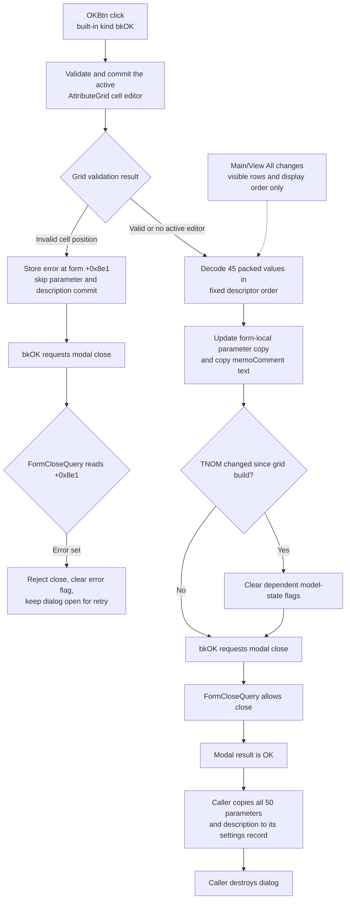

# OKBtn

## Control

| Property | Recovered value |
| --- | --- |
| Form | AnalParametersDlg |
| Component path | AnalParametersDlg.pnlButtons.OKBtn |
| Control class | TBitBtn |
| Caption | Not present in the recovered resource. |
| Hint | Not present in the recovered resource. |
| Text | Not present in the recovered resource. |
| Handler name | OKBtnClick |
| Handler address | 01153160 |
| Graph node | `resource:dfm:AnalParametersDlg/AnalParametersDlg.pnlButtons.OKBtn` |
| Handler node | `function:01153160` |
| Graph layer | UI |

## What happens when clicked

`FUN_01153160` first asks the attribute grid to validate and commit its active cell editor. A return value of zero means that the current edit is valid or that no cell editor is active. A nonzero return value means that the grid position is not valid. The handler stores this result in the form byte at offset `+0x8e1`.

If validation succeeds, the handler commits the grid's packed edit buffer to the dialog's form-local parameter record. It decodes 45 parameter values in fixed descriptor order:

- descriptor types 1 and 2 read a signed 32-bit integer and convert it to a double;
- type 3 reads a signed byte and converts it to a double;
- type 4 reads a zero-based byte, adds one, and converts it to a double;
- all other types copy an 8-byte floating-point value.

The handler then reads `memoComment` and assigns its text to the form-local description string. If the first parameter changed since the last grid build, it obtains the current model collection and recursively clears a state flag on affected nested objects. The callers identify this first parameter as the nominal temperature (`TNOM`). This invalidation does not run when `TNOM` is unchanged.

If validation fails, the handler does not copy the 45 parameter values, does not copy the description, and does not invalidate model state. The built-in `bkOK` button still requests a modal close, but `FUN_011537c0`, the form's `OnCloseQuery` handler, sees the error byte and rejects that close. It then clears the byte so that the user can correct the cell and try again.

## Ordering and filter effects

The grid build routine `FUN_01152760` always packs all 45 editable parameters in fixed descriptor order. The **View All** state changes the visible rows and the display-order field that is used for those rows. In the main-parameter view, the routine omits descriptors that are not marked as main parameters. These display choices do not change the packed buffer order that `FUN_01153160` decodes.

The **View All**, **Save**, and **Save As** handlers also call `FUN_01153160`. For **View All**, this call occurs before the old rows are removed and the filtered grid is rebuilt. Therefore, an active edit is committed against the old row layout before the display order or filter changes.

## Modal result and ownership

The constructor `FUN_01152540` copies 50 input parameter slots and the input description into form-local storage. The grid exposes 45 of these slots. The five other slots remain in the form-local copy.

On a successful `bkOK` close, the modal caller receives the OK result and copies all 50 slots and the description from the dialog back to its own settings record. The caller then destroys the dialog. On Cancel, the caller does not perform this copy-back, so its parameters and description remain unchanged. The click handler does not itself own or update the caller's settings record.

If no grid cell editor is active, validation is a successful no-op and the handler still performs the full form-local commit. If no parameter changed, the copies still occur, but the `TNOM` invalidation can be skipped. The handler has no local exception handler. A conversion, allocation, or VCL exception can therefore leave the commit incomplete and propagate through the modal event path.

## Click flow

## Handler evidence

- Handler: [FUN_01153160](../../../DecompiledSources/Tina16/functions/0000000001153160__FUN_01153160.c)
- Grid commit gate: [FUN_00b0a890](../../../DecompiledSources/Tina16/functions/0000000000B0A890__FUN_00b0a890.c) and [FUN_00b0a150](../../../DecompiledSources/Tina16/functions/0000000000B0A150__FUN_00b0a150.c)
- Grid build, packing, filter, order, and `TNOM` snapshot: [FUN_01152760](../../../DecompiledSources/Tina16/functions/0000000001152760__FUN_01152760.c)
- Form-local copy construction: [FUN_01152540](../../../DecompiledSources/Tina16/functions/0000000001152540__FUN_01152540.c)
- Close-query retry gate: [FUN_011537c0](../../../DecompiledSources/Tina16/functions/00000000011537C0__FUN_011537c0.c)
- Modal callers and copy-back: [FUN_01c76bb0](../../../DecompiledSources/Tina16/functions/0000000001C76BB0__FUN_01c76bb0.c) and [FUN_01532880](../../../DecompiledSources/Tina16/functions/0000000001532880__FUN_01532880.c)
- Recursive dependent-state invalidation: [FUN_019af700](../../../DecompiledSources/Tina16/functions/00000000019AF700__FUN_019af700.c)

## Direct calls

- `function:00b0a890` validates and commits the active grid cell editor.
- `function:00b909d0` advances through the typed packed parameter buffer.
- `function:0064dd90` reads the description memo text.
- `function:00414ad0` assigns the form-local Unicode description.
- `function:019a4600` obtains the current model collection.
- `function:019af700` recursively invalidates dependent model state after a `TNOM` change.
- `function:00414480` finalizes the temporary Unicode string.

## Resource evidence

- The resource identifies this control as a `TBitBtn` with built-in kind `bkOK`.
- The form caption is `Analysis Parameters`.
- The control has no recovered caption, hint, text, or glyph.
- The form resource binds `OnCloseQuery` to `FUN_011537c0`.

## Analysis limits

- The recovered code proves that the invalidation clears a byte flag on selected nested model objects. It does not recover the original Delphi field name for that flag.
- The recovered code does not identify a user-facing error message for an invalid grid cell. The proven response is that the close is rejected once and the dialog remains open.
