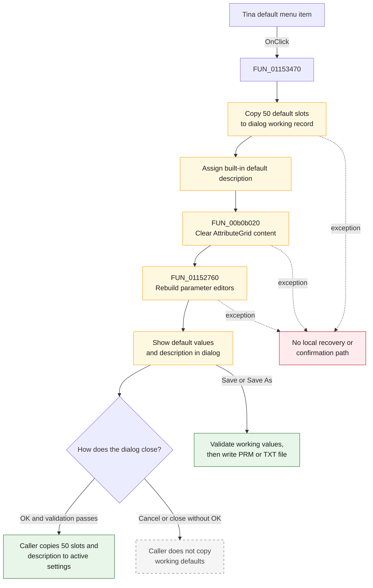

# Tina default

> Analysis status: Complete. The recovered handler, dynamic parameter-grid builder, dialog callers, and parameter-file commands establish the reset and persistence behavior.

## Control

| Property | Recovered value |
| --- | --- |
| Form | AnalParametersDlg |
| Form caption | Analysis Parameters |
| Component path | AnalParametersDlg.PopupMenu.PMIDefault |
| Control class | TMenuItem |
| Caption | &Tina default |
| Hint | Not present in the recovered resource. |
| Handler name | PMIDefaultClick |
| Handler address | 01153470 |
| Graph node | `resource:dfm:AnalParametersDlg/AnalParametersDlg.PopupMenu.PMIDefault` |
| Handler node | `function:01153470` |
| Graph layer | UI |

## What happens when clicked

The command replaces the dialog's working analysis settings with TINA's built-in defaults. It does not ask for confirmation and does not immediately change the active application settings or write a parameter file.

`FUN_01153470` performs these operations in order:

1. It copies 50 consecutive 64-bit slots, or 400 bytes, from the built-in default record at `PTR_DAT_02001120 + 200` to the dialog working record at form offset `+0x740`.
2. It assigns the built-in default description at `PTR_DAT_02001120 + 600` to the dialog description field at `+0x8d8`.
3. It clears the existing dynamic controls and cells from `AttributeGrid`, starting at grid index `0`.
4. It calls the form's recovered `OnShow` handler, `FUN_01152760`, to rebuild the visible parameter editors from the new working values and to copy the default description into `memoComment`.

The handler does not compare the current values with the defaults. A second click copies the same values again and rebuilds the grid again.

## Parameters reset to built-in defaults

The grid builder reads the first 45 values in the copied record. It loads English labels 1 through 44 from resource IDs `0x24c` through `0x277`; label 45 is a recovered literal.

| # | Parameter shown in the grid |
| ---: | --- |
| 1 | Temperature of environment [C] |
| 2 | DC absolute current error [A] |
| 3 | DC absolute base-current error [A] |
| 4 | DC absolute voltage error [V] |
| 5 | DC relative error [%] |
| 6 | GMIN (minimum conductance) [S] |
| 7 | PIVREL (rel. pivot tolerance) |
| 8 | PIVTOL (abs. pivot tolerance) |
| 9 | Accelerate model equations |
| 10 | Always starts with source step |
| 11 | DC max. iteration number [-] |
| 12 | DC min. iteration number [-] |
| 13 | DC min. source step [%] |
| 14 | DC Second source step [%] |
| 15 | DC First source step [%] |
| 16 | TR max. iteration number [-] |
| 17 | TR max. abs. voltage incr. [V] |
| 18 | TR max. abs. current incr. [A] |
| 19 | TR max. relative increment [%] |
| 20 | TR truncation error factor [-] |
| 21 | TR iteration control factor [-] |
| 22 | TR charge tolerance |
| 23 | TR maximum time step [s] |
| 24 | TR minimum time step [s] |
| 25 | TR excitation subdivisions [-] |
| 26 | TR time intrv. subdivisions [-] |
| 27 | Abs. error of optimization [-] |
| 28 | Rel. error of optimization [%] |
| 29 | Semiconductor capacitors enabled |
| 30 | Shunt conductance [S] |
| 31 | Max. no. of saved TR points [-] |
| 32 | TR maximum value relative error [%] |
| 33 | TR LTE voltage-based/charge-based |
| 34 | Wave processing quality (1-4) |
| 35 | Audio latency [s] |
| 36 | DC max. abs. voltage incr. [V] |
| 37 | DC max. abs. current incr. [A] |
| 38 | DC max. relative increment [%] |
| 39 | DC iter. limitation enabled |
| 40 | Shunt capacitance [F] |
| 41 | Operating point with initial conditions |
| 42 | Minimum capacitance [F] |
| 43 | Table smoothing parameter [-] |
| 44 | TR minimum PWL time step [s] |
| 45 | Harmonic balance initial guess mode |

The copied record has five more 64-bit slots after these 45 grid values. The handler resets those slots too. The recovered grid code does not display or label them, so this review does not invent semantic names for them.

## Inputs, decisions, and outputs

| Stage | Proven behavior |
| --- | --- |
| Input | The built-in default record and description referenced by `PTR_DAT_02001120`. The command does not use the menu-item sender. |
| Decision | There is no confirmation, changed-state test, or conditional reset path. |
| Working-state update | Replaces 400 bytes at form offset `+0x740` and the description string at `+0x8d8`. |
| Grid update | Clears all existing dynamic grid content and rebuilds the applicable editors from the new working values. |
| Description update | Assigns the built-in description to `memoComment`. |
| Active-setting effect | None until the dialog later returns `mrOk`. |
| File effect | None. The Default handler does not call the `.PRM` or `.TXT` save path. |
| Output | The open dialog shows TINA's built-in values and description as its current editable working state. |

## Command flow

## Handler and call-path evidence

- Default command: [FUN_01153470](../../../DecompiledSources/Tina16/functions/0000000001153470__FUN_01153470.c)
- Dynamic grid rebuild and description refresh: [FUN_01152760](../../../DecompiledSources/Tina16/functions/0000000001152760__FUN_01152760.c)
- Parameter label loader: [FUN_011526b0](../../../DecompiledSources/Tina16/functions/00000000011526B0__FUN_011526b0.c)
- Grid-content clear: [FUN_00b0b020](../../../DecompiledSources/Tina16/functions/0000000000B0B020__FUN_00b0b020.c)
- OK validation and working-value readback: [FUN_01153160](../../../DecompiledSources/Tina16/functions/0000000001153160__FUN_01153160.c)
- Dialog initialization wrapper: [FUN_01152540](../../../DecompiledSources/Tina16/functions/0000000001152540__FUN_01152540.c)
- Schematic Editor commit after `mrOk`: [FUN_01c76bb0](../../../DecompiledSources/Tina16/functions/0000000001C76BB0__FUN_01c76bb0.c)
- Netlist Editor commit after `mrOk`: [FUN_01532880](../../../DecompiledSources/Tina16/functions/0000000001532880__FUN_01532880.c)
- Save command: [FUN_01153600](../../../DecompiledSources/Tina16/functions/0000000001153600__FUN_01153600.c)
- Save As command: [FUN_01153680](../../../DecompiledSources/Tina16/functions/0000000001153680__FUN_01153680.c)
- Recovered handler role: Reset the Analysis Parameters dialog working state to TINA defaults.
- Likely Delphi method: `TAnalParametersDlg.PMIDefaultClick`.
- Complexity: complex
- Distinct outgoing calls: 3

## Confirmation and persistence timing

- Default has no confirmation prompt. The working values and visible editors change immediately.
- The command does not write to the active settings record at `PTR_DAT_02004010`.
- The Schematic Editor and Netlist Editor callers copy the dialog's 50 slots and description to the active settings record only when the modal result is `1`, which is `mrOk`.
- Cancel or another non-OK modal result leaves the active settings record unchanged. The temporary defaults disappear when the dialog instance is released.
- Save and Save As are separate commands. They first read and validate the current grid values, then write a parameter file. Default does not call either command.
- The Netlist Editor caller also updates affected `.OPTIONS` or `.TRAN` entries after an accepted dialog. That work occurs after `mrOk`, not during Default.
- This call path does not prove when the active settings record is written to the application's long-term preferences. It only proves the dialog-to-active-settings commit and the explicit parameter-file save paths.

## No-op and error behavior

- Repeated Default click: values are copied and the UI is rebuilt again. The resulting values are unchanged, but the handler is not a code-level no-op.
- Hidden parameters: the grid builder can omit parameters according to the current main-parameter view mode. The underlying 50-slot working record is still fully reset.
- Validation: Default does not validate the copied built-in record. Validation occurs when OK, Save, or Save As reads the grid.
- Failure: the handler has no local exception handler. An assignment, grid clear, or editor rebuild failure leaves the dialog in the state reached before the exception and propagates to the outer Delphi exception mechanism.
- Partial UI rebuild: if the grid rebuild fails after the copy, the working record already contains defaults, but the visible grid can be incomplete. There is no rollback in this handler.

## Resource evidence

- The menu caption is **Tina default**.
- `AttributeGrid` is the dynamic parameter editor that `FUN_01152760` clears and repopulates.
- The dialog has a **Description** label and `memoComment`; the grid rebuild copies the default description into that memo.
- The same popup menu has separate **Open...**, **Save**, and **Save As...** commands. Their recovered handlers confirm that Default itself does not perform file persistence.
- No hint, image reference, glyph, or nearby same-parent label is present for this menu item.

## Analysis limits

- The five trailing 64-bit slots in the copied 400-byte record are not displayed by this dialog and have no recovered labels.
- The resource catalog supplies the first 44 parameter labels. The original Delphi field names for the 50-slot record are not recovered.
- The source proves commit to the active in-memory settings record after `mrOk`. It does not prove the later application-shutdown or preferences-file persistence policy.
