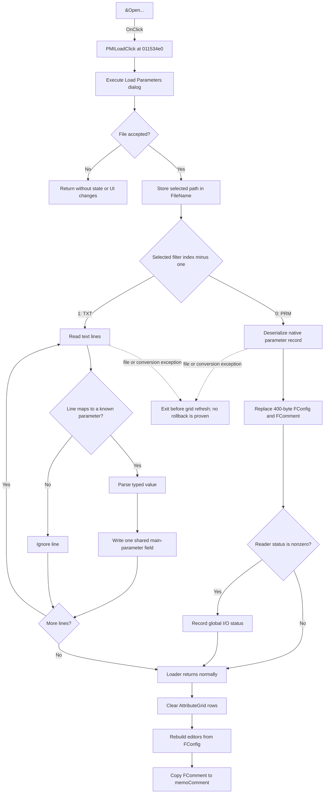

# &Open...

> Analysis status: Complete. The native PRM and text TXT paths have different state targets.

## Control

| Property | Recovered value |
| --- | --- |
| Form | AnalParametersDlg |
| Component path | AnalParametersDlg.PopupMenu.PMILoad |
| Control class | TMenuItem |
| Caption | &Open... |
| Hint | Not present in the recovered resource. |
| Text | Not present in the recovered resource. |
| Handler name | PMILoadClick |
| Handler address | 011534e0 |
| Graph node | `resource:dfm:AnalParametersDlg/AnalParametersDlg.PopupMenu.PMILoad` |
| Handler node | `function:011534e0` |
| Graph layer | UI |

## What happens when clicked

`PMILoadClick` executes the form's `LoadDialog`. Form creation configures this dialog with the title `Load Parameters`, the initial Main Tina folder, and these two filters in this order:

1. `Parameter file (*.PRM)|*.PRM`
2. `Parameter file (*.TXT)|*.TXT`

Cancel returns from the handler without changing the file name, parameter data, comment, or visible grid. If the user accepts the dialog, the handler first stores the selected path in the form's `FileName` field. It then subtracts one from the selected filter index and calls `FUN_014aeb50`. The resulting value selects one of two proven load modes.

| Selected filter | Load behavior | State target |
| --- | --- | --- |
| PRM | Deserializes a native analysis-parameter record. With the zero context argument supplied by this handler, the loader copies 0x32 qwords (400 bytes) into the form's working configuration and assigns the loaded comment to the form's working comment. | Full replacement of `FConfig` and `FComment` in this dialog. |
| TXT | Reads the file line by line. It maps recognized line positions to one of 45 parameter definitions, parses the trailing integer, localized choice, or floating-point value, and writes that value to the corresponding entry in the shared main-parameter record. Unknown line positions are ignored. | Field-by-field merge into the shared in-memory main-parameter record. The loader does not reset unspecified fields and does not load a comment. |

The handler clears all rows from `AttributeGrid` after a normal loader return. It then calls the form's show-time population routine. That routine rebuilds the typed parameter editors from the form's `FConfig` working copy and writes `FComment` to `memoComment`.

The PRM replacement is therefore visible in the rebuilt grid and comment memo. The recovered TXT branch writes the shared main-parameter record, but it does not copy those values into `FConfig`. The subsequent rebuild still reads `FConfig`. No recovered call proves that the current dialog immediately displays the TXT changes. This difference can leave the dialog working copy unchanged while shared in-memory parameters have changed.

## Cancellation, errors, and persistence

- Dialog cancellation is a no-op apart from local string cleanup.
- The selected file name is stored before parsing. A later parse failure has no proven rollback for that field.
- The PRM reader copies its recovered record and comment before it checks its reader status. A nonzero status is passed to the global I/O-status recorder. The recovered code does not prove an atomic rollback.
- File operations and numeric conversions can raise an exception. `PMILoadClick` has no local exception handler. If the loader does not return normally, the grid clear and UI rebuild are skipped.
- The handler does not save a file. PRM data remains in the dialog's working configuration until another action applies or discards it. TXT import directly changes the shared in-memory main-parameter record, but this path has no proven disk-persistence call.

## Click flow

## Handler evidence

- Handler source: [DecompiledSources/Tina16/functions/00000000011534E0__FUN_011534e0.c](../../../DecompiledSources/Tina16/functions/00000000011534E0__FUN_011534e0.c)
- Dialog setup: [DecompiledSources/Tina16/functions/0000000001153810__FUN_01153810.c](../../../DecompiledSources/Tina16/functions/0000000001153810__FUN_01153810.c)
- Loader: [DecompiledSources/Tina16/functions/00000000014AEB50__FUN_014aeb50.c](../../../DecompiledSources/Tina16/functions/00000000014AEB50__FUN_014aeb50.c)
- UI rebuild: [DecompiledSources/Tina16/functions/0000000001152760__FUN_01152760.c](../../../DecompiledSources/Tina16/functions/0000000001152760__FUN_01152760.c)
- Recovered role: Load analysis parameters from a selected PRM or TXT file and refresh the dialog.
- Complexity: complex
- Distinct outgoing calls: 7

## Direct calls

- `function:00414480` — Finalizes the temporary selected-file UnicodeString.
- `function:00414ad0` — Assigns the selected path to the form's `FileName` field.
- `function:00724270` — Reads the selected file name from the load dialog.
- `function:00724300` — Reads the selected filter index from the load dialog.
- `function:014aeb50` — Loads native PRM data or imports text parameter values.
- `function:00b0b020` — Clears the attribute grid from row zero.
- `function:01152760` — Rebuilds the parameter grid and comment memo from the form's working state.

## Resource evidence

- The menu caption identifies an open command, but it does not identify the file format or state target by itself.
- Form creation supplies the dialog title, filter order, extensions, and initial folder.
- No hint, image, extracted glyph, modal result, checked state, text, or list items are present for this menu item.

## Analysis limits

- Recovered names for `FConfig`, `FComment`, `FileName`, `LoadDialog`, and the shared main-parameter record come from form RTTI or repeated data-flow evidence. Individual fields inside the 400-byte record do not have recovered Delphi names here.
- The fifth loader argument is absent from the decompiler's cross-file call prototype. The recovered machine code sets that stack argument to zero before the call, which selects the temporary-object copy path in the native loader.
- The global I/O-status recorder does not display an error in its recovered body. A later error presentation path was not established for this control.
- No hidden synchronization from the shared TXT target to the form's `FConfig` working copy is present in the recovered handler or loader path.
