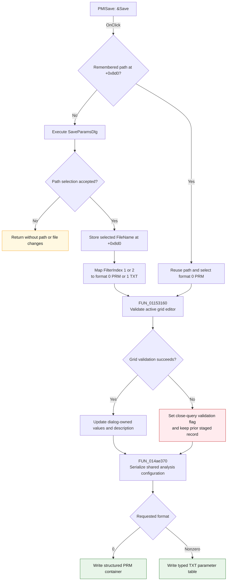

# &Save

> Analysis status: Source reviewed. The remembered-path decision, Save As
> delegation, grid validation, file-format selection, and serializer inputs are
> supported by the recovered handlers and dialog resources.

## Control

| Property | Recovered value |
| --- | --- |
| Form | AnalParametersDlg |
| Form caption | Analysis Parameters |
| Component path | AnalParametersDlg.PopupMenu.PMISave |
| Control class | TMenuItem |
| Caption | &Save |
| Hint | Not present in the recovered resource. |
| Text | Not present in the recovered resource. |
| Handler name | PMISaveClick |
| Handler address | 01153600 |
| Graph node | `resource:dfm:AnalParametersDlg/AnalParametersDlg.PopupMenu.PMISave` |
| Handler node | `function:01153600` |
| Graph layer | UI |

## What happens when clicked

`FUN_01153600` saves to the dialog's remembered parameter-file path at form
offset `+0x8d0`. The same field receives the selected file name after an Open
or Save As command.

- When `+0x8d0` is empty, Save delegates the complete operation to
  `TAnalParametersDlg.PMISaveAsClick` at `FUN_01153680`.
- When `+0x8d0` contains a path, Save does not show a file dialog. It first
  calls `TAnalParametersDlg.OKBtnClick` to validate the active grid editor and
  update the dialog's private staged record. It then calls the analysis-
  parameter serializer with format `0` and the remembered path.

Format `0` is the structured PRM branch. This branch is selected for every
remembered-path Save call. The handler does not inspect the path extension or
remember the Save As filter. Therefore, this direct branch requests PRM output
even if the remembered path came from a TXT Open or Save As selection.

Save As configures these resource-backed filters:

| Filter index | Filter | Serializer format |
| ---: | --- | ---: |
| 1 | Parameter file (`*.PRM`) | 0 |
| 2 | Parameter file (`*.TXT`) | 1 |

After a Save As acceptance, `FUN_01153680` stores the selected file name in
`+0x8d0`, subtracts one from the dialog filter index, and passes the resulting
format to the same serializer. A canceled Save As returns without assigning a
path, validating the grid, or starting serialization.

## Staging and serialized state

The shared OK routine and the serializer act on different records:

- On successful grid validation, `FUN_01153160` decodes 45 typed values from
  the grid buffer into the dialog-owned record at `+0x740` and copies the
  Description memo into the dialog string at `+0x8d8`.
- The dialog constructor created these fields as a private copy. Modal callers
  copy them back to the shared analysis configuration only after the dialog
  returns OK.
- Both Save paths call `FUN_014ae370` with a zero context pointer. In this
  mode, its PRM and TXT branches read the current shared analysis configuration
  through `PTR_DAT_02004010`.

The recovered Save path does not copy the dialog-owned record into the shared
record before serialization. It is therefore not proven that edits staged in
the still-open dialog are present in the file. The proven serializer input is
the shared configuration.

For PRM output, `FUN_014ae370` creates a structured **Analysis parameters**
container, adds recovered version and product metadata, and writes the shared
parameter record. For TXT output, it builds a two-column parameter/value table
for the 45 definitions, formats each integer, Boolean, enumeration, or
floating-point value according to its descriptor, and saves that table to the
selected path.

## Click flow

## Inputs, decisions, state changes, and outputs

| Stage | Proven behavior |
| --- | --- |
| Path decision | Tests the UnicodeString at form offset `+0x8d0`. Empty delegates to Save As; non-empty reuses the exact path. |
| Existing-path format | Passes format `0` without checking the extension or a stored filter choice. |
| Save As path | On acceptance, replaces `+0x8d0` with the selected file name. On cancellation, it leaves the path unchanged. |
| Grid state | Calls the OK routine before serialization. Valid input updates the private dialog record and Description. Invalid input sets `+0x8e1` and leaves the private record unchanged. |
| Serialized state | Reads the shared main analysis-parameter record. This handler does not commit its private record to that shared record. |
| File output | Writes a structured PRM container for format 0 or a typed parameter/value text table for a nonzero format. |
| Dialog state | Does not close the form and does not set a modal result. |

## Handler evidence

- Save handler: [FUN_01153600](../../../DecompiledSources/Tina16/functions/0000000001153600__FUN_01153600.c)
- Save As path and filter handling: [FUN_01153680](../../../DecompiledSources/Tina16/functions/0000000001153680__FUN_01153680.c)
- Grid validation and private staging: [FUN_01153160](../../../DecompiledSources/Tina16/functions/0000000001153160__FUN_01153160.c)
- PRM and TXT serialization: [FUN_014ae370](../../../DecompiledSources/Tina16/functions/00000000014AE370__FUN_014ae370.c)
- Dialog and filter construction: [FUN_01153810](../../../DecompiledSources/Tina16/functions/0000000001153810__FUN_01153810.c)
- Private-record construction: [FUN_01152540](../../../DecompiledSources/Tina16/functions/0000000001152540__FUN_01152540.c)
- Modal caller commit: [FUN_01c76bb0](../../../DecompiledSources/Tina16/functions/0000000001C76BB0__FUN_01c76bb0.c)
- Validation close guard: [FUN_011537c0](../../../DecompiledSources/Tina16/functions/00000000011537C0__FUN_011537c0.c)
- Recovered role: Saves shared analysis parameters to the remembered path or
  delegates path selection to Save As.
- Likely Delphi method: `TAnalParametersDlg.PMISaveClick`.
- Complexity: complex.
- Distinct outgoing calls: 3.

## Direct calls

- `function:01153680` - Executes Save As when no remembered path exists. Only
  an accepted selection stores a path and starts serialization.
- `function:01153160` - Validates the current AttributeGrid editor. Success
  updates the form-local staging record; failure sets the close-query flag.
- `function:014ae370` - Serializes the shared analysis parameters. Direct Save
  supplies format 0 and a zero context pointer.

## Cancellation, no-path, and error behavior

- An empty remembered path has no separate failure message. It routes to Save
  As.
- Canceling the delegated Save As operation is a no-op for the remembered path,
  private staging record, validation flag, and file output.
- After Save As reports acceptance, the handler does not make a second empty-
  path check. It assigns and passes through the file name returned by the
  dialog.
- A grid validation failure does not stop serialization. The OK routine sets
  `+0x8e1` and skips its private-record update, but both the direct Save and
  Save As paths still call the serializer. `FormCloseQuery` can later reject
  one close attempt and reset this flag.
- The handlers have no local exception block around the serializer. The PRM
  branch reports a nonzero writer status through the recovered runtime error
  path, and file-operation exceptions propagate. An accepted Save As path was
  already stored before such an error and is not rolled back.
- A successful file write does not set a recovered dirty, saved, or status flag
  and does not close the dialog.

## Resource evidence

- Menu caption: **&Save**.
- Peer command: **Save &As...**.
- Save dialog title: **Save Parameters**.
- Save filters: **Parameter file (`*.PRM`)** and **Parameter file (`*.TXT`)**.
- Save dialog initial folder: the recovered Settings folder.
- Hint, image reference, and extracted glyph: None.
- No same-parent label candidate is available.

## Analysis limits

- The saved-path field at `+0x8d0` is private and has no recovered Delphi field
  name. Its use by Open, Save, and Save As establishes its responsibility.
- The exact exception type and user-facing error text for a failed file write
  are not recovered.
- The serializer's structured metadata includes a fixed recovered version and
  timestamp. This article does not treat those strings as the current
  application version or save time.
- The direct Save branch always passes format 0. The source does not establish
  that a remembered TXT path is rewritten or given a PRM extension before the
  serializer receives it.
