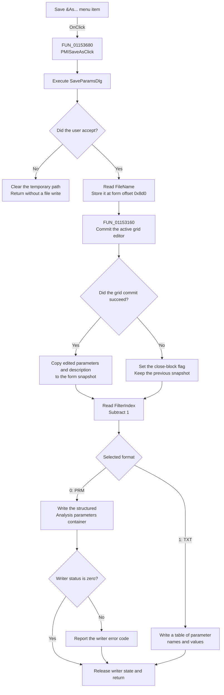

# Save &As...

> Analysis status: Source reviewed. The save path, format selection, state changes, and error boundaries are supported by recovered code.

## Control

| Property | Recovered value |
| --- | --- |
| Form | AnalParametersDlg |
| Component path | AnalParametersDlg.PopupMenu.PMISaveAs |
| Control class | TMenuItem |
| Caption | Save &As... |
| Hint | Not present in the recovered resource. |
| Text | Not present in the recovered resource. |
| Handler name | PMISaveAsClick |
| Handler address | 01153680 |
| Graph node | `resource:dfm:AnalParametersDlg/AnalParametersDlg.PopupMenu.PMISaveAs` |
| Handler node | `function:01153680` |
| Graph layer | UI |

## What happens when clicked

`PMISaveAsClick` always opens the form's `SaveParamsDlg` save dialog. If the user cancels the dialog, the handler clears its temporary string and returns. It does not change the remembered path, commit an active grid edit, or write a file.

If the user accepts the dialog, the handler gets the selected file name and stores it in the form field at offset `0x8d0`. This field is the current analysis-parameter path. The normal Save command and the Open command also use this field. The selected path therefore remains available to a later Save command.

The handler then calls the shared OK routine. This routine tries to commit the active parameter-grid editor. If the commit succeeds, it copies the edited parameter snapshot and the description into form state. If the commit fails, it records a close-block flag and does not update that snapshot. `PMISaveAsClick` does not test this result. It continues to the file writer in both cases.

The dialog filter index selects the output:

- Filter index 1 becomes format index 0 and writes the structured PRM parameter container.
- Filter index 2 becomes format index 1 and writes a TXT table of parameter names and values.

## Click flow

## Handler evidence

- Source: [DecompiledSources/Tina16/functions/0000000001153680__FUN_01153680.c](../../../DecompiledSources/Tina16/functions/0000000001153680__FUN_01153680.c)
- Recovered role: Prompts for an analysis-parameter path and saves in the selected PRM or TXT format.
- The save dialog is the form field at offset `0x900`. The handler calls its Execute virtual method at slot `0xa8`.
- A false Execute result bypasses all path assignment, commit, and serialization calls.
- An accepted result passes the selected path to the UnicodeString field at form offset `0x8d0`, calls `FUN_01153160`, reads the dialog filter index, subtracts one, and passes the result to `FUN_014ae370`.
- Complexity: complex.
- Distinct outgoing calls: 6.

## Save-dialog configuration

The form-create routine constructs the dialog and configures these values:

| Setting | Recovered value |
| --- | --- |
| Component name | `SaveParamsDlg` |
| Title | `Save Parameters` |
| Filter 1 | `Parameter file (*.PRM)` / `*.PRM` |
| Filter 2 | `Parameter file (*.TXT)` / `*.TXT` |
| Initial location | Settings folder |
| Places | Settings folder and Main Tina folder |
| Options bitset | `0x80116` |

The routine also sets a default-extension string from static data. The recovered code does not expose that string as a reliable literal, so this document does not assign an extension value to it. The exact setup is in [FUN_01153810](../../../DecompiledSources/Tina16/functions/0000000001153810__FUN_01153810.c).

## Relevant call evidence

- [FUN_00724270](../../../DecompiledSources/Tina16/functions/0000000000724270__FUN_00724270.c) gets the selected file name from the file dialog. It queries the native dialog when it is active and otherwise returns the dialog's stored FileName.
- [FUN_00724300](../../../DecompiledSources/Tina16/functions/0000000000724300__FUN_00724300.c) gets the current filter index. The caller subtracts one before it calls the writer.
- [FUN_01153160](../../../DecompiledSources/Tina16/functions/0000000001153160__FUN_01153160.c) is also the OK button handler. It commits the active grid editor, records the result at form offset `0x8e1`, and updates the parameter snapshot and description only when the result is zero.
- [FUN_014ae370](../../../DecompiledSources/Tina16/functions/00000000014AE370__FUN_014ae370.c) writes the file. Format 0 creates a structured container with the title `Analysis parameters`, version metadata, and serialized parameter data. Other format values build a text table from the parameter names and current values and save that table to the selected path.
- [FUN_014aeb50](../../../DecompiledSources/Tina16/functions/00000000014AEB50__FUN_014aeb50.c), the inverse load routine, uses the same zero/nonzero format split. This confirms the structured PRM and text interpretations.

## Error and state boundaries

- Cancel is a clean return. No file operation starts and the current path does not change.
- The selected path is assigned before grid commit and serialization. The handler has no rollback for that assignment if a later operation fails.
- A grid-commit error sets the form flag at offset `0x8e1` and skips the snapshot update. The Save As handler still calls the writer. [FUN_011537c0](../../../DecompiledSources/Tina16/functions/00000000011537C0__FUN_011537c0.c) later uses this flag to reject one form-close request and then resets it.
- The structured PRM branch checks the writer status. A nonzero status is sent to the application's error-reporting routine.
- The TXT branch has no explicit status test in `FUN_014ae370`. File API failures can propagate from its callees, but this handler does not show a separate TXT error policy.
- The handler does not show a success message.

## Difference from Save

[FUN_01153600](../../../DecompiledSources/Tina16/functions/0000000001153600__FUN_01153600.c) implements the normal Save command.

- If the current-path field at `0x8d0` is empty, Save delegates to this Save As handler.
- If the field is not empty, Save does not open the dialog. It commits the grid and writes to the remembered path.
- Save always passes format index 0 to the writer. Save As passes the selected dialog filter index minus one. Therefore, the recovered Save code always selects the structured PRM serializer, even when Save As previously remembered a path selected with the TXT filter.

The Open handler [FUN_011534e0](../../../DecompiledSources/Tina16/functions/00000000011534E0__FUN_011534e0.c) also stores an accepted path at `0x8d0`. This confirms that the field represents the current analysis-parameter file path, not only the last Save As selection.

## Direct calls

- `function:00414480` - Delphi UnicodeString clear and finalization helper.
- `function:00414ad0` - Delphi UnicodeString assignment helper.
- `function:00724270` - Gets the dialog FileName.
- `function:00724300` - Gets the dialog FilterIndex.
- `function:01153160` - Commits the parameter editor and updates the form snapshot when valid.
- `function:014ae370` - Serializes analysis parameters in the selected format.

## Resource evidence

- The DFM resource binds `PMISaveAs.OnClick` to `PMISaveAsClick` at `01153680`.
- The menu caption is `Save &As...`.
- The parent popup also contains Open and Save commands.
- No hint, image, glyph, built-in modal result, checked state, or nearby label is present for this menu item.

## Analysis limits

- The source proves the filter-to-writer mapping and the two writer branches. It does not prove the exact default-extension literal that the dialog receives from static data.
- The handler does not check the grid-commit flag before it writes. The recovered code does not prove which prior or current parameter values the writer observes after a failed active-editor commit.
- The text writer has no explicit error branch in this function, so no more specific TXT error result is assigned.
