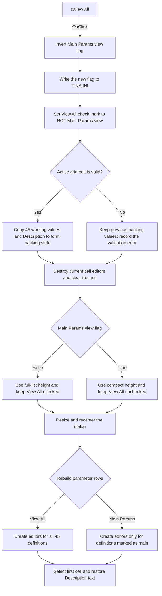

# &View All

> Analysis status: Source, graph, and form evidence reviewed.

## Control

| Property | Recovered value |
| --- | --- |
| Form | AnalParametersDlg |
| Component path | AnalParametersDlg.PopupMenu.PMIViewAll |
| Control class | TMenuItem |
| Caption | &View All |
| Hint | Not present in the recovered resource. |
| Text | Not present in the recovered resource. |
| Handler name | PMIViewAllClick |
| Handler address | 01153360 |
| Graph node | `resource:dfm:AnalParametersDlg/AnalParametersDlg.PopupMenu.PMIViewAll` |
| Handler node | `function:01153360` |
| Graph layer | UI |

## What happens when clicked

This menu item switches the Analysis Parameters grid between the complete parameter list and the smaller main-parameter list. It is a toggle although its caption does not change.

The form stores a Boolean `Main Params view` flag at offset `0x8e0`. `FUN_01153360` inverts this flag on every click and writes the new value to `TINA.INI`, section `Analysis Setup`, key `Main Params view`. A false flag selects View All. A true flag selects the main-parameter view. The form constructor reads the same key and uses true as its default, so this display preference persists for later dialog instances.

The handler sets the `PMIViewAll` check mark to the inverse of that flag through the recovered VCL menu-item checked setter `FUN_007e2d20`. Therefore:

- Checked means View All is active and the grid contains all 45 parameter definitions.
- Unchecked means Main Params view is active and the rebuild includes only definitions whose recovered main-parameter marker is `1`.

Before it removes the current rows, the handler calls `FUN_01153160`, which is also the OK-button event handler. In this call path, that function validates the active grid editor. If validation succeeds, it copies the 45 working parameter values to the form's backing fields, copies the Description memo text, and can invalidate dependent analysis state when the watched parameter changed. This internal call does not save a parameter file and does not close the dialog.

If active-cell validation fails, `FUN_01153160` sets the form's error byte and skips the value and Description copies. `FUN_01153360` does not test that byte and does not cancel the view change. It continues to remove the editors and rows, resize the form, and rebuild the grid from the previous backing values. Thus an invalid active edit is not accepted. The click handler has no explicit error-message or retry branch of its own.

After the commit attempt, `FUN_00b0b020` destroys the current cell editor objects and clears the AttributeGrid from row zero. The handler selects the stored height for the new mode, adds the fixed panel heights, applies the form height, and recenters the resized dialog in the monitor work area. It then calls the form's rebuild handler `FUN_01152760`. That function recreates typed editors in the mode-specific order, selects the first grid cell, and restores the Description memo from the form's backing text.

There is no sender-specific branch and no ordinary no-op path: each invocation inverts the mode. The menu checked setter itself avoids a native-menu update if the requested checked value is already present. The only durable write proven in this click path is the `TINA.INI` view preference. Parameter values remain dialog working state; this handler does not prove that they are saved to a `.PRM` file or accepted by the owner of the Analysis Parameters dialog.

## Click flow

## Handler evidence

- Source: [DecompiledSources/Tina16/functions/0000000001153360__FUN_01153360.c](../../../DecompiledSources/Tina16/functions/0000000001153360__FUN_01153360.c)
- Recovered role: Toggles the Analysis Parameters grid between all parameters and main parameters, persists the view preference, and rebuilds the grid.
- Current graph summary: Handles 1 Delphi UI event: AnalParametersDlg.PopupMenu.PMIViewAll.OnClick.
- State evidence: The handler inverts byte `0x8e0`, passes the new value with key `Main Params view` to `FUN_00f06730`, and passes its inverse to `FUN_007e2d20` for the menu item at form field `0x6e8`.
- Startup evidence: `FUN_01153810` reads `Main Params view` from `TINA.INI` with a default value of true and calculates separate full-list and compact grid heights.
- Filter evidence: `FUN_01152760` loops over 45 parameter definitions. Flag false includes every definition. Flag true includes only definitions whose recovered main-parameter marker equals `1`.
- Commit evidence: `FUN_01153160` copies the working values and Description only when `FUN_00b0a890` accepts the active editor. The caller does not branch on the resulting error byte.
- Rebuild evidence: `FUN_00b0b020` destroys existing cell editors and rows. `FUN_01152760` recreates typed editors, sets the final row count, selects the first cell, and restores the Description text.
- Persistence evidence: `FUN_00f06730` writes a Boolean to `TINA.INI` under `Analysis Setup`. No parameter-file save call is present in this handler.
- Complexity: complex
- Distinct outgoing calls: 7

## Direct calls

- `function:007e2d20` — Sets the `PMIViewAll` menu-item checked state when it changes.
- `function:007fdf10` — Applies the form height calculated for the selected view.
- `function:00b0b020` — Destroys the current AttributeGrid cell editors and clears its rows.
- `function:00f06730` — Writes the `Main Params view` Boolean preference to `TINA.INI`.
- `function:01152760` — Rebuilds the parameter grid for the selected view and restores the Description text.
- `function:01153160` — Validates the active editor and, on success, copies working values and Description to form backing state.
- `function:01b1d750` — Recenters the resized dialog in the monitor work area.

## Resource evidence

- Kind: Not present in the recovered resource.
- Modal result: Not present in the recovered resource.
- Declared checked state: Not present in the recovered DFM; the runtime handler sets it from the inverse of `Main Params view`.
- List items: Not present in the recovered resource.
- Image reference: Not present in the recovered resource.
- Extracted glyph: None.
- Related controls: The form contains an `AttributeGrid` for parameters and a Description memo. The popup also contains commands for Tina defaults and parameter-file open/save operations, but this handler does not invoke those commands.

## Nearby label candidates

Nearby labels are layout candidates only. They are not proof of behavior.

- No same-parent label candidate is available.

## Analysis limits

- Recovered field names are unavailable. `Main Params view` is the exact INI key, while offsets `0x8e0` and `0x8e1` are used for the mode and validation-result bytes.
- The source proves that the main view uses a definition marker equal to `1`. It does not recover a user-visible name for each marker or each ordering byte.
- The click handler does not stop after an active-editor validation failure. Any validation feedback produced deeper in the AttributeGrid code is outside this handler; no explicit message call is present here.
- The handler persists the display mode only. Parameter-file saving and final acceptance of the dialog's working values occur in other paths.
