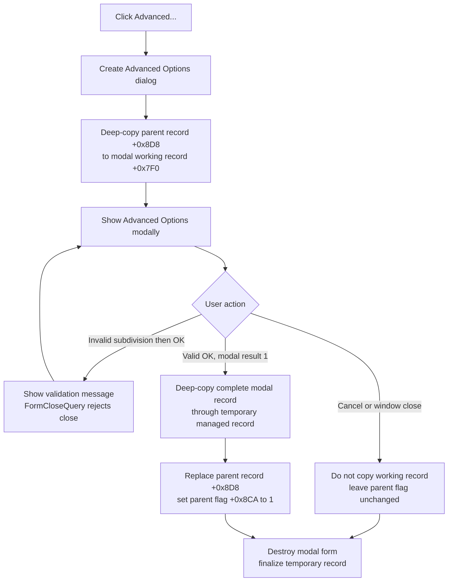

# Advanced...

> Analysis status: Complete. The click opens the Advanced Options modal editor and copies its staged configuration back only after an accepted OK result.

## Control

| Property | Recovered value |
| --- | --- |
| Form | AnalysisOptionDlg |
| Form caption | Analysis Options |
| Page | Digital simulation |
| Group | HDL / MCU / Spice |
| Component path | AnalysisOptionDlg.pcOptions.tshDigital.rgVhdl.bAdvaced |
| Control class | TButton |
| Caption | Advanced... |
| Hint | Not present in the recovered resource. |
| Handler name | bAdvacedClick |
| Handler address | 014f4590 |
| Graph node | `resource:dfm:AnalysisOptionDlg/AnalysisOptionDlg.pcOptions.tshDigital.rgVhdl.bAdvaced` |
| Handler node | `function:014f4590` |
| Graph layer | UI |

## What happens when clicked

`FUN_014f4590` creates the **Advanced Options** dialog and treats its settings
as a staged managed record. It first clears a 176-byte temporary record. It
then calls `FUN_014eeb90` to deep-copy the parent Analysis Options record at
offset `+0x8D8` into the new dialog's working record at offset `+0x7F0`.
`FUN_014eeb90` uses the recovered Delphi record metadata, so managed fields such
as strings are copied correctly rather than copied as unowned pointers.

The handler then runs the dialog modally. The modal contains settings for:

- HDL model family, library search list, node-state display, and interactive
  clock behavior.
- PIC assembler selection, Arduino and Atmel Studio paths, MCU speed, and
  Arduino optimization.
- Spice timing, input and output conversion levels, initial digital state, and
  search path.
- Logging, simulation progress, rollback enablement and subdivision, and
  related advanced switches.

The modal result is the commit boundary. When `ShowModal` returns `1`
(`mrOk`), `FUN_014eec20` deep-copies the dialog's complete working record to
the cleared temporary record. `FUN_00417c40` then replaces the parent record at
`+0x8D8`, and the handler sets the parent flag at `+0x8CA` to one. The recovered
handler does not compare old and new values. Therefore, an accepted OK marks
the flag even when the user made no visible change.

For Cancel, title-bar close, or any other non-OK modal result, the handler does
not copy the working record and does not set the parent flag. The parent
advanced-options record is unchanged. After either result, the handler destroys
the modal form and finalizes the temporary managed record on the normal return
path.

This click does not itself write `TINA.INI`, a file, or the active global
settings. It only updates state staged in the parent **Analysis Options**
dialog. The parent OK handler owns the later settings commit. The
**Manage Libraries...** button inside Advanced Options is a separate command;
this handler does not execute it automatically, and the record-copy boundary
does not establish rollback for effects of that separate command.

## Validation, cancellation, and failure behavior

The Advanced Options `bOKClick` handler copies visible controls into the modal
working record only while its validation-error flag is clear. The recovered
integer-error route for rollback subdivision sets that flag and displays the
first validation message. `FormCloseQuery` then rejects that close request and
clears the flag so the user can correct the value. Because `ShowModal` has not
returned `mrOk`, the parent record is not updated on the rejected attempt.

The click handler has no recovered local exception handler. An exception during
form construction, record copying, a VCL modal call, or cleanup can interrupt
the normal path. The recovered code does not provide a compensating write or an
error-specific return path.

## Click flow

## Evidence

- [Click handler `FUN_014f4590`](../../../DecompiledSources/Tina16/functions/00000000014F4590__FUN_014f4590.c) constructs the advanced form, loads parent record `+0x8D8`, invokes modal VMT slot `+0x2D0`, tests for result `1`, copies back only on that branch, and sets parent byte `+0x8CA`.
- [Record loader `FUN_014eeb90`](../../../DecompiledSources/Tina16/functions/00000000014EEB90__FUN_014eeb90.c) copies 22 eight-byte fields and uses the recovered record metadata to initialize, deep-copy, and finalize managed fields before it installs the value at modal offset `+0x7F0`.
- [Record exporter `FUN_014eec20`](../../../DecompiledSources/Tina16/functions/00000000014EEC20__FUN_014eec20.c) deep-copies modal record `+0x7F0` into the caller's output record.
- [Modal OK handler `FUN_014ef040`](../../../DecompiledSources/Tina16/functions/00000000014EF040__FUN_014ef040.c) copies the HDL, MCU, Spice, progress, logging, rollback, and path controls into the modal working record when validation permits it.
- [Modal initializer `FUN_014eec50`](../../../DecompiledSources/Tina16/functions/00000000014EEC50__FUN_014eec50.c) performs the inverse mapping from the working record to the Advanced Options controls when the form is shown.
- [Close guard `FUN_014ef3d0`](../../../DecompiledSources/Tina16/functions/00000000014EF3D0__FUN_014ef3d0.c) rejects closing while the modal error flag is set and then resets that flag.
- The recovered DFM binds this button to `bAdvacedClick`. It identifies the parent page and group, the **Advanced Options** form caption, and built-in `bkOK` and `bkCancel` buttons. The source button has no hint, image reference, or extracted glyph.

## Direct calls

- `function:007fc180` - constructs the `TAnaloptVHDLAdvanced` form instance.
- `function:014eeb90` - deep-copies the parent advanced-options record into the modal working record.
- `function:014eec20` - deep-copies the accepted modal working record to the handler's temporary record.
- `function:00417c40` - performs the Delphi managed-record copy back to the parent.
- `function:00410f20` - destroys the modal form when it exists.
- `function:00417740` - finalizes the temporary managed record.

## Analysis limits

- Original Delphi member names for the records at `+0x8D8` and `+0x7F0`, and
  for the parent flag at `+0x8CA`, are not recovered. Their roles follow from
  the paired record load, modal edit, conditional copy-back, and initialization
  paths.
- The indirect VMT call has the recovered VCL modal-call pattern and is paired
  with the DFM `bkOK` and `bkCancel` buttons. Its original method symbol is not
  present in the decompilation.
- This handler establishes the parent-dialog transaction boundary. The exact
  storage location and timing of every later setting write belong to the parent
  OK path, not this click path.
