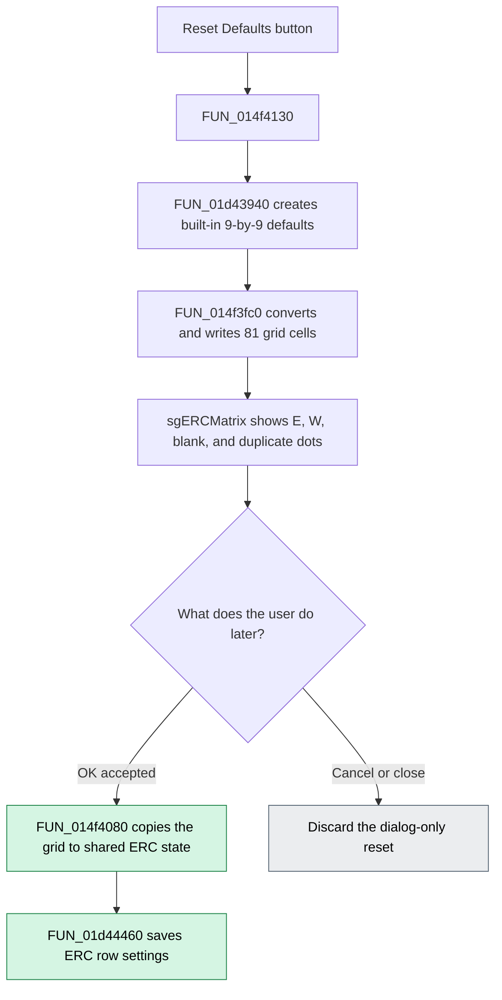

# Reset Defaults

## Control

| Property | Recovered value |
| --- | --- |
| Form | AnalysisOptionDlg |
| Component path | AnalysisOptionDlg.pcOptions.tshERC.btnDefaults |
| Control class | TButton |
| Caption | Reset &Defaults |
| Handler name | btnDefaultsClick |
| Handler address | 014f4130 |
| Affected control | `sgERCMatrix` at form offset `+0x6E0` |
| Graph node | `resource:dfm:AnalysisOptionDlg/AnalysisOptionDlg.pcOptions.tshERC.btnDefaults` |
| Handler node | `function:014f4130` |
| Graph layer | UI |

## What happens when clicked

The button replaces all 81 data cells in the **ERC Matrix** string grid with the built-in Electrical Rules Check defaults. `FUN_014f4130` first creates a temporary 9-by-9 rule matrix with `FUN_01d43940`. It then passes that matrix to `FUN_014f3fc0`, which writes cells 1 through 9 in both dimensions to `sgERCMatrix`.

The grid compares these nine pin types: **In**, **Out**, **Bidirectional**, **Power**, **Passive**, **3-State**, **Open Collector**, **Open Emitter**, and **Unconnected**. The reset restores the following nonblank rules:

| Cell value | Pin-type pairs |
| --- | --- |
| `E` | Out–Out; Out–Power; Out–3-State; Out–Open Collector; Out–Open Emitter; Power–3-State; Power–Open Collector; Power–Open Emitter |
| `W` | In–Unconnected; Out–Bidirectional; Bidirectional–Bidirectional; Bidirectional–Power; Open Collector–Open Emitter; Open Emitter–Open Emitter |

All other editable cells become blank. The duplicate half of the symmetric matrix is shown as `.` and cannot be selected. The grid draw handler displays `E` cells in red and `W` cells in yellow. Its edit handler cycles an editable cell from blank to `W`, then to `E`, then back to blank. These independent handlers confirm the meaning of the values that Reset writes.

Reset changes only the grid in the open dialog. It does not change **Apply ERC matrix rules**, **Always warn for unconnected pins**, or **Check for unconnected wires**. It also does not save the matrix. A later accepted click on **OK** copies the grid to the shared ERC matrix and saves the rows under the `ERC_I`, `ERC_O`, `ERC_BIDI`, `ERC_PWR`, `ERC_PAS`, `ERC_3S`, `ERC_OC`, `ERC_OE`, and `ERC_uc` settings. Canceling the dialog discards the reset because the Cancel path does not copy the grid to shared state.

## Click flow

## Inputs, decisions, and state changes

- The click handler does not read the current grid. It always creates the same default matrix.
- `FUN_01d43940` clears the 81-byte matrix and loads the fixed row patterns `--------W`, `.EWE-EEE-`, `..WW-----`, `...--EEE-`, `....-----`, `.....----`, `......-W-`, `.......W-`, and `........-`.
- `FUN_014f3fc0` converts each stored rule code to a display character. It converts `-` to a blank and replaces the noneditable duplicate half with `.`.
- The write loop always visits grid columns 1 through 9 and rows 1 through 9. It does not change the row and column headers.
- Clicking Reset when the grid already contains these defaults performs the same 81 writes but causes no effective value change.
- The handler has no confirmation, validation, cancel, or error branch.

## Handler evidence

- [Click handler `FUN_014f4130`](../../../DecompiledSources/Tina16/functions/00000000014F4130__FUN_014f4130.c) creates a local matrix, calls the default initializer, and calls the grid-copy helper.
- [Grid-copy helper `FUN_014f3fc0`](../../../DecompiledSources/Tina16/functions/00000000014F3FC0__FUN_014f3fc0.c) performs the nested 1-to-9 loops and writes each cell to the control at form offset `+0x6E0`.
- [Default initializer `FUN_01d43940`](../../../DecompiledSources/Tina16/functions/0000000001D43940__FUN_01d43940.c) contains the nine fixed rule strings.
- [Form creation `FUN_014f1700`](../../../DecompiledSources/Tina16/functions/00000000014F1700__FUN_014f1700.c) labels the same grid as `ERC Matrix`, adds the nine pin-type headers, and initially displays the current shared matrix instead of the defaults.
- [Cell selection `FUN_014f3e40`](../../../DecompiledSources/Tina16/functions/00000000014F3E40__FUN_014f3e40.c) rejects header cells and the duplicate half of the symmetric matrix.
- [Cell editing `FUN_014f3e70`](../../../DecompiledSources/Tina16/functions/00000000014F3E70__FUN_014f3e70.c) cycles blank, `W`, and `E` values. [Keyboard editing `FUN_014f3fa0`](../../../DecompiledSources/Tina16/functions/00000000014F3FA0__FUN_014f3fa0.c) invokes the same cycle for the Space key.
- [OK handler `FUN_014f28f0`](../../../DecompiledSources/Tina16/functions/00000000014F28F0__FUN_014f28f0.c) reaches the grid-to-state copy and ERC settings save only after its earlier validation succeeds.
- [Grid-to-state copy `FUN_014f4080`](../../../DecompiledSources/Tina16/functions/00000000014F4080__FUN_014f4080.c) reads the editable grid cells into the shared ERC matrix. [ERC settings writer `FUN_01d44460`](../../../DecompiledSources/Tina16/functions/0000000001D44460__FUN_01d44460.c) writes the nine named ERC rows and related check-box settings.

## Direct calls

- `FUN_01d43940` — build the temporary default ERC matrix.
- `FUN_014f3fc0` — display that matrix in `sgERCMatrix`.

## Failure and no-op behavior

- Reset reports no error and has no partial-update branch in the recovered source.
- Reset does not enable ERC rules. If **Apply ERC matrix rules** is clear, it remains clear.
- Reset does not commit or save shared settings. Cancel or ordinary dialog close leaves the previous shared ERC matrix unchanged.
- If the later OK handler rejects another option before it calls `FUN_014f4080`, the displayed defaults remain uncommitted.

## Resource evidence

- The button caption is `Reset &Defaults` on the `ERC` tab.
- Its sibling grid is `sgERCMatrix`; the recovered form field table places this grid at `+0x6E0` and the button at `+0x6E8`.
- The sibling check boxes are `Apply ERC matrix rules`, `Always warn for unconnected pins`, and `Check for unconnected wires`.
- The button has no hint, glyph, image, action, or modal result.

## Analysis limits

- The recovered source gives the literal `E` and `W` symbols and their red and yellow draw colors. It does not contain a legend string that expands those letters.
- The click handler does not call the later OK or Cancel paths. Those paths are included only to show when the dialog-only reset becomes persistent or is discarded.
