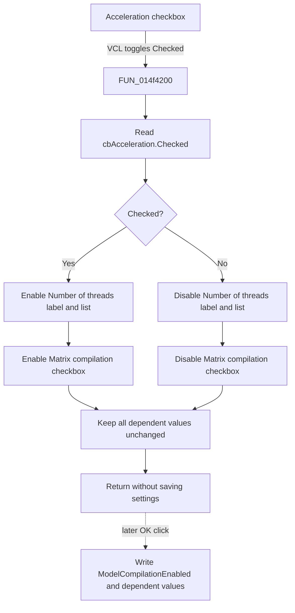

# Acceleration

This checkbox enables or disables the performance controls that depend on analysis acceleration.

## Control

| Property | Recovered value |
| --- | --- |
| Form | AnalysisOptionDlg |
| Component path | AnalysisOptionDlg.pcOptions.tshGeneral.GroupBox1.cbAcceleration |
| Control class | TCheckBox |
| Caption | Acceleration |
| Hint | Not present in the recovered resource. |
| Text | Not present in the recovered resource. |
| Handler name | cbAccelerationClick |
| Handler address | 014f4200 |
| Graph node | `resource:dfm:AnalysisOptionDlg/AnalysisOptionDlg.pcOptions.tshGeneral.GroupBox1.cbAcceleration` |
| Handler node | `function:014f4200` |
| Graph layer | UI |

## What happens when clicked

VCL changes the `cbAcceleration` checked state before `FUN_014f4200` handles the click. The handler reads that state and applies the same Boolean value to the enabled state of three controls:

- the **Number of threads** label;
- the `cbxMaxNumOfThreads` drop-down list; and
- the **Matrix compilation** checkbox.

When **Acceleration** is checked, these controls become enabled. When it is cleared, they become disabled. The handler does not change the selected thread count, the matrix-compilation checked state, or the **Matrix solver** selection. Disabled controls therefore retain their current values.

This click does not update the analysis engine or write a configuration file. The dialog's OK handler later writes the acceleration state as `Analysis Setup/ModelCompilationEnabled`. It also writes the retained thread-count and matrix-compilation values. The form-create handler reads these settings and calls `FUN_014f4200`, so the dependent enabled states are also synchronized when the dialog opens.

The handler has no validation or error branch. Each enabled-state setter changes the control only when its current state differs. If all three controls already match the checkbox, the setter calls have no visible effect.

## Click flow

## Handler evidence

- Source: [DecompiledSources/Tina16/functions/00000000014F4200__FUN_014f4200.c](../../../DecompiledSources/Tina16/functions/00000000014F4200__FUN_014f4200.c)
- Recovered role: Synchronizes the enabled state of acceleration-dependent performance controls.
- Current graph summary: Handles `AnalysisOptionDlg.pcOptions.tshGeneral.GroupBox1.cbAcceleration.OnClick` and is also called during dialog creation.
- Input: The checked state of `cbAcceleration` at form field `+0x758`.
- State change: VCL `SetEnabled` receives that state for the controls at `+0x730`, `+0x738`, and `+0x740`.
- Field evidence: Dialog initialization and saving map `+0x738` to `cbxMaxNumOfThreads`, `+0x740` to `cbMatrixCompilation`, and `+0x758` to `cbAcceleration`; the recovered form field order maps `+0x730` to the **Number of threads** label.
- Output: Only the three dependent enabled states can change.
- Complexity: simple
- Distinct outgoing calls: 0

## Direct calls

- No direct call edge is present in the recovered graph because the handler uses VCL virtual dispatch.
- [FUN_0064dc60](../../../DecompiledSources/Tina16/functions/000000000064DC60__FUN_0064dc60.c) is the recovered `SetEnabled` implementation for virtual slot `0x128`. It changes the enabled byte and sends `CM_ENABLEDCHANGED` only when the state differs.
- [FUN_014f1700](../../../DecompiledSources/Tina16/functions/00000000014F1700__FUN_014f1700.c) loads `ModelCompilationEnabled`, `MatrixCompilationEnabled`, and `MaxNumberOfThreads` during form creation, then calls this synchronizer.
- [FUN_014f28f0](../../../DecompiledSources/Tina16/functions/00000000014F28F0__FUN_014f28f0.c) is the OK handler that writes those three settings.

## Resource evidence

- Kind: Not present in the recovered resource.
- Modal result: Not present in the recovered resource.
- Checked state: Not present in the recovered resource.
- List items: Not present in the recovered resource.
- Image reference: Not present in the recovered resource.
- Extracted glyph: None.

The checkbox is inside the **Performance** group. The same group contains **Number of threads**, `cbxMaxNumOfThreads`, **Matrix compilation**, and the separate **Matrix solver** drop-down list. The source, not label proximity alone, establishes which controls the handler changes.

## Nearby label candidates

Nearby labels are layout candidates only. They are not proof of behavior.

- Rank 1: Matrix solver at distance 24.
- Rank 2: Number of threads at distance 45.

## Analysis limits

- The caption **Acceleration** does not identify the internal setting name. The initialization and OK paths establish the `ModelCompilationEnabled` key.
- The handler does not prove how the analysis engine uses model or matrix compilation. This article limits its claim to the recovered dialog state and persistence paths.
- The **Matrix solver** label is only a nearby layout candidate. Its selector is not changed by this handler.
