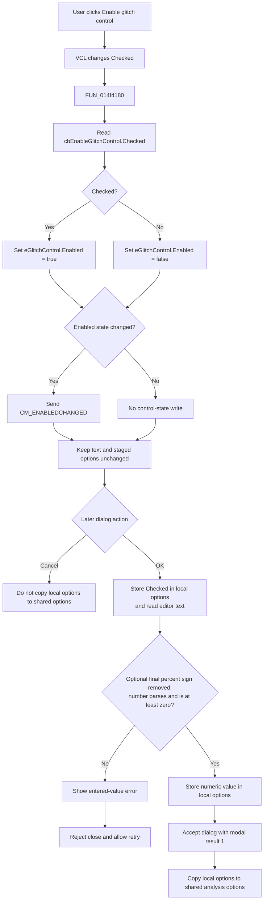

# Enable glitch control

> Analysis status: Complete. The checkbox immediately controls the glitch-value editor; the setting remains staged until the Analysis Options dialog is accepted.

## Control

| Property | Recovered value |
| --- | --- |
| Form | AnalysisOptionDlg |
| Component path | AnalysisOptionDlg.pcOptions.tshDigital.gbDigital.cbEnableGlitchControl |
| Control class | TCheckBox |
| Caption | Enable glitch control |
| Hint | Not present in the recovered resource. |
| Text | Not present in the recovered resource. |
| Handler name | cbEnableGlitchControlClick |
| Handler address | 014f4180 |
| Graph node | `resource:dfm:AnalysisOptionDlg/AnalysisOptionDlg.pcOptions.tshDigital.gbDigital.cbEnableGlitchControl` |
| Handler node | `function:014f4180` |
| Graph layer | UI |

## What happens when clicked

The VCL changes `cbEnableGlitchControl.Checked` before it dispatches `OnClick`. `FUN_014f4180` reads that checked state from the control at form offset `+0x7e8`. It passes the same Boolean value to the enabled-state setter of `eGlitchControl` at form offset `+0x7e0`.

| Checkbox state | Immediate UI result |
| --- | --- |
| Checked | Enables the `eGlitchControl` value editor. |
| Cleared | Disables the value editor without clearing its text. |

The handler changes only the editor's enabled state. It does not change the **Glitch control:** label, parse the editor text, change the stored glitch-control flag or value, run an analysis, or write a file. The enabled-state setter sends `CM_ENABLEDCHANGED` only when the requested state differs from the current state. Reapplying the same state is a VCL no-op.

## Related digital-delay behavior

The **Delay:** list contains **Default**, **Always**, and **Ideal**. Its separate `OnChange` handler forces `cbEnableGlitchControl` to checked and enabled for Default or Always. It forces the checkbox to cleared and disabled for Ideal. A checked-state change can dispatch this checkbox's click handler, which then disables `eGlitchControl` for Ideal. This rule is not implemented by `FUN_014f4180` itself.

## Value, validation, and acceptance

On form creation, the dialog restores the staged checkbox flag, formats the staged numeric value into `eGlitchControl`, and synchronizes the editor's enabled state with the checkbox. The recovered DFM supplies `50%` as the design-time editor text, but the restored staged value can replace it.

The later OK handler reads the checkbox into the dialog's local options record. It then reads the editor text whether the checkbox is checked or cleared. A final `%` character is optional and is removed before conversion. The value must parse as a number and must be greater than or equal to zero. The recovered path does not apply an upper bound.

If conversion fails or the value is negative, the dialog shows a localized error that includes the entered text. `FormCloseQuery` rejects that close attempt and clears the error flag so the user can correct the value and retry. The checkbox click itself has no error path.

After valid OK acceptance, the caller copies the dialog's complete local options record, including the checked flag and numeric glitch-control value, to the shared analysis-options record. Cancel does not copy the local record. The recovered paths do not establish how the simulator uses the flag or value.

## Click flow

## Handler evidence

- Source: [DecompiledSources/Tina16/functions/00000000014F4180__FUN_014f4180.c](../../../DecompiledSources/Tina16/functions/00000000014F4180__FUN_014f4180.c)
- Form initialization: [FUN_014f1700](../../../DecompiledSources/Tina16/functions/00000000014F1700__FUN_014f1700.c)
- Digital-delay state handler: [FUN_014f42a0](../../../DecompiledSources/Tina16/functions/00000000014F42A0__FUN_014f42a0.c)
- OK validation and capture: [FUN_014f28f0](../../../DecompiledSources/Tina16/functions/00000000014F28F0__FUN_014f28f0.c)
- Error-state helper: [FUN_014f3b80](../../../DecompiledSources/Tina16/functions/00000000014F3B80__FUN_014f3b80.c)
- Form close guard: [FUN_014f3b60](../../../DecompiledSources/Tina16/functions/00000000014F3B60__FUN_014f3b60.c)
- Parent modal-copy path: [FUN_01533b40](../../../DecompiledSources/Tina16/functions/0000000001533B40__FUN_01533b40.c)
- VCL enabled-state setter: [FUN_0064dc60](../../../DecompiledSources/Tina16/functions/000000000064DC60__FUN_0064dc60.c)
- VCL checkbox getter: [FUN_00689d50](../../../DecompiledSources/Tina16/functions/0000000000689D50__FUN_00689d50.c)
- VCL checkbox setter and change dispatch: [FUN_00689da0](../../../DecompiledSources/Tina16/functions/0000000000689DA0__FUN_00689da0.c)
- Recovered role: Synchronizes the glitch-value editor's enabled state with the Enable glitch control checkbox.
- Current graph summary: Handles 1 Delphi UI event: AnalysisOptionDlg.pcOptions.tshDigital.gbDigital.cbEnableGlitchControl.OnClick.
- Current graph behavior: Reads `cbEnableGlitchControl.Checked` and assigns the same Boolean to `eGlitchControl.Enabled`. It does not read or change the editor text or staged option values.
- Current graph evidence: Form initialization and OK capture map the controls to form offsets `+0x7e8` and `+0x7e0`. The handler calls virtual getter slot `0x260` on the checkbox and virtual enabled-state setter slot `0x128` on the editor.
- Complexity: simple
- Distinct outgoing calls: 0

## Direct calls

- No direct call edge is present because both operations use VCL virtual dispatch.
- Virtual checkbox getter slot `0x260` reads the checked state.
- Virtual control setter slot `0x128` applies the editor's enabled state.

## Resource evidence

- Kind: Not present in the recovered resource.
- Modal result: Not present in the recovered resource.
- Checked state: The DFM does not define a fixed checked state. Form creation restores it from the local options record.
- List items: Not present in the recovered resource.
- Image reference: Not present in the recovered resource.
- Extracted glyph: None.

## Nearby label candidates

Nearby labels are layout candidates only. They are not proof of behavior.

- Rank 1: &Glitch control:  at distance 25.
- Rank 2: D&elay:  at distance 30.

## Analysis limits

- The nearby **Glitch control:** label is consistent with `eGlitchControl`, but control offsets and the form initialization and OK paths establish the mapping.
- The click path controls editor availability only. It does not prove the simulator's glitch-detection algorithm.
- The recovered acceptance path proves transfer into the shared analysis-options record. It does not prove direct file persistence for this setting.
