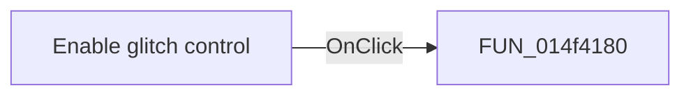

# Enable glitch control

> Analysis status: Pending individual source review.

## Control

| Property | Recovered value |
| --- | --- |
| Form | AnalysisOptionDlg |
| Component path | AnalysisOptionDlg.pcOptions.tshDigital.gbDigital.cbEnableGlitchControl |
| Control class | TCheckBox |
| Caption | Enable glitch control |
| Hint | Not present in the recovered resource. |
| Text | Not present in the recovered resource. |
| Handler name | cbEnableGlitchControlClick |
| Handler address | 014f4180 |
| Graph node | `resource:dfm:AnalysisOptionDlg/AnalysisOptionDlg.pcOptions.tshDigital.gbDigital.cbEnableGlitchControl` |
| Handler node | `function:014f4180` |
| Graph layer | UI |

## What happens when clicked

Pending individual analysis. An agent must read the recovered handler source and its relevant callees before it replaces this text.

## Click flow

## Handler evidence

- Source: [DecompiledSources/Tina16/functions/00000000014F4180__FUN_014f4180.c](../../../DecompiledSources/Tina16/functions/00000000014F4180__FUN_014f4180.c)
- Recovered role: Not present in the recovered resource.
- Current graph summary: Handles 1 Delphi UI event: AnalysisOptionDlg.pcOptions.tshDigital.gbDigital.cbEnableGlitchControl.OnClick.
- Current graph behavior: Not present in the recovered resource.
- Current graph evidence: Not present in the recovered resource.
- Complexity: simple
- Distinct outgoing calls: 0

## Direct calls

- No direct call edge is present in the recovered graph.

## Resource evidence

- Kind: Not present in the recovered resource.
- Modal result: Not present in the recovered resource.
- Checked state: Not present in the recovered resource.
- List items: Not present in the recovered resource.
- Image reference: Not present in the recovered resource.
- Extracted glyph: None.

## Nearby label candidates

Nearby labels are layout candidates only. They are not proof of behavior.

- Rank 1: &Glitch control:  at distance 25.
- Rank 2: D&elay:  at distance 30.

## Analysis limits

- Do not infer behavior from the control class, caption, hint, glyph, or nearby label alone.
- Do not replace the pending status until the handler source and relevant call path provide enough evidence.
