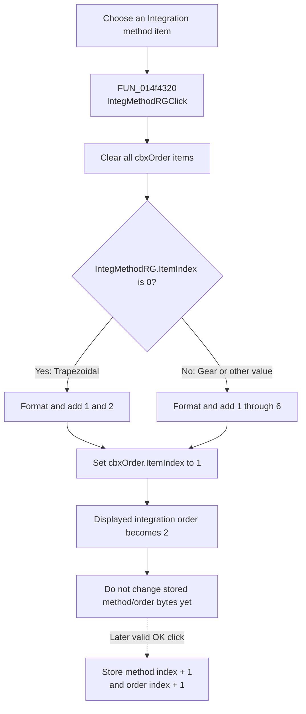

# Integration method

> Analysis status: Recovered click handler, dynamic order list, initialization, and OK-state commit reviewed.

## Control

| Property | Recovered value |
| --- | --- |
| Form | AnalysisOptionDlg |
| Component path | AnalysisOptionDlg.pcOptions.tshGeneral.Transient.IntegMethodRG |
| Control class | TRadioGroup |
| Caption | Integration method |
| Items | Trapezoidal, Gear |
| Related control | `cbxOrder`, a read-only-list combo box |
| Related label | Integration order |
| Handler name | IntegMethodRGClick |
| Handler address | 014f4320 |
| Graph node | `resource:dfm:AnalysisOptionDlg/AnalysisOptionDlg.pcOptions.tshGeneral.Transient.IntegMethodRG` |
| Handler node | `function:014f4320` |
| Graph layer | UI |

## What happens when clicked

`IntegMethodRGClick` rebuilds the choices in the adjacent **Integration order** drop-down each time the handler runs.

The handler first clears every item from `cbxOrder`. It then reads `IntegMethodRG.ItemIndex`:

- Index 0, **Trapezoidal**, adds the decimal strings `1` and `2`.
- Every nonzero index, normally index 1 for **Gear**, adds `1` through `6`.

After either branch, it sets `cbxOrder.ItemIndex` to 1. Combo indexes are zero-based, so this selects the second displayed item, integration order `2`. Changing the integration method therefore discards the previous order selection and resets it to 2.

The handler changes only the order combo's item list and selection. It does not start an analysis, run an integration algorithm, save configuration, validate a numeric value, or show an error.

## Click flow

## Handler evidence

- Handler source: [FUN_014f4320](../../../DecompiledSources/Tina16/functions/00000000014F4320__FUN_014f4320.c).
- `param_1 + 0x718` is the bound integration-method radio group. The source reads its `ItemIndex` field at control offset `0x4a8`.
- `param_1 + 0x720` is `cbxOrder`. The handler gets its Items object at control offset `0x4f0`, calls the virtual clear method, adds formatted integers, and finally calls the combo ItemIndex setter with 1.
- Recovered role: Rebuilds the permitted integration-order choices when the transient integration method changes.
- Complexity: moderate.
- Distinct outgoing calls: 2.

## Initialization and saved-state behavior

[FUN_014f1700](../../../DecompiledSources/Tina16/functions/00000000014F1700__FUN_014f1700.c) initializes the dialog in this order:

1. It sets the method radio index from the stored byte at form offset `0xc36`, after converting the stored one-based value to a zero-based index.
2. It calls `IntegMethodRGClick` to build the correct set of order items.
3. It restores the previously stored order from form offset `0xc37`, also converting from one-based to zero-based form.

This means dialog initialization does not leave the forced order 2 in place. It restores a saved valid order after the list exists. A later user method change has no such restore step and therefore resets the order to 2.

[FUN_014f28f0](../../../DecompiledSources/Tina16/functions/00000000014F28F0__FUN_014f28f0.c), the OK handler, copies the current method index plus one to `0xc36` and the current order index plus one to `0xc37`. These writes occur only inside its successful validation path. The click handler itself does not modify either stored byte.

## Direct call evidence

- [FUN_0043f750](../../../DecompiledSources/Tina16/functions/000000000043F750__FUN_0043f750.c) formats each loop integer as a Unicode decimal string before it is added to the combo.
- [FUN_00414560](../../../DecompiledSources/Tina16/functions/0000000000414560__FUN_00414560.c) finalizes the handler's temporary UnicodeString storage after the combo has copied the item text.
- All list clear, item add, and ItemIndex operations are recovered VCL virtual calls. They do not appear as named direct call edges.

## Resource evidence

- The DFM binds `IntegMethodRG.OnClick` to `IntegMethodRGClick` at `014f4320`.
- The radio items are `&Trapezoidal` and `&Gear`; the ampersands define keyboard accelerators.
- `cbxOrder` is a `TComboBox` with style `csDropDownList`, so the user selects one of the dynamically supplied values instead of entering free text.
- The label `Integration order` shares the Transient group with `cbxOrder`. The handler's direct access to that combo confirms the label relationship; proximity alone is not the evidence.
- No hint, text property, image, glyph, action, modal result, or initial checked state is present for the radio group.
- Recovered resource data: [ui-evidence.json](../../../DecompiledSources/Tina16/resources/dfm/ui-evidence.json).

## Error and boundary behavior

- The handler has no error-message, validation, early-return, or exception-recovery branch.
- Method index 0 selects the two-item list. Every other value, including an unexpected negative or value above 1, selects the six-item list.
- Both branches add at least two items before selecting index 1, so the forced selection is valid for either normal method.
- Canceling the dialog before a successful OK commit leaves the stored method and order bytes unchanged by this click handler.
- If OK's earlier validation fails, the recovered OK path does not update the stored method or order bytes.

## Analysis limits

- The source proves UI constraints and stored index values. It does not show the transient solver that interprets Trapezoidal, Gear, or the selected order.
- This article does not infer numerical stability, accuracy, or algorithm details from the method names.
- The stored fields are one-based method and order selections inside the recovered dialog state. The original Delphi field names are not available.
