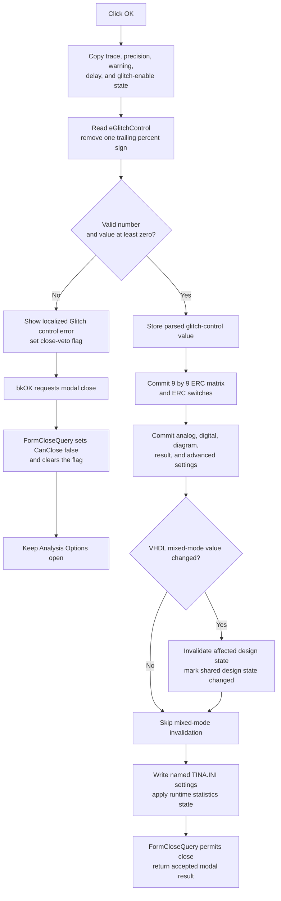

# OK

> Analysis status: Complete. The handler validates the glitch-control value, commits Analysis Options state, writes persistent settings, and uses `FormCloseQuery` to keep the dialog open after a validation error.

## Control

| Property | Recovered value |
| --- | --- |
| Form | AnalysisOptionDlg |
| Form caption | Analysis Options |
| Component path | AnalysisOptionDlg.OKBtn |
| Control class | TBitBtn |
| Kind | bkOK |
| Hint | Not present in the recovered resource. |
| Embedded glyph or image | Not present in the recovered resource. |
| Handler name | OKBtnClick |
| Handler address | 014f28f0 |
| Graph node | `resource:dfm:AnalysisOptionDlg/AnalysisOptionDlg.OKBtn` |
| Handler node | `function:014f28f0` |
| Graph layer | UI |

## What happens when clicked

`FUN_014f28f0` accepts settings from all five Analysis Options pages: **Analog simulation**, **Digital simulation**, **Diagram**, **Miscallenous**, and **ERC**. It first copies the current trace mode, numeric precision, digital warning choice, delay mode, and glitch-control enabled state into their staged or shared fields.

The handler then validates `eGlitchControl`. The DFM initializes this edit to `50%`. The handler removes one trailing percent sign when present, parses the remaining text as a floating-point number, and requires a value of zero or more.

### Invalid glitch-control value

If parsing fails or the value is negative, the handler builds a localized error message that includes the **Glitch control:** label and calls `FUN_014f3b80`. That function shows the message once and sets the dialog's error flag at offset `0x8c8`.

The `bkOK` button then follows the normal modal close route. `FormCloseQuery` at `FUN_014f3b60` sets `CanClose` to false while the error flag is set, then clears the flag. The dialog stays open so the user can correct the value. A later valid OK attempt can close normally.

The invalid path does not reach the bulk settings commit or the persistent writes. It is not a complete rollback: the trace mode, warning, delay, and glitch-enable values were already copied to the dialog's staged fields, and numeric precision was already written to its shared value before validation.

### Valid value and commit

For a valid nonnegative value, the handler stores the parsed glitch-control number and commits the remaining controls. The recovered field table and DFM identify these groups:

| Area | Committed settings |
| --- | --- |
| Transient and performance | Integration method and order, maximum thread count, matrix compilation, matrix solver, acceleration or model compilation, nonlinear solver, and MOSFET PWL level. |
| Digital simulation | MCU code debugger, synthesizable-code generation, old digital engine, VHDL mixed mode, advanced digital settings, warnings, delay, and glitch control. |
| Diagram | Output-curve filter enabled state, threshold constant, maximum skip, X and Y scale rounding, gain and phase margin reference, remembered diagram settings, and grid-view design diagrams. |
| Analysis results | Runtime statistics, instant diagram drawing, save-all-results, large-result warning suppression, stress analysis, power-dissipation analysis, and auto-converge mode. |
| ERC | The 9 by 9 electrical-rule matrix, apply-rules state, unconnected-pin warning, and unconnected-wire check. |

`FUN_014f4080` copies every non-dot ERC grid cell into the shared symmetric ERC matrix. `FUN_01d44460` then writes the matrix rows and the ERC switches through the settings sink.

The handler writes named settings to the `TINA.INI` object created by `FormCreate`. Recovered names include `ManualScale`, `GridViewDesign`, `EnableStatistics`, `EnableInstantDrawing`, `ModelCompilationEnabled`, `MatrixCompilationEnabled`, `MaxNumberOfThreads`, `CurveFilterEnabled`, `CurveFilterTrigger`, and `CurveFilterMaxSkip`. The shared helper `FUN_00f06730` also writes `SaveAllAnalResults`, `DisableTRTooManyPointsWarning`, `EnableInstantDrawing`, and `EnableAutoConverge` under **Analysis Setup** in `TINA.INI`.

The commit updates the active runtime statistics flag and requests a refresh only if that value changed. If the VHDL mixed-mode checkbox changed from its value when the form opened, the handler traverses the current design to invalidate recovered mixed-mode state and marks a shared design object changed. When the value is unchanged, it skips that invalidation branch.

After a successful handler return, no validation flag blocks the built-in OK close request, so the modal dialog can close with its accepted result.

## Click flow

## Evidence

- [OK handler `FUN_014f28f0`](../../../DecompiledSources/Tina16/functions/00000000014F28F0__FUN_014f28f0.c) contains the validation gate, control-to-state copies, conditional mixed-mode invalidation, persistent setting writes, and live statistics update.
- [Strict numeric parser `FUN_00410100`](../../../DecompiledSources/Tina16/functions/0000000000410100__FUN_00410100.c) returns a parsed floating-point value and reports a nonzero error position when the complete input is not valid.
- [Validation-error coordinator `FUN_014f3b80`](../../../DecompiledSources/Tina16/functions/00000000014F3B80__FUN_014f3b80.c) delegates to [the one-message error marker `FUN_01b1cf30`](../../../DecompiledSources/Tina16/functions/0000000001B1CF30__FUN_01b1cf30.c), which shows the message only while the form error flag is clear and then sets that flag.
- [Close guard `FUN_014f3b60`](../../../DecompiledSources/Tina16/functions/00000000014F3B60__FUN_014f3b60.c) permits closing only when the error flag is clear, then resets it.
- [ERC grid commit `FUN_014f4080`](../../../DecompiledSources/Tina16/functions/00000000014F4080__FUN_014f4080.c) reads cells 1 through 9 in both dimensions, skips dot cells, maps the other cell markers to rule values, and updates the shared ERC matrix.
- [ERC settings writer `FUN_01d44460`](../../../DecompiledSources/Tina16/functions/0000000001D44460__FUN_01d44460.c) emits the recovered `ERC_I`, `ERC_O`, `ERC_BIDI`, `ERC_PWR`, `ERC_PAS`, `ERC_3S`, `ERC_OC`, `ERC_OE`, and `ERC_uc` rows plus the ERC Boolean settings.
- [`TINA.INI` Boolean writer `FUN_00f06730`](../../../DecompiledSources/Tina16/functions/0000000000F06730__FUN_00f06730.c) constructs the `TINA.INI` path and writes a named value under **Analysis Setup**.
- [Runtime statistics setter `FUN_007e2f80`](../../../DecompiledSources/Tina16/functions/00000000007E2F80__FUN_007e2f80.c) changes the live flag and requests a refresh only when the value differs.
- [Form initializer `FUN_014f1700`](../../../DecompiledSources/Tina16/functions/00000000014F1700__FUN_014f1700.c) loads the same staged, shared, and `TINA.INI` values into the controls and clears the validation flag when the form opens.
- The recovered DFM gives the form caption, page and group captions, control names, list items, labels, default `50%` glitch text, and `bkOK` button kind. The OK button has no hint or embedded image data. `NumGlyphs = 2` is present, but no glyph bytes were available for extraction.

## Error and no-op behavior

- Invalid text and negative values use the same localized Glitch control error route and veto that close request.
- One trailing `%` is accepted and removed before parsing. Other trailing text causes the parse-error route.
- An unchanged mixed-mode choice skips design invalidation. An unchanged runtime-statistics choice skips its live refresh.
- The handler does not check a return status for each persistent write and has no local exception handler. An exception from a control getter, allocation, or settings sink can interrupt the commit without a recovered rollback path.

## Analysis limits

- The localized resource string used for the Glitch control error is not present as plain text in the recovered function. The label substitution, message call, error flag, and close veto are proven.
- Several advanced digital values are copied through private form records whose original Delphi type names are not recovered. This article does not assign more specific semantics to those fields.
- The exact VCL method that supplies the `bkOK` modal result is framework behavior and is not a direct static call in `FUN_014f28f0`. The resource kind and the recovered `FormCloseQuery` gate establish the accept-or-veto flow.
