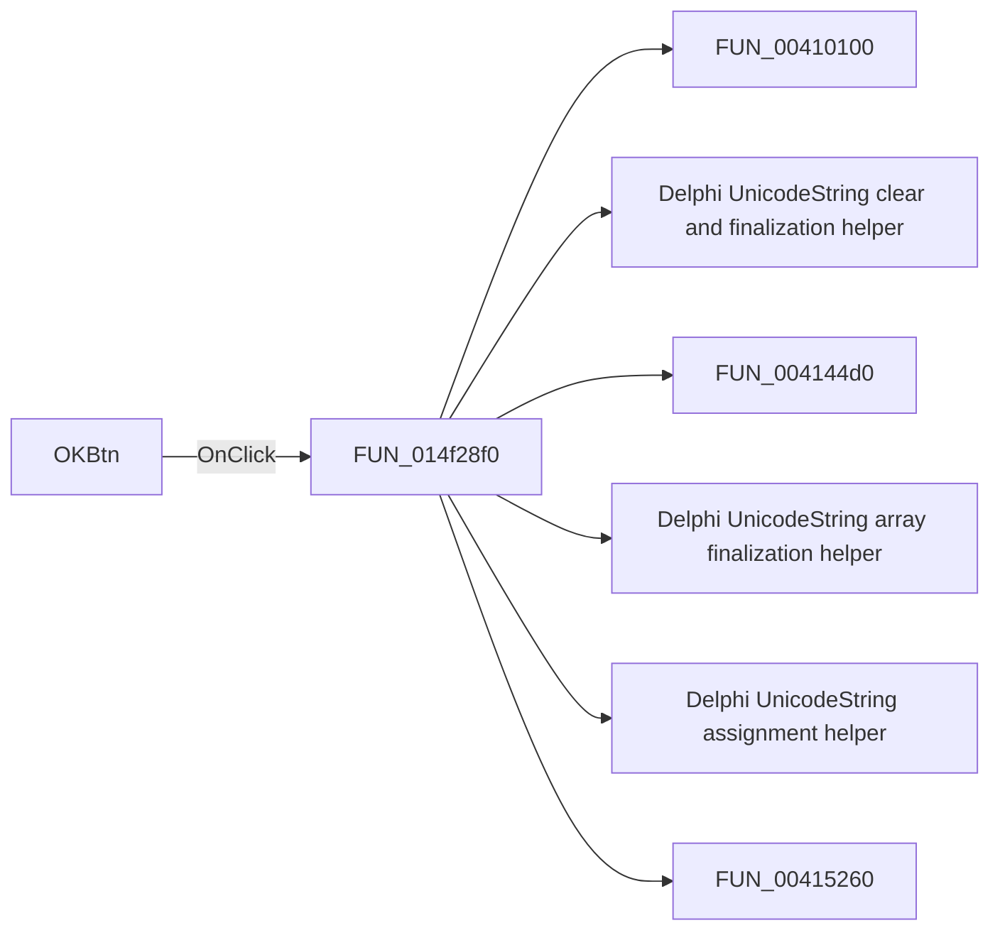

# OKBtn

> Analysis status: Pending individual source review.

## Control

| Property | Recovered value |
| --- | --- |
| Form | AnalysisOptionDlg |
| Component path | AnalysisOptionDlg.OKBtn |
| Control class | TBitBtn |
| Caption | Not present in the recovered resource. |
| Hint | Not present in the recovered resource. |
| Text | Not present in the recovered resource. |
| Handler name | OKBtnClick |
| Handler address | 014f28f0 |
| Graph node | `resource:dfm:AnalysisOptionDlg/AnalysisOptionDlg.OKBtn` |
| Handler node | `function:014f28f0` |
| Graph layer | UI |

## What happens when clicked

Pending individual analysis. An agent must read the recovered handler source and its relevant callees before it replaces this text.

## Click flow

## Handler evidence

- Source: [DecompiledSources/Tina16/functions/00000000014F28F0__FUN_014f28f0.c](../../../DecompiledSources/Tina16/functions/00000000014F28F0__FUN_014f28f0.c)
- Recovered role: Not present in the recovered resource.
- Current graph summary: Handles 1 Delphi UI event: AnalysisOptionDlg.OKBtn.OnClick.
- Current graph behavior: Not present in the recovered resource.
- Current graph evidence: Not present in the recovered resource.
- Complexity: complex
- Distinct outgoing calls: 30

## Direct calls

- `function:00410100` — FUN_00410100
- `function:00414480` — Delphi UnicodeString clear and finalization helper
- `function:004144d0` — FUN_004144d0
- `function:00414560` — Delphi UnicodeString array finalization helper
- `function:00414ad0` — Delphi UnicodeString assignment helper
- `function:00415260` — FUN_00415260
- `function:004154b0` — FUN_004154b0
- `function:00416880` — FUN_00416880
- `function:00416910` — FUN_00416910
- `function:004169a0` — FUN_004169a0
- `function:00417c40` — FUN_00417c40
- `function:00442f70` — FUN_00442f70
- `function:0064dd90` — VCL control Unicode text reader
- `function:007e2f80` — FUN_007e2f80
- `function:00b89270` — FUN_00b89270
- `function:00b8e520` — FUN_00b8e520
- `function:00b90090` — FUN_00b90090
- `function:00c5a450` — FUN_00c5a450
- `function:00e06090` — FUN_00e06090
- `function:00f06730` — FUN_00f06730
- `function:00f06890` — FUN_00f06890
- `function:014f12b0` — FUN_014f12b0
- `function:014f14b0` — FUN_014f14b0
- `function:014f3b80` — FUN_014f3b80
- `function:014f4080` — FUN_014f4080
- `function:015fc210` — FUN_015fc210
- `function:015fc260` — FUN_015fc260
- `function:019a4600` — FUN_019a4600
- `function:019af700` — FUN_019af700
- `function:01d44460` — FUN_01d44460

## Resource evidence

- Kind: bkOK
- Modal result: Not present in the recovered resource.
- Checked state: Not present in the recovered resource.
- List items: Not present in the recovered resource.
- Image reference: Not present in the recovered resource.
- Extracted glyph: None.

## Nearby label candidates

Nearby labels are layout candidates only. They are not proof of behavior.

- No same-parent label candidate is available.

## Analysis limits

- Do not infer behavior from the control class, caption, hint, glyph, or nearby label alone.
- Do not replace the pending status until the handler source and relevant call path provide enough evidence.
